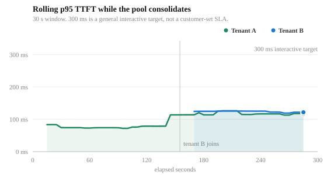
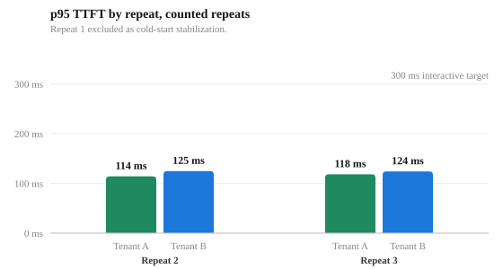
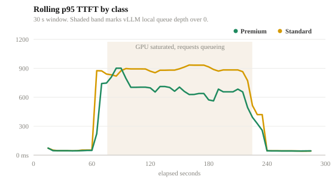
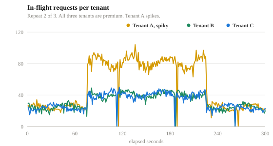
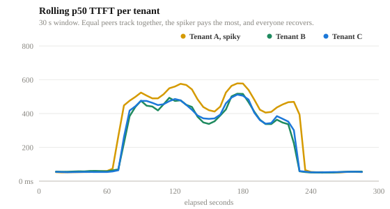
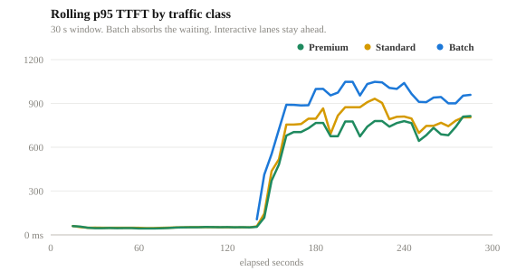

# Flow control benchmarks for llm-d

Flow control is the Endpoint Picker's policy layer for multi-tenant inference. While the GPU has available capacity, requests move through without queueing. When the pool is under pressure, flow control activates. New work waits in policy-aware queues before it enters vLLM's local queue, so priority, fairness, and tenant rules decide what runs next.

This repo holds the benchmark evidence, the pipeline that produced it, and the raw per-request data. The benchmark answers the two questions platform teams care about. Can we consolidate workloads onto one GPU and still uphold our latency SLOs? And past capacity, does the platform keep priority workloads fast while lower-priority traffic absorbs the queue?

## How to read the numbers

The pool is one GPU running GPT-OSS 20B, and the absolute latencies track that hardware and tuning. The finding that transfers is the pattern. The target held during consolidation, priority ordered the queue under saturation, fairness bounded the spiker, and batch absorbed the waiting. On different hardware the numbers move. The behavior is what the platform guarantees.

## Scenario 1 · Consolidation without giving up latency

**What it proves.** Two interactive workloads can share one GPU and uphold an interactive latency target, here 300 ms p95 TTFT as a general working target.

**What we saw.** Tenant A ran alone, then tenant B joined mid-run. The p95 TTFT moved from about 75 ms to about 120 ms, inside the target, in both counted repeats, with every request HTTP 200.

**Why it matters.** Consolidation is a cost decision. The shared GPU upholds the target with measured evidence, and flow control is the insurance if a spike pushes the pool past capacity.

*SLA rerun, 2026-07-23. One stabilization pass plus two counted repeats, 1,298 counted requests. Data in [`data/scenario-1-consolidation/`](data/scenario-1-consolidation/).*

## Scenario 2 · Priority under mixed load

**What it proves.** When the pool saturates, priority decides who waits. Premium stays ahead while standard absorbs the queue.

**What we saw.** Standard traffic surged past what the GPU could absorb and requests queued. The p50 TTFT averaged 41 ms for premium tenants and 379 ms for standard. Priority, not arrival order, decided who waited.

**Why it matters.** A latency-sensitive product keeps its experience through a surge it did not cause. That is what makes chargeback and SLA commitments enforceable on shared capacity.

*Noisy priority run, 2026-07-24. Three counted repeats, 53,399 requests, 2 non-200. Data in [`data/scenario-2-priority/`](data/scenario-2-priority/).*

## Scenario 3 · Fairness inside one priority band

**What it proves.** Within one priority band, fairness means equal treatment at equal load. The spiking tenant gets its share, not more, and pays the most queue time.

**What we saw.** All three tenants were premium and tenant A spiked to about double its peers' load. Peers B and C tracked each other within 9 ms for the whole run. In the spike window the p50 TTFT was 501 ms for the spiker against about 427 ms for its peers, and when the spike ended every tenant recovered to 54 ms within seconds.

| Tenant | Traffic role | Avg p50 TTFT | Avg p95 TTFT | Avg EPP queue mean |
|---|---|---:|---:|---:|
| premium-tenant-a | Greedy spike | 382 ms | 744 ms | 107 ms |
| premium-tenant-b | Same-priority peer | 206 ms | 671 ms | 80 ms |
| premium-tenant-c | Same-priority peer | 221 ms | 675 ms | 81 ms |

*Full-run averages. The spiker's p50 average is higher partly because more of its requests land inside the spike window. In-window, most of every tenant's latency is time inside the shared vLLM batch after dispatch, not EPP queueing.*

**Why it matters.** Teams at the same tier share a pool without anyone tuning per-tenant rate limits. Fairness shares capacity, it does not add it. A workload that needs insulation from same-tier surges belongs in its own priority band, which is Scenario 2.

*Saturated fairness run, 2026-07-24. Three counted repeats, 65,003 requests, all HTTP 200. Data in [`data/scenario-3-fairness/`](data/scenario-3-fairness/).*

## Scenario 4 · Batch isolation under surge

**What it proves.** Batch cannot displace interactive traffic, even when it dominates the arrival rate.

**What we saw.** Batch ramped to about three times the interactive arrival rate. Mean queue time averaged 202 ms for batch against 64 and 66 ms for the interactive lanes. Two 503s appeared, on batch only.

**Why it matters.** Overnight document and report pipelines can fill the same GPUs that serve interactive traffic by day, without risking interactive SLOs. That is what lets a consolidated pool run hot.

*Clean pressure pass, 2026-07-21. Three counted repeats, 53,954 requests, 2 non-200. Data in [`data/scenario-4-batch-isolation/`](data/scenario-4-batch-isolation/).*

## Policy auditability

You can verify the policy is real from four records in four layers, from the request header to the GPU runtime.

| Layer | What it records | Why it matters |
|---|---|---|
| Request headers | `x-gateway-inference-objective`, `x-gateway-inference-fairness-id` | Traffic is classified by trusted platform policy, not by a hidden route |
| InferenceObjective | Premium 100, standard 0, batch -10 | Business priority maps to a concrete platform resource |
| Endpoint Picker queues | Priority band, fairness ID, queue duration | Queueing can be explained by tenant and traffic class |
| vLLM metrics | Running and waiting requests | Shows when the GPU runtime is actually saturated |

## Methodology

Traffic for the saturation scenarios is noisy and sinusoidal on purpose, closer to production arrival patterns than a flat synthetic load, and each traffic chart shows the pattern that ran. We measured TTFT client side, from request start to first streamed token, through the gateway. Each scenario ran 300 s of active traffic with repeats, warmup and stabilization excluded. Every request is logged individually, and every chart is drawn from that per-request data. Prompts targeted 512 input tokens with fixed response lengths, a benchmark control, so end-to-end latency here is not a production prediction. TTFT is the comparable metric.

The four scenarios come from separate campaigns, each with its own accepted run. [`RUNLOG.md`](RUNLOG.md) lists them with the acceptance bar.

## Repo layout

| Path | Contents |
|---|---|
| [`report/`](report/) | The benchmark report, HTML and PDF |
| [`data/`](data/) | Summaries, configs, and per-request samples from the accepted runs |
| [`assets/`](assets/) | Every chart, generated from the data |
| [`pipeline/`](pipeline/) | The benchmark runner and chart generator |
| [`RUNLOG.md`](RUNLOG.md) | Each campaign, its verdict, and the reason |

## How to read this evidence

Use Scenario 1 for the consolidation claim and Scenarios 2 through 4 for behavior under pressure. The pattern is the finding. At the operating point the target held, and past saturation the policy decided who waited, by priority, fairness, and traffic class.
