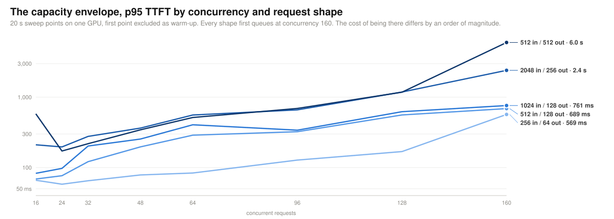
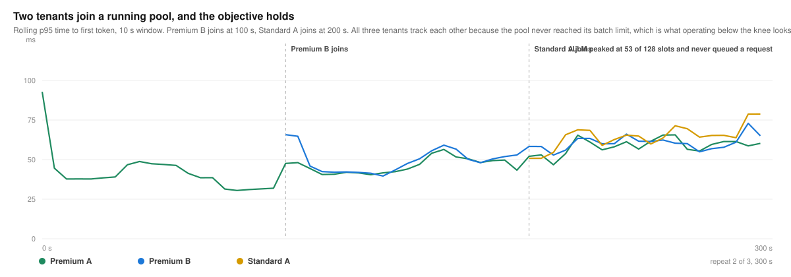
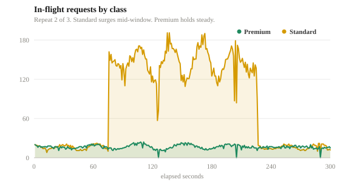
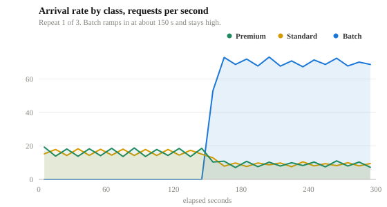
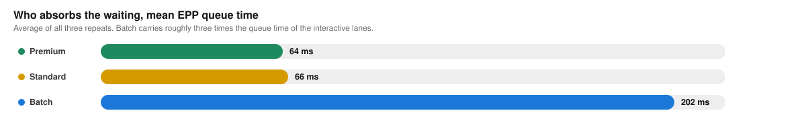
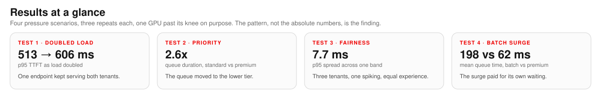

# Flow control benchmarks for llm-d

Flow control is the Endpoint Picker's policy layer for multi-tenant inference. While the GPU has capacity, requests pass straight through. When the pool comes under pressure, flow control activates, and new work waits in policy-aware queues in front of vLLM, so priority, fairness, and traffic class decide what runs next instead of arrival order.

This repo holds the measured evidence, the charts drawn from it, the per-request data, and the runner that produced it. Everything ran on one GPU serving GPT-OSS 20B behind the llm-d inference gateway.

**How to read the numbers.** The pool is one GPU, so the absolute latencies track that hardware and tuning. The pattern is the finding. The target held during consolidation, priority ordered the queue under saturation, and batch absorbed the waiting. On different hardware the numbers move and the behavior stays.

## The capacity envelope

Before any scenario, we swept the pool to learn its shape. Five request shapes, from short interactive to long generation, each stepped from 16 to 160 concurrent requests.

**What it proves.** Concurrency alone does not describe load. Every shape first showed vLLM waiting requests at 160 concurrent, and the cost of operating there ranged from 569 ms p95 TTFT at 165 requests per second to 6.0 s at 27 requests per second.

| Shape | Requests/s at 160 | p95 TTFT at 160 | Mean EPP queue at 160 |
|---|---:|---:|---:|
| 256 in / 64 out | 165.1 | 569 ms | 47 ms |
| 512 in / 128 out | 88.4 | 689 ms | 102 ms |
| 1024 in / 128 out | 84.9 | 761 ms | 91 ms |
| 512 in / 512 out | 27.2 | 6.0 s | 56 ms |
| 2048 in / 256 out | 40.0 | 2.4 s | 119 ms |

**Why it matters.** This is how every operating point below was chosen. Consolidation runs below the knee, and the saturation scenarios run above it on purpose. A platform team runs this same sweep once per hardware and model pair to place its own operating points. Data in [`data/capacity-sweeps/`](data/capacity-sweeps/).

## Consolidation without giving up latency

**What it proves.** Two interactive workloads can share one GPU and uphold an interactive latency target, here 300 ms p95 TTFT as a general working target.

**What we saw.** Tenant A ran alone, then tenant B joined mid-run. The p95 TTFT moved from about 75 ms to about 120 ms, inside the target, in both counted repeats, with every request HTTP 200.

**Why it matters.** Consolidation is a cost decision. The shared GPU upholds the target with measured evidence, and flow control is the insurance if a spike pushes the pool past capacity.

*SLA rerun, 2026-07-23. One stabilization pass plus two counted repeats, 1,298 counted requests. Data in [`data/consolidation/`](data/consolidation/).*

## Service tiers under mixed load

**What it proves.** When the pool saturates, priority decides who waits. Premium stays ahead while standard absorbs the queue.

**What we saw.** Standard traffic surged past what the GPU could absorb and requests queued. The p50 TTFT averaged 41 ms for premium tenants and 379 ms for standard. Priority, not arrival order, decided who waited.

**Why it matters.** A latency-sensitive product keeps its experience through a surge it did not cause. That is what makes tiering and SLA commitments enforceable on shared capacity.

*Noisy priority run, 2026-07-24. Three counted repeats, 53,399 requests, 2 non-200. Data in [`data/priority/`](data/priority/).*

## Batch isolation under surge

**What it proves.** Batch traffic cannot displace interactive traffic, even when it dominates the arrival rate.

**What we saw.** Batch ramped to about three times the interactive arrival rate. Mean queue time averaged 202 ms for batch against 64 and 66 ms for the interactive lanes.

**Why it matters.** Overnight document and report pipelines can fill the same GPUs that serve interactive traffic by day, without risking interactive SLOs. That is what lets a consolidated pool run hot.

*Clean pressure pass, 2026-07-21. Three counted repeats, 53,954 requests, 2 non-200. Data in [`data/batch-isolation/`](data/batch-isolation/).*

## The first pressure campaign

The first campaign, on 2026-07-21, pushed one endpoint to doubled load and served every request at 513 to 606 ms p95 TTFT. It showed the mechanism working end to end at the first configuration we tried. Tuning the configuration brings that number down, which is what the runs above show at their chosen operating points. The report and the run-level data from that campaign are kept here so the progression is visible.

[`report/flow-control-under-pressure.html`](report/flow-control-under-pressure.html) is the written report, and the PDF beside it renders in the browser. Run-level and per-tenant rollups are in [`data/first-pressure-campaign/`](data/first-pressure-campaign/).

## In progress

Same-band fairness, where three tenants share one priority band and one of them spikes, is being rerun at a hotter operating point. Numbers land here when the run meets its acceptance bar.

## Learn flow control

[`learn/flow-control.html`](learn/flow-control.html) explains the mechanism end to end: what breaks without it, how a request travels through it, what it guarantees, what it costs, and how to operate it. Written against the upstream llm-d Endpoint Picker documentation. Enable GitHub Pages on this repo and the page is served live, or download the file and open it locally.

## Policy auditability

The policy is verifiable from four records in four layers, from the request header to the GPU runtime.

| Layer | What it records | Why it matters |
|---|---|---|
| Request headers | `x-gateway-inference-objective`, `x-gateway-inference-fairness-id` | Traffic is classified by trusted platform policy, not by a hidden route |
| InferenceObjective | Premium 100, standard 0, batch -10 | Business priority maps to a concrete platform resource |
| Endpoint Picker queues | Priority band, fairness ID, queue duration | Queueing can be explained by tenant and traffic class |
| vLLM metrics | Running and waiting requests | Shows when the GPU runtime is actually saturated |

## Methodology

Traffic for the saturation scenarios is noisy and sinusoidal on purpose, closer to production arrival patterns than a flat synthetic load, and each traffic chart shows the pattern that ran. We measured TTFT client side, from request start to first streamed token, through the gateway. Each scenario ran 300 s of active traffic with repeats, warmup and stabilization excluded. Every request is logged individually, and every chart is drawn from that per-request data. Prompts targeted 512 input tokens with fixed response lengths, a benchmark control, so end-to-end latency here is not a production prediction. TTFT is the comparable metric.

Each result comes from its own accepted campaign. [`RUNLOG.md`](RUNLOG.md) lists them with the bar each one had to clear.

## Repo layout

| Path | Contents |
|---|---|
| [`data/`](data/) | Summaries, configs, and per-request samples from the accepted runs |
| [`assets/`](assets/) | Every chart, generated from the data |
| [`pipeline/`](pipeline/) | The benchmark runner and the chart generator |
| [`report/`](report/) | The first campaign report, HTML and PDF |
| [`learn/`](learn/) | The flow control explainer page |
| [`RUNLOG.md`](RUNLOG.md) | Each campaign, its verdict, and the reason |

## Reproducing it

`pipeline/benchmark_v3.py` drives the traffic and writes per-request samples, and `pipeline/gen_charts.py` redraws every chart from those samples. Point the runner at an llm-d gateway with priority bands configured as premium 100, standard 0, and batch -10. See [`pipeline/README.md`](pipeline/README.md).
