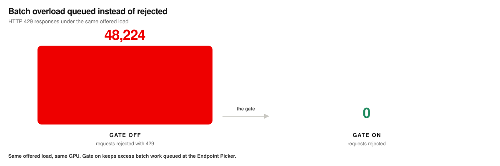
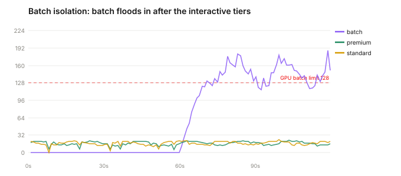
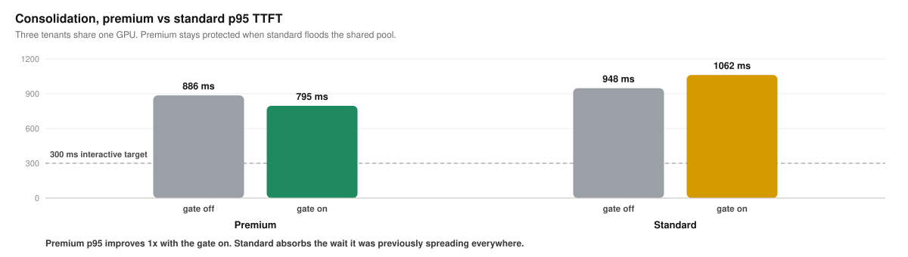
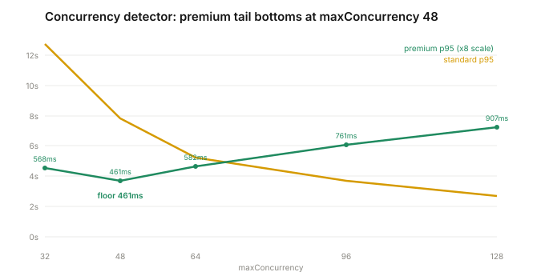

# Flow control benchmarks for llm-d

Flow control is the Endpoint Picker's policy layer for multi-tenant inference. While the GPU has capacity, requests pass straight through. When the pool saturates, flow control activates: new work waits in policy-aware queues in front of vLLM, so priority, fairness, and traffic class decide what runs next instead of arrival order.

This repo holds the measured evidence, the charts drawn from it, the per-request data, and the runner that produced it. Everything ran on one H100 serving GPT-OSS 20B behind the llm-d inference gateway, with automatic prefix caching off so the latencies reflect scheduling rather than a warm cache.

## What flow control does, in one screen

Same traffic, same GPU, the only change is whether flow control is on. Premium is the interactive tier, standard is normal traffic, batch is deferrable background work.

- **A surge that isn't yours no longer sets your latency.** Under a standard surge, the premium p95 time to first token went from 1778 ms without flow control to 251 ms with it, roughly 7 times faster, and inside the 300 ms interactive objective. Standard absorbed the wait it created.
- **Overload is queued, not rejected.** When batch traffic flooded the pool, the run without flow control returned 48,224 HTTP 429 rejections. With flow control on, zero. The platform held the deferrable work until capacity existed instead of pushing retries back to the application.
- **It costs nothing when the pool is calm.** When the GPU has headroom, gate-on and gate-off match. Flow control is the insurance that only charges under pressure.

**How to read the numbers.** The pool is one GPU, so the absolute latencies track that hardware and tuning. The pattern is the finding: premium held its objective through a surge it did not cause, and deferrable work waited instead of failing. On different hardware the numbers move and the behavior stays.

## Service tiers under mixed load

**What it proves.** When the pool saturates, priority decides who waits. Premium stays ahead while standard absorbs the queue.

**What we saw.** Standard traffic surged past what the GPU could absorb, so vLLM ran a full batch of 128 with requests waiting behind it. Without flow control, premium and standard degraded together, and the premium p95 TTFT reached 1778 ms. With flow control on, the premium p95 TTFT held at 251 ms while standard rose to 691 ms. Priority moved the wait from the tier that had an objective to the tier that could absorb it.

The arrivals are noisy sinusoidal, so the load looks like production rather than a flat synthetic ramp. Standard surges past the GPU batch limit mid-run; premium holds a low steady rate throughout.

The gap widens with output length, because longer generations hold a slot longer and make the queue matter more. At 512 output tokens the premium p95 TTFT went from 5259 ms without flow control to 145 ms with it (data in [`data-v4/tiers-512-gate-on`](data-v4/tiers-512-gate-on) and [`data-v4/tiers-512-gate-off`](data-v4/tiers-512-gate-off)).

**Why it matters.** A latency-sensitive product keeps its experience through a surge it did not cause. That is what makes tiering and SLA commitments enforceable on shared capacity.

*Noisy priority run, 512 input / 128 output tokens, three counted 120 s repeats. Premium resolved to priority 100, verified in the flow-control queue metric before counting. Data in [`data-v4/tiers-gate-on`](data-v4/tiers-gate-on) and [`data-v4/tiers-gate-off`](data-v4/tiers-gate-off).*

## Batch isolation under surge

**What it proves.** Deferrable work fills the pool without displacing interactive work, and the gate moves the retry burden from the application to the platform.

**What we saw.** Batch traffic ramped past what the pool could serve. Without flow control, the saturation shed load, and 48,224 requests returned HTTP 429. With flow control on, zero requests were rejected. Batch was queued behind the interactive tiers, its p95 TTFT rose as it waited, and interactive latency was unharmed. The served throughput was nearly the same in both arms. What changed is who handled the overflow.

**Why it matters.** Without the gate, application teams build retry and backoff for the requests the platform refuses. With it, overnight document and report pipelines can fill the same GPUs that serve interactive traffic by day, and the platform holds the work until capacity exists. That is what lets a consolidated pool run hot.

*Batch isolation run, three counted repeats. Premium and batch priorities verified before counting. Data in [`data-v4/batch-gate-on`](data-v4/batch-gate-on) and [`data-v4/batch-gate-off`](data-v4/batch-gate-off).*

## Consolidation without giving up latency

**What it proves.** Two premium tenants share one GPU, and when a standard tenant floods the pool, flow control keeps the premium tenants ahead of the flood.

**What we saw.** Two premium tenants ran together while a standard tenant ramped in and pushed the pool to a full batch of 128 with requests waiting. With flow control on, the premium p95 TTFT held at 795 ms against standard at 1062 ms. The separation is the point: the shared pool ran hot, and the interactive tenants kept their place in line.

**Why it matters.** Consolidation is a cost decision. Packing tenants onto one GPU only pays off if a noisy neighbor cannot take the interactive tenants down with it, and flow control is what holds that line.

*Saturated consolidation run, three counted repeats. Data in [`data-v4/consolidation-gate-on`](data-v4/consolidation-gate-on) and [`data-v4/consolidation-gate-off`](data-v4/consolidation-gate-off).*

## Where flow control does little, stated plainly

Flow control arbitrates across priority bands. Where there is no priority gap to enforce, it has little to do, and the honest result is a small one.

- **Same-band fairness.** Three tenants at one priority, one bursting: fairness bounds the burster's share of the pool so it cannot starve its peers, but it does not insulate a peer's latency from its neighbor, because all three compete for the same batch. The gate bounds throughput, not tail latency, inside a band.
- **A calm pool.** Below saturation there is no queue to order, so gate-on and gate-off match. Low latency there comes from headroom, not policy.

Reporting these keeps the strong claims credible. What flow control changes is who waits when the pool is contested across tiers.

## The concurrency detector, and the limit of a latency SLO

Every result above uses the shipped **utilization detector**, which gates on vLLM queue depth. An alternative **concurrency detector**, from upstream llm-d, caps in-flight concurrency directly. The two answer the saturation question differently, so we swept the concurrency detector to see whether it does better on an absolute latency target. We swept its `maxConcurrency` from 32 to 128 to find whether any setting holds premium under 300 ms at a saturating load.

The premium p95 TTFT traces a U: it bottoms at 461 ms at `maxConcurrency` 48, then rises as the cap loosens and premium competes with more admitted standard traffic. Standard improves as the cap loosens, from 12.7 s down to 2.7 s. No setting reaches a premium p95 under 300 ms at this offered load; the floor is set by GPU capacity, not by the policy. Reaching a 300 ms premium SLO under a saturating load takes headroom or more capacity, not a tighter cap. The concurrency detector is a separation control, not a latency-SLO control.

*Upstream concurrency-detector sweep, matched load, premium resolved to priority 100. Data in [`data-v4/upstream-sweep`](data-v4/upstream-sweep).*

## Scope

Every run above is a single replica, so cross-pod scoring was not the subject; what is measured is priority admission control on one pool. A two-replica pass reproduced the tier result, with the premium p95 TTFT at 177 ms (data in [`data-v4/multi-replica-tiers`](data-v4/multi-replica-tiers)). The multi-replica behavior of the endpoint picker is a separate study.

A verification gap earlier in this campaign sent tenants to pools without priority objectives, so the gate saw every request at priority 0 and the tier results collapsed to no effect. Every counted run here was re-run with the priority resolution verified in the flow-control queue metric before the data was kept. The invalidated runs are archived, not deleted, and the correction is recorded in the run log.

## Learn flow control

**[Open the interactive explainer](https://alexagriffith.github.io/flow-control-benchmarks/learn/flow-control-journey.html)**

Six stops take you from the cost problem to the dispatch path, the saturation gate, and what the policy does under pressure, ending in a playground where you drive the load yourself. It autoplays and runs in light or dark. Source is at [`learn/flow-control-journey.html`](learn/flow-control-journey.html). [The written explainer](https://alexagriffith.github.io/flow-control-benchmarks/learn/flow-control.html) is the same material as a page to read.

## Ordering is not occupancy

Fairness divides a band's capacity among the tenants inside it. Priority decides which band is served first. Neither one limits how much of the running batch a tenant holds, which is what sets latency once the pool is saturated. [`docs/fairness-vs-isolation.md`](docs/fairness-vs-isolation.md) walks a request through the mechanism and covers how to size the batch and the queue limits. [`docs/tuning-map.md`](docs/tuning-map.md) maps the question you are asking onto the one mechanism that answers it.

## Pipeline

`pipeline/benchmark_v4.py` is the runner that produced every accepted run. It drives multi-tenant traffic through the gateway with per-tenant objective and fairness headers, verifies priority resolution and gate state before counting, logs every request, scrapes vLLM and Endpoint Picker metrics, and writes one directory per repeat with `client_samples.csv`, `metric_samples.csv`, and `summary.json`. `pipeline/gen_charts.py` draws every chart in `assets/` from those CSVs. Same data in, identical charts out.

The first campaign's report and its run-level data are archived in [`archive/`](archive/) so the progression is visible. The numbers in this README supersede it.
