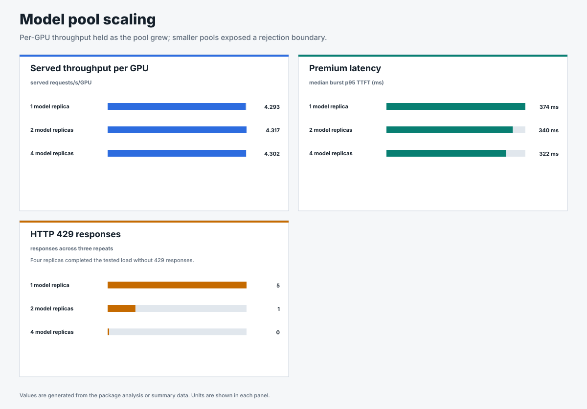

# Flow control benchmarks for llm-d

These benchmarks ask whether realtime and batch workloads can share GPUs
without batch delaying realtime requests.

## Protect realtime access on a shared GPU

When the pool of workers is saturated, requests are dispatched in order of
priority, with lower-priority bands absorbing the wait. Reserved capacity
limits how much batch work can enter vLLM. If batch work is already running,
eviction stops it and the Async Processor resubmits it.

## Business questions answered

| Question | Answer | Evidence |
|---|---|---|
| Can realtime and batch safely share the same GPU? | Yes, when capacity is reserved for realtime traffic. Without that protection, batch delayed realtime requests. Eviction recovered capacity after batch was already running. | [Batch interference](benchmark-data/upstream-flow-control-v0.9.0/batch-interference/) and [batch eviction](benchmark-data/batch-eviction/single-model-replica/) |
| What happens when workers are saturated? | Requests are dispatched in priority order. Lower-priority bands spend more time queued. | [Production scenarios](benchmark-data/upstream-flow-control-v0.9.0/production-scenarios/) |
| Do same-priority tenants continue receiving turns? | Yes. Round-robin dispatch prevented starvation in the tested fairness scenario. Their latency still depended on shared vLLM capacity. | [Same-priority fairness](benchmark-data/upstream-flow-control-v0.9.0/production-scenarios/same-priority-fairness/) |
| What protects realtime traffic before and after batch starts? | Reserved capacity keeps room available before batch starts. Eviction stops running batch work and the Async Processor retries it. | [Batch interference](benchmark-data/upstream-flow-control-v0.9.0/batch-interference/) and [eviction](benchmark-data/batch-eviction/) |
| Can evicted batch work be retried reliably? | Every evicted request was retried and each batch job produced one final result in the single-model-replica proof. The retry path also worked with two model replicas. | [Single-model-replica proof](benchmark-data/batch-eviction/single-model-replica/) and [two-model-replica proof](benchmark-data/batch-eviction/two-model-replicas/) |
| Which admission method produced lower realtime latency? | Request-count admission produced lower realtime latency in the tested mixed workload. Input-token admission lowered batch latency and raised realtime latency. | [Mixed production workload](benchmark-data/upstream-flow-control-v0.9.0/mixed-production-workload/) |
| Were long-context, agentic, and batch workloads tested together? | Yes. The mixed test ran all three with realtime chat traffic. Request-count admission protected realtime traffic best in that workload. | [Mixed production workload](benchmark-data/upstream-flow-control-v0.9.0/mixed-production-workload/) |
| How should the vLLM limits be chosen? | Sweep the limits with the target request shape. In this campaign, a higher running-request limit added little throughput and increased output-token latency. | [Engine configuration](benchmark-data/upstream-flow-control-v0.9.0/engine-configuration/) |
| Does the service recover after sustained surges? | Yes. The queue drained after both surges, realtime latency returned to its earlier range, and every request completed. | [Long stability](benchmark-data/upstream-flow-control-v0.9.0/long-stability/) |
| Does adding model replicas preserve per-GPU throughput? | Served throughput per GPU stayed stable from one to four replicas. Only the four-replica runs served all offered traffic. | [Model-pool scaling](benchmark-data/upstream-flow-control-v0.9.0/multi-replica-scaling/) |
| Did prefix-aware routing improve every workload? | It lowered realtime and batch latency, but increased standard long-context latency, route imbalance, and HTTP 429 responses. | [Prefix-cache routing](benchmark-data/upstream-flow-control-v0.9.0/prefix-cache-routing/) |
| Were the main results dependent on cache reuse? | No. The main control and production tests disabled prefix caching. Cache-aware routing was tested separately. | [Test matrix](benchmark-data/upstream-flow-control-v0.9.0/README.md) and [prefix-cache routing](benchmark-data/upstream-flow-control-v0.9.0/prefix-cache-routing/) |
| Do these results establish a deployment SLO? | They establish measured behavior and relative baselines. A deployment SLO still needs a named target and matched TTFT, end-to-end latency, TPOT, and success-rate tests. | [SLO proof tests](docs/slo-proof-tests.md) |

How the top-line results were measured

Traffic changed over time, including timed surges and recovery periods. Each
selected scenario ran three times with prefix caching off. The figures report
the median p95 time to first token across those repeats. Batch eviction was
tested separately with an upstream experimental build.

## How traffic was generated

- **Closed loop:** a fixed number of callers wait for each response before
  sending another request. We used this for capacity and configuration sweeps.
- **Open-loop Poisson:** requests arrive on schedule even when earlier requests
  are still running. We used this for production behavior.
- **Noisy sinusoidal phases:** the open-loop rate moves through baseline, surge,
  and recovery periods. We used this to test burst protection and recovery.

## Enforce priority under production traffic

**What it proves.** Under saturation, flow control dispatched higher-priority
requests first while same-priority tenants continued receiving turns.

**Why it matters.** Realtime and batch can share GPUs without changing the
priority order. Same-priority latency still depends on available vLLM capacity.

## Choose settings for the workload

vLLM controls how much work can run. The Endpoint Picker controls how much work
enters vLLM and when requests are queued. These settings must be tested with the
traffic they will serve.

### Find the engine boundary

Increasing vLLM's running-request limit produced little additional throughput
and increased p95 time per output token. The production tests used the setting
with lower output-token latency.

### Choose how much work enters vLLM

**What we saw.** Request-count admission kept realtime latency lower by holding
batch requests longer. Input-token admission lowered batch latency and raised
realtime latency in these runs.

**Why it matters.** The latency goal and request sizes determine which admission
method fits the workload. The
[utilization-detector calibration](benchmark-data/upstream-flow-control-v0.9.0/utilization-detector-calibration/)
shows how queue-depth and KV-cache thresholds change when the Endpoint Picker
begins holding requests.

## Advanced tests: protect realtime from batch interference

The Endpoint Picker can queue lower-priority requests before dispatch. Reserved
capacity prevents batch from consuming all available capacity. If batch is
already running inside vLLM, eviction stops it and the Async Processor retries
it.

### How much can batch interfere with realtime traffic?

**Answer.** Under request-count admission, running batch increased realtime p95
TTFT from 133 ms to 15,378 ms.

With request-count admission, lower-priority batch already running in vLLM
raised realtime p95 TTFT from 133 ms to 15,378 ms. That is 115 times the
realtime-only reference. The detector queued additional batch requests but
could not remove batch work that was already running.

Request-count and utilization detection both act before dispatch, so neither
can reclaim running work. The 115-times result was measured with request-count
admission; the utilization detector was not tested under this exact batch-first
traffic pattern.

### Reserved capacity and eviction protect realtime after batch starts

Reserved capacity kept realtime p95 TTFT close to the realtime-only run.
Evicted batch requests were retried, and each job produced one final result.
The retry path also worked with
[two model replicas](benchmark-data/batch-eviction/two-model-replicas/), although
run-to-run variation was too large to compare latency.

## Test recovery, scaling, and routing separately

These tests answer three separate questions: does the service recover after a
surge, does per-GPU throughput hold as model replicas are added, and does
prefix-aware routing improve this traffic?

### The queue drained after both surges

The service recovered after both surges without manual intervention. Realtime
latency returned to its earlier range, every request completed, and no requests
remained queued at the end.

### Per-GPU throughput held as the model pool grew

Adding replicas increased total capacity while served throughput per GPU stayed
stable. Rejections fell as the pool grew, and the four-replica runs served all
offered requests.

### Prefix-aware routing helped some workloads and hurt others

Prefix-aware routing lowered realtime and batch latency in this traffic. It
also increased standard long-context latency, route imbalance, and HTTP 429
responses. The cache hit rate did not increase. The mixed result does not
support changing the routing policy for this workload.

**Why it matters.** A setting that helps one request shape can hurt another.
Routing and admission settings must be tested with the workloads they will
serve.

## Evidence packages

- [`benchmark-data/upstream-flow-control-v0.9.0/results.html`](benchmark-data/upstream-flow-control-v0.9.0/results.html) summarizes the selected configuration, four production scenarios, workload shapes, scaling, stability, and prefix-aware routing.
- [`benchmark-data/rhaii-3.4-flow-control/`](benchmark-data/rhaii-3.4-flow-control/) contains the original utilization-detector evidence used throughout this README.
- [`benchmark-data/batch-eviction/`](benchmark-data/batch-eviction/) contains the batch-eviction and retry proof for one and two model replicas.
- [`flow-control-visualizer`](https://github.com/alexagriffith/flow-control-visualizer) replays the published time-series packages as synchronized traffic, Endpoint Picker queue, and vLLM views.

The [combined evidence page](benchmark-data/results.html) shows the three
campaigns together. Each package includes its configuration, request and system
metrics, acceptance checks, and supported claims. Absolute latency depends on
the model, hardware, request shape, and offered load.

Most packages disable prefix caching so the tests measure scheduling behavior.
The prefix-routing package enables caching because cache reuse is the behavior
under test.

Readable scenario names and claim boundaries for the run folders are defined in
[`benchmark-data/RUN-METADATA.json`](benchmark-data/RUN-METADATA.json).

## Reproduce and replay

Each accepted package records the scenario, seed, runner hash, image,
configuration, commands, and acceptance checks. GuideLLM uses those inputs to
recreate the request schedule. Request latency and model output can vary across
clusters, so comparisons should use repeated runs with the same hardware,
images, and settings. The original model responses remain in each evidence
package.

Selected time-series packages also include a recorded replay. The same clips can be regenerated with the public [Flow Control Flight Recorder](https://github.com/alexagriffith/flow-control-visualizer) and the package commands in [`pipeline/README.md`](pipeline/README.md).

## RHAII 3.4 reference campaign

The sections below preserve the first verified utilization-detector campaign
used by the original walkthrough. The stable upstream v0.9.0 campaign adds
open-loop traffic, mixed request sizes, model-pool scaling, routing, and a
30-minute stability run.

Open the original RHAII 3.4 reference results

## What flow control does, in one screen

These comparisons use the same traffic and GPU. The only change is whether flow
control is enabled. Premium represents interactive traffic, standard represents
normal traffic, and batch represents work that can wait.

- **Priority determines queue order.** When the pool of workers is saturated,
  higher-priority requests dispatch first and lower-priority bands absorb more
  of the wait.
- **The Endpoint Picker can hold batch requests.** At the same load, more than
  48,000 low-priority batch requests were rejected without flow control. With
  flow control, those requests entered Endpoint Picker queues and waited for
  capacity.
- **Below saturation, the results were similar.** No policy queue formed while
  workers had capacity, so enabling flow control did not materially change
  latency.

**How to read the numbers.** Absolute latency depends on the GPU, model, request
shape, and offered load. These tests show that premium requests are dispatched
before standard requests when workers are saturated. They also show that batch
requests can be queued instead of rejected. A service-level objective requires
a named target plus TTFT, end-to-end latency, time per output token (TPOT), and success-rate results at
the target load; see [SLO proof tests](docs/slo-proof-tests.md) and the
[execution plan](docs/slo-proof-execution-plan.md).

## How we chose the operating point and configuration

At 128 concurrent requests, throughput was near its peak. Raising concurrency
further increased latency and vLLM waiting with little additional throughput.
The later scenarios used 128 concurrent requests to create controlled
saturation.

The later tests kept these settings fixed so each comparison changed one thing:

| Choice | Value | Why |
|---|---|---|
| Request shape | 512 in / 128 out | A single fixed shape so every number is comparable; the output ladder (64, 128, 512) is varied separately |
| `max-num-seqs` | 128 | Sets how many sequences vLLM can schedule concurrently. Additional requests wait inside vLLM |
| Prefix caching | off | Keeps measured latency focused on scheduling. Each prompt has a unique head and body |
| Repeats | 3 counted; 300 s for corrected SLO-sensitive runs | Repeats capture run-to-run variance; SLO-sensitive claims use per-repeat p95 with a min-max range, never pooled repeats |
| Priority | verified per run | Premium had to resolve to priority 100 in the flow-control queue metric before a run counted |

Each point ran for 180 seconds in two randomized passes. Both passes found the
same capacity boundary. Data is in
[`benchmark-data/rhaii-3.4-flow-control/operating-point-sweep`](benchmark-data/rhaii-3.4-flow-control/operating-point-sweep).

## Service tiers under mixed load

**What it proves.** When the pool of workers is saturated, requests are
dispatched in priority order. Lower-priority bands absorb more of the wait.

**What we saw.** The standard surge filled vLLM and created waiting. Flow
control dispatched premium requests first. Standard requests spent more time
in the Endpoint Picker queue.

The request rate changed throughout the run. Standard traffic surged midway
through while premium traffic remained steady.

| tier | p50 TTFT (ms) | p90 TTFT (ms) | p95 TTFT (ms) | p95 TTFT range (ms) |
|---|---|---|---|---|
| premium | 374 ms | 914 ms | 1117 ms | 1056-1211 ms |
| standard | 593 ms | 1240 ms | 1406 ms | 1250-1488 ms |

The published result calculates p95 separately for each repeat, then reports
the median and range. An earlier 251 ms value pooled the repeats and is
withdrawn because that method hid run-to-run variation.

Corrected 300 s gate-on data is in
[`benchmark-data/rhaii-3.4-flow-control/tiers-gate-on-300s`](benchmark-data/rhaii-3.4-flow-control/tiers-gate-on-300s).
Only the corrected 128-output data supports the headline SLO evidence. The older
64- and 512-output cells remain for provenance until the same per-repeat method
restates them.

**Why it matters.** Realtime requests can keep faster access to a shared GPU
during a surge caused by lower-priority traffic. A complete service-level
objective still requires a named target, end-to-end latency, TPOT, and success
rate.

*Noisy priority run, 512 input / 128 output tokens, three counted 300 s repeats. Premium resolved to priority 100, verified in the flow-control queue metric before counting. Data in [`benchmark-data/rhaii-3.4-flow-control/tiers-gate-on-300s`](benchmark-data/rhaii-3.4-flow-control/tiers-gate-on-300s).*

## Batch isolation under surge

**What it proves.** Batch can use available GPU capacity while realtime
requests are dispatched first when workers are saturated. Excess batch
requests are queued at the Endpoint Picker instead of rejected to the caller.

**What we saw.** When batch exceeded capacity, the Endpoint Picker queued it
behind realtime traffic. Realtime latency and served throughput remained
stable. Callers did not have to retry the excess batch requests.

| tier | p50 TTFT off (ms) | p90 TTFT off (ms) | p95 TTFT off (ms) | p50 TTFT on (ms) | p90 TTFT on (ms) | p95 TTFT on (ms) |
|---|---|---|---|---|---|---|
| premium | 145 ms | 1030 ms | 1394 ms | 154 ms | 968 ms | 1196 ms |
| standard | 155 ms | 1082 ms | 1347 ms | 164 ms | 1069 ms | 1328 ms |
| batch | 559 ms | 1354 ms | 1605 ms | 1148 ms | 1975 ms | 2173 ms |

Batch TTFT rises because the platform queues it behind the interactive tiers
until capacity opens.

**Why it matters.** Batch can use capacity that realtime traffic does not need.
When demand grows, the Endpoint Picker queues batch requests and reduces the
retry and backoff work left to application teams.

*Batch isolation run, three counted repeats. Premium and batch priorities verified before counting. Data in [`benchmark-data/rhaii-3.4-flow-control/batch-gate-on`](benchmark-data/rhaii-3.4-flow-control/batch-gate-on) and [`benchmark-data/rhaii-3.4-flow-control/batch-gate-off`](benchmark-data/rhaii-3.4-flow-control/batch-gate-off).*

## Batch eviction and retry

Reserved capacity kept realtime p95 TTFT close to the realtime-only run while
batch shared the GPU. When realtime traffic needed capacity already occupied by
batch, eviction stopped those requests and the Async Processor retried them.
Each batch job produced one final result in the tested single-model-replica
path.

*Four matched scenarios, three counted 300-second repeats, one NVIDIA H100 GPU, prefix
caching off. Data, configuration, and the visual report are in
[`benchmark-data/batch-eviction`](benchmark-data/batch-eviction).*

## Consolidate tenants on one GPU

During a standard-tenant burst, flow control dispatched requests from both
premium tenants first.

| tier | p50 TTFT off (ms) | p90 TTFT off (ms) | p95 TTFT off (ms) | p50 TTFT on (ms) | p90 TTFT on (ms) | p95 TTFT on (ms) |
|---|---|---|---|---|---|---|
| premium | 256 ms | 750 ms | 886 ms | 256 ms | 664 ms | 795 ms |
| standard | 455 ms | 849 ms | 948 ms | 499 ms | 935 ms | 1062 ms |

The premium tenants kept lower p95 TTFT than the standard tenant. One GPU served
all three tenants while preserving the configured priority order.

*Saturated consolidation run, three counted repeats. Data in [`benchmark-data/rhaii-3.4-flow-control/consolidation-gate-on`](benchmark-data/rhaii-3.4-flow-control/consolidation-gate-on) and [`benchmark-data/rhaii-3.4-flow-control/consolidation-gate-off`](benchmark-data/rhaii-3.4-flow-control/consolidation-gate-off).*

## Where priority and fairness apply

Flow control chooses which priority band dispatches first. Round-robin fairness
chooses which tenant takes the next turn within one band.

**Same-band fairness.** One tenant burst to several times the load of its two
same-priority peers. Round-robin fairness kept all three tenants receiving
dispatch turns and prevented starvation. Tail latency still depended on the
vLLM capacity they shared.

| tier | p50 TTFT off (ms) | p90 TTFT off (ms) | p95 TTFT off (ms) | p50 TTFT on (ms) | p90 TTFT on (ms) | p95 TTFT on (ms) |
|---|---|---|---|---|---|---|
| premium, all three at priority 100 | 258 ms | 740 ms | 894 ms | 290 ms | 752 ms | 882 ms |

**Below saturation.** No policy queue formed, and latency was similar with flow
control enabled and disabled.

These tests show when flow control changes behavior. When a full worker pool
receives requests at different priorities, priority determines dispatch order.
Within one priority band, round-robin fairness prevents starvation but does not
create a separate low-latency lane. Below saturation, no policy queue forms.

## Tune how many requests enter vLLM

Every RHAII 3.4 result in this section uses the **utilization detector**, which
activates flow control from vLLM queue depth. The upstream **concurrency
detector** limits how many requests can enter vLLM. We tested
`maxConcurrency` values from 32 to 128 at the same saturating load.

Premium p95 TTFT was lowest at `maxConcurrency=48` for this workload. At 32,
premium requests queued at the admission limit. Above 48, vLLM admitted more
standard requests and premium TTFT increased. None of the tested settings kept
premium p95 TTFT below 300 ms at this load.

*Endpoint Picker v0.9.0 request-concurrency tuning, with matched load and
premium resolved to priority 100. The run metrics record build commit
`5f4e762f`. This test compares v0.9.0 cap settings. The RHAII 3.4 campaign used
a different test. Data is in
[`benchmark-data/upstream-flow-control-v0.9.0/request-concurrency-priority-tuning`](benchmark-data/upstream-flow-control-v0.9.0/request-concurrency-priority-tuning).*

## SLO proof tests

The results above show priority dispatch and batch queuing. A deployment can
claim a specific service-level objective only after the target is defined and
the test measures TTFT, end-to-end latency, TPOT, and success rate. The test
design is in [`docs/slo-proof-tests.md`](docs/slo-proof-tests.md), with the
public evidence protocol in
[`docs/slo-proof-execution-plan.md`](docs/slo-proof-execution-plan.md). The
short version:

- **Closed-loop priority admission test:** confirms the gate puts premium ahead of standard under saturation.
- **Open-loop SLO test:** drives a named request rate with Poisson arrivals and checks whether premium meets the target at p95/p99.
- **Success-rate test:** treats 429, 503, and timeout as SLO failures, not just latency exclusions.
- **Decode and memory test:** reports TPOT and KV/preemption metrics so a fast first token cannot hide slow generation.
- **Detector comparison:** runs both detectors against the same traffic to show
  where requests queue and how each detector affects latency, throughput, and
  errors.

## Scope

The RHAII 3.4 reference campaign primarily uses one model replica. A separate
two-replica run also dispatched premium requests first. Its premium p95 TTFT was
177 ms. Data is in
[`benchmark-data/rhaii-3.4-flow-control/multi-replica-tiers`](benchmark-data/rhaii-3.4-flow-control/multi-replica-tiers).

The v0.9.0 campaign tests one Endpoint Picker with one, two, and four model
replicas. Served requests per second per GPU stayed within 0.6% across those
tests. The one-replica runs returned five realtime HTTP 429 responses. The
two-replica runs returned one standard long-context HTTP 429 response. All
three four-replica runs completed every offered request.

Before accepting a run, the validator confirms that the expected priority label
appears in Endpoint Picker queue metrics. Runs that fail this check are excluded
from the public benchmark data.

## The walkthrough

**[How we got the numbers, one pass at a time](walkthrough.html)** documents the
test order, the invalid measurements we rejected, and the method used for the
published results.

## Learn flow control

**[Open the interactive explainer](https://alexagriffith.github.io/flow-control-benchmarks/learn/flow-control-journey.html)**

The interactive explainer shows the request path, saturation detector, Endpoint
Picker queues, and dispatch behavior. Its playground lets readers change the
load. Source is at
[`learn/flow-control-journey.html`](learn/flow-control-journey.html). The
[written explainer](https://alexagriffith.github.io/flow-control-benchmarks/learn/flow-control.html)
presents the same material as a page to read.

## Pipeline

`pipeline/benchmark.py` runs the closed-loop sweeps. The open-loop production
scenarios use `pipeline/guidellm_trace.py` to create the GuideLLM request
schedule and `pipeline/run_guidellm_scenario.py` to run it. Both runners attach
the tenant headers, verify the deployed configuration, confirm that flow
control engaged, log request outcomes, and capture vLLM and Endpoint Picker
metrics. Each accepted package records the command, runner hash, scenario,
seed, image, and configuration.

`pipeline/gen_charts.py` draws the RHAII 3.4 charts from their CSV inputs.
`pipeline/generate_package_visuals.py` generates the v0.9.0 and batch-eviction
visuals deterministically from the accepted package data.

The public benchmark folders contain accepted evidence. Exploratory runs remain
outside this repository.

## Other resources

- [First pressure campaign report](report/flow-control-under-pressure.html) — the 2026-07-21 run, kept for the progression. It ran with prefix caching on, so its latencies reflect a warm cache; the report carries that note at the top. The verified numbers on this page supersede it.
