# Flow control benchmarks for llm-d

Flow control is the Endpoint Picker's policy layer for multi-tenant inference.
Requests pass through while the GPU has capacity. When the pool saturates, flow
control queues new work in front of vLLM. Priority, fairness, and traffic class
determine dispatch order.

The repository contains measured evidence, generated charts, per-request data,
and the runner code. The benchmark campaigns ran GPT-OSS 20B on NVIDIA H100 GPUs
behind the llm-d inference gateway.

- **[Utilization detector](benchmark-data/rhaii-3.4-flow-control/):** established
  the operating point and tested priority, batch queuing, shared pools, and
  peer fairness.
- **[Concurrency detector](benchmark-data/upstream-flow-control-v0.9.0/):**
  tested request-count and token-count admission with production and advanced
  traffic patterns.
- **[Batch eviction](benchmark-data/batch-eviction/):** tested reserved capacity,
  eviction, and retry after batch work entered vLLM.

## Takeaways

### GPU consolidation let mixed traffic share one pool

**Chat, batch, and tenant traffic can share one GPU instead of separate
underutilized pools.** The consolidation runs put two high-priority tenants and
a lower-priority burst on one model pool.
Production scenarios test real-time, standard, and batch traffic under the same
flow-control policy.

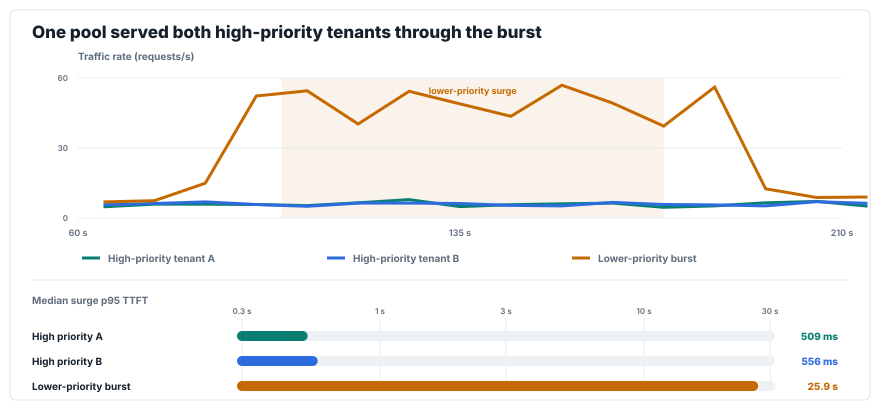

Traffic: selected repeat 2. Surge p95 TTFT: median across three request-count admission repeats, log scale.

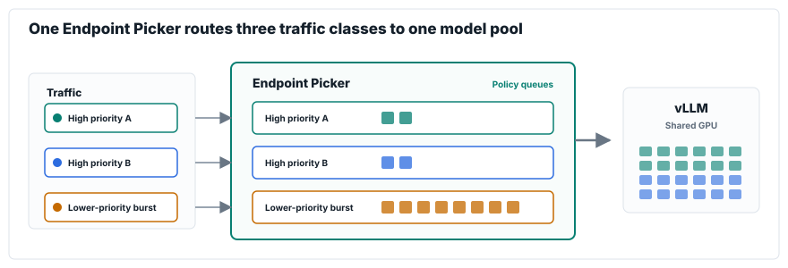

[Tenant consolidation runs](benchmark-data/upstream-flow-control-v0.9.0/production-scenarios/consolidation/) · [Production scenario runs](benchmark-data/upstream-flow-control-v0.9.0/production-scenarios/) · [Additional consolidation evidence](benchmark-data/rhaii-3.4-flow-control/consolidation-gate-on/)

### Lower-priority traffic absorbed the wait

**When the pool saturates, policy decides who waits. Higher-priority traffic is
protected under load, while lower-priority traffic absorbs the queue's
latency.**

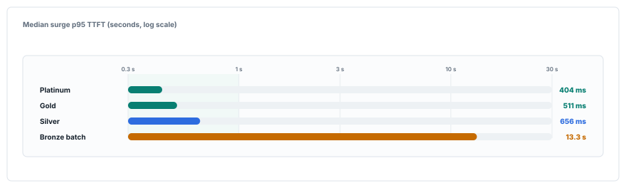

Surge p95 TTFT: median across three request-count admission repeats, log scale.

[Priority-tier runs](benchmark-data/upstream-flow-control-v0.9.0/production-scenarios/priority-tiers/)

### Fairness was upheld within a priority tier

**One tenant's surge does not starve same-priority peers.** Round-robin fairness
gives each tenant dispatch turns inside one priority band. Tail latency still
depends on the vLLM capacity shared by the tenants.

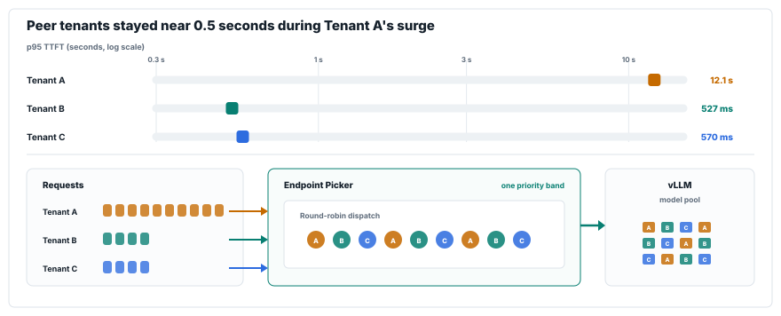

Surge p95 TTFT: median across three request-count admission repeats, log scale. The lower panel shows Endpoint Picker round-robin dispatch and the resulting A/B/C sequence sent to the model pool.

[Peer fairness runs](benchmark-data/upstream-flow-control-v0.9.0/production-scenarios/same-priority-fairness/)

### Reserved capacity protected real-time traffic during batch execution

**Reserved capacity and eviction protect real-time p95 TTFT while batch
sequences are already executing in vLLM.** Reserved capacity kept real-time
latency near the real-time-only reference in the bounded burst. The
batch-eviction test measured similar real-time latency with reserved capacity
alone and with reserved capacity plus eviction. Eviction added recovery for
eligible batch work already running in vLLM; its measured real-time latency was
within 7 ms of reserved capacity alone.

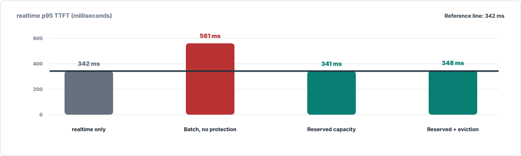

Real-time p95 TTFT: median across three matched 300-second repeats.

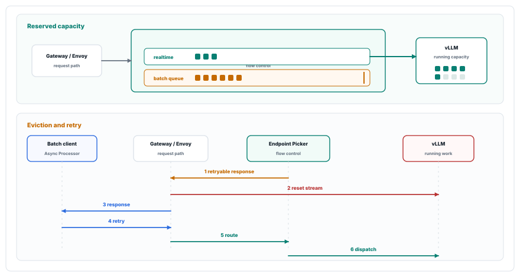

Reserved capacity acts before dispatch. After dispatch, the Endpoint Picker selects eligible batch work and issues ImmediateResponse(429). Envoy resets the upstream connection, vLLM releases the sequence, and the client-side Async Processor submits the job again as a new request.

[Batch-interference runs](benchmark-data/upstream-flow-control-v0.9.0/batch-interference/) · [Single-model-replica eviction runs](benchmark-data/batch-eviction/single-model-replica/) · [Two-model-replica eviction runs](benchmark-data/batch-eviction/two-model-replicas/)

## Flow control under load

The priority-admission and shared-pool tests compare traffic classes with flow
control enabled. The batch-overload test compares flow control disabled and
enabled.

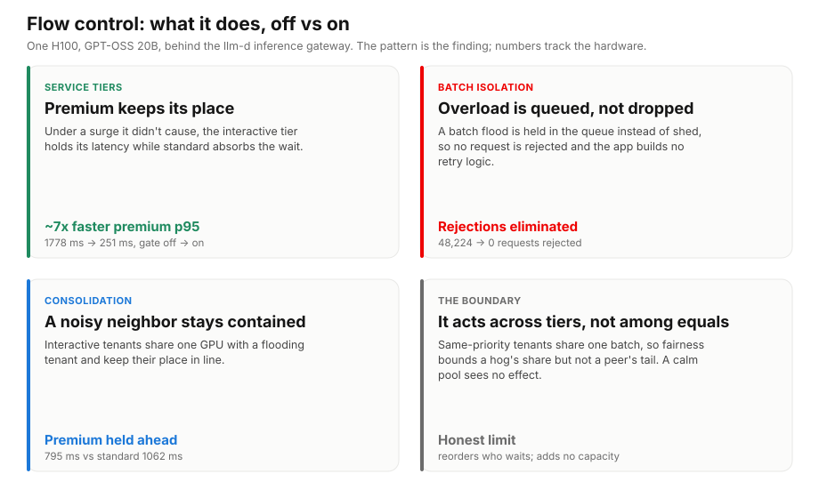

Compare bars within each card. Each card shows its own metric and unit.

- **Priority admission:** higher-priority traffic had lower p95 TTFT than
  standard traffic under saturated load.
- **Zero rejections:** batch overload queued at the Endpoint Picker; HTTP 429
  responses dropped to zero with the gate on.
- **Shared pool protection:** higher-priority tenants kept lower p95 TTFT than
  standard traffic in one shared model pool.

[Utilization-detector campaign](benchmark-data/rhaii-3.4-flow-control/campaign-overview.md)

## Where flow control sits in llm-d

The llm-d Gateway uses Envoy's `ext_proc` protocol to ask the Endpoint Picker
(EPP) where a request should run. Inside the EPP, request-header processors run
before `FlowControlAdmissionController.EnqueueAndWait`. Admitted requests then
move through endpoint-candidate lookup and request-data preparation, admission
plugins, scheduler filters, scorers, and the picker.

**Flow-control admission runs before endpoint scoring.**

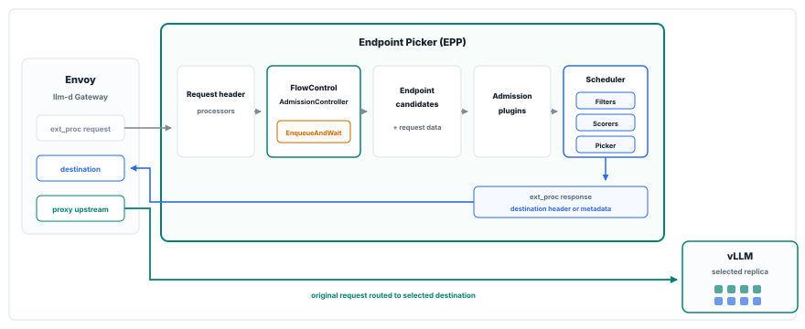

**Flow control queues by priority band and tenant.**

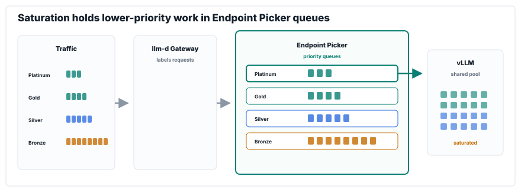

The EPP returns the selected destination as a request header or dynamic metadata. Envoy then forwards the original request to that vLLM replica. The queue diagram uses the consolidation run: Tenant A and Tenant B share priority 100. Tenant C waits in priority 0.

## How we chose the operating point and configuration

Each configuration sweep changed one control while the other settings in the
benchmark package stayed fixed.

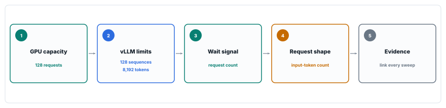

### 1. Find GPU capacity

**Throughput stopped improving near 128 concurrent requests.** Higher offered
concurrency added latency without increasing served throughput.

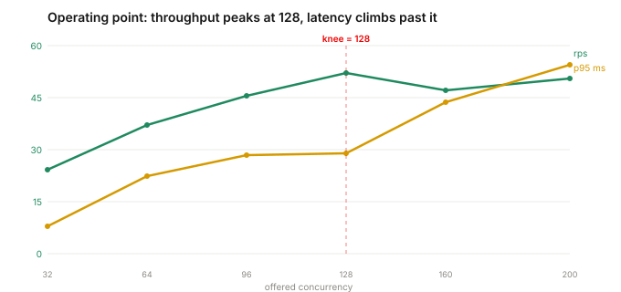

Operating-point sweep: median of two single-tenant passes. The 128-request knee was the capacity reference for that campaign; later packages ran separate engine and admission sweeps.

### 2. Set vLLM execution limits

**More active sequences added little throughput and much more token delay.**

Raising vLLM's active-sequence limit from 128 to 192 increased throughput from
50.5 to 51.9 requests/s. Over the same sweep, p95 time per output token rose
from 19.6 to 28.9 ms/token. In the batched-token sweep, an 8,192-token budget
produced the highest tested throughput and the lowest tested p95 TTFT.

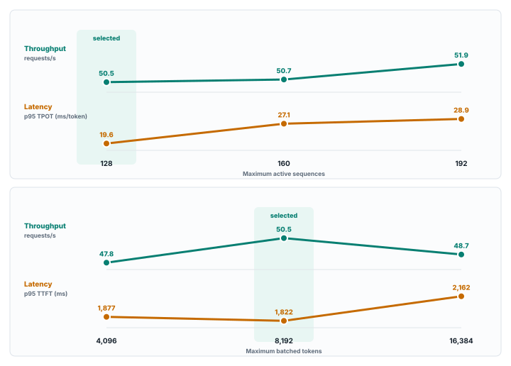

Engine sweeps: three matched runs per setting. Each plot uses its printed unit and directly labels every measured point.

### 3. Choose when requests wait

**Request count limits work before dispatch. Queue depth and KV pressure react
after work reaches vLLM.**

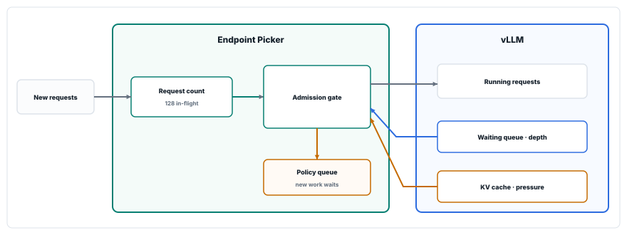

| Signal | Setting carried forward |
|---|---|
| Request count | 128 in-flight requests as the default |
| Queue depth | Calibrated per workload; a threshold of 8 was selected in the short calibration |
| KV pressure | 0.8 retained as a pressure guardrail |

The [production detector comparison](benchmark-data/upstream-flow-control-v0.9.0/results.html#production)
tests request count and queue depth directly.

### 4. Account for request shape

**Count requests by default. Count input tokens when prompt sizes differ
materially.** Input-token admission lowered p95 TTFT for short and medium
prompts in the mixed-size calibration. Request-count admission was lower for
long prompts. The fixed input-plus-output estimate was excluded after a
one-run screen.

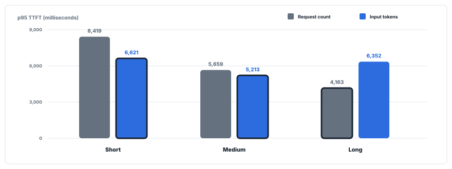

Admission calibration: median p95 TTFT across three matched runs per retained method. Lower is better; the outlined bar is lower within each prompt-size pair. The one-run input-plus-output screen was excluded from the retained comparison.

### 5. Configuration decisions and evidence

| Decision | Setting carried forward | Evidence |
|---|---|---|
| Replica saturation reference | 128 concurrent requests | [Operating-point sweep](benchmark-data/rhaii-3.4-flow-control/operating-point-sweep/) |
| vLLM maximum sequences | 128 active sequences | [Engine configuration](benchmark-data/upstream-flow-control-v0.9.0/engine-configuration/) |
| vLLM batched-token budget | 8,192 batched tokens | [Engine configuration](benchmark-data/upstream-flow-control-v0.9.0/engine-configuration/) |
| Default admission signal | Request count; 128 in-flight requests | [Request and token admission](benchmark-data/upstream-flow-control-v0.9.0/request-and-token-admission-calibration/) |
| Reactive queue signal | Queue depth, calibrated per workload | [Utilization detector calibration](benchmark-data/upstream-flow-control-v0.9.0/utilization-detector-calibration/) · [Detector comparison](benchmark-data/upstream-flow-control-v0.9.0/results.html#production) |
| Reactive memory signal | KV pressure; 0.8 retained as a guardrail | [Utilization detector calibration](benchmark-data/upstream-flow-control-v0.9.0/utilization-detector-calibration/) |
| Size-aware admission | Exact input tokens; fixed output estimate rejected | [Request and token admission](benchmark-data/upstream-flow-control-v0.9.0/request-and-token-admission-calibration/) |
| Historical priority tuning | 48-request cap for the two-repeat study only | [Historical priority tuning](benchmark-data/upstream-flow-control-v0.9.0/request-concurrency-priority-tuning/) |

### Results

Served throughput reached its tested plateau near 128 admitted requests while
p95 TTFT continued to rise at higher limits. Increasing the active-sequence
limit from 128 to 192 added 1.4 requests/s and raised p95 time per output token
from 19.6 to 28.9 ms/token. The 8,192-token budget had the highest throughput
and lowest p95 TTFT in its sweep. Request count became the default admission
signal because it limits work before dispatch. Queue depth and KV pressure
report pressure after work reaches vLLM, while input-token counting fit the
mixed-size calibration better for short and medium prompts.

## Production scenarios

The four scenarios used the same surge schedule and changed the traffic mix.
The charts use request-count admission with flow control enabled. The direct
flow-control-off comparison belongs to the earlier utilization-detector
campaign in [Flow control under load](#flow-control-under-load); the two
campaigns remain separate because they used different detector configurations.

- [Priority tiers](#bronze-batch-absorbed-most-of-the-surge-delay): Bronze batch
  absorbed most of the surge delay.
- [Batch isolation](#batch-queued-behind-real-time-traffic): batch waited while
  real-time and standard traffic stayed below one second.
- [Tenant consolidation](#two-high-priority-tenants-shared-one-pool): two
  high-priority tenants shared one model pool.
- [Same-priority fairness](#fairness-was-upheld-within-a-priority-tier): peers
  continued receiving dispatch turns within one priority tier.

### Bronze batch absorbed most of the surge delay

Platinum, Gold, and Silver stayed below one second while Bronze absorbed the
queue delay.

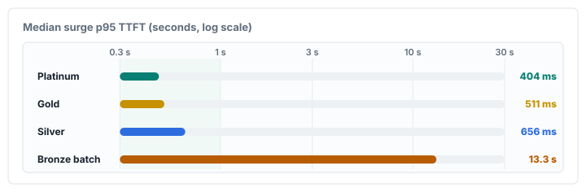

Production scenario: median p95 TTFT during the surge, log scale.

[Priority-tier evidence](benchmark-data/upstream-flow-control-v0.9.0/production-scenarios/priority-tiers/) · [Utilization-detector evidence](benchmark-data/rhaii-3.4-flow-control/tiers-gate-on-300s/)

### Batch queued behind real-time traffic

Real-time and standard traffic stayed below one second during the surge while
batch absorbed the wait.

**Traffic during the selected repeat**

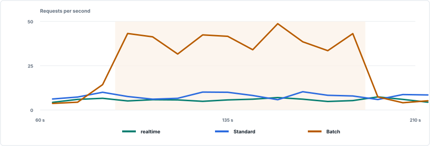

Requests per second in selected repeat 2. The shaded interval is the configured surge window.

**Latency during the surge**

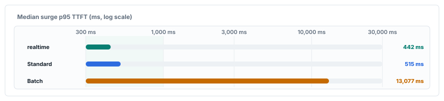

Production scenario: median p95 TTFT during the surge, log scale.

[Batch queued behind real-time traffic](benchmark-data/upstream-flow-control-v0.9.0/production-scenarios/batch-isolation/) · [Utilization-detector evidence](benchmark-data/rhaii-3.4-flow-control/batch-gate-on/)

### Two high-priority tenants shared one pool

Both high-priority tenants stayed below one second while the lower-priority
burst carried the queue delay.

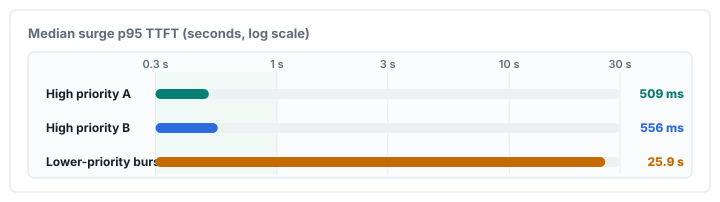

Production scenario: median p95 TTFT during the surge, log scale.

[Tenant-consolidation evidence](benchmark-data/upstream-flow-control-v0.9.0/production-scenarios/consolidation/) · [Utilization-detector evidence](benchmark-data/rhaii-3.4-flow-control/consolidation-gate-on/)

### Fairness was upheld within a priority tier

Round-robin dispatch kept peers B and C below one second while Tenant A's
larger burst waited longer.

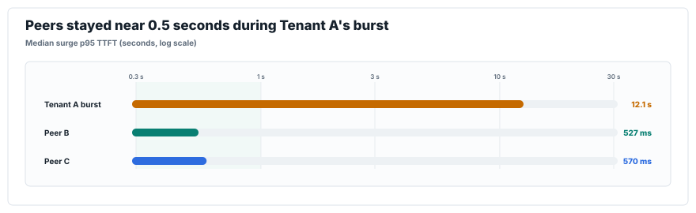

Production scenario: median p95 TTFT during the surge, log scale.

[Peer-fairness evidence](benchmark-data/upstream-flow-control-v0.9.0/production-scenarios/same-priority-fairness/)

### Request-count admission kept real-time latency lower than queue-depth detection

Request-count admission kept real-time p95 TTFT lower in the two direct
comparisons. Request count limits admitted work in the Endpoint Picker before
dispatch. Queue depth reacts after requests enter the vLLM waiting queue.

The direct production comparison tests request count and queue depth. KV pressure is shown to locate the other reactive signal; it was calibrated separately.

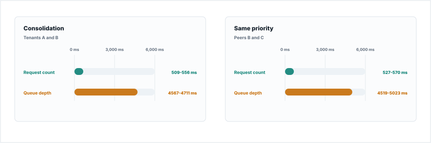

Median p95 TTFT range across the selected real-time tenants. Both detector methods used the same prompts, traffic schedule, model, GPU, and repeat count.

[Detector comparison](benchmark-data/upstream-flow-control-v0.9.0/results.html#production)

Across the four scenarios, higher-priority traffic stayed below one second
while lower-priority batch or the bursting tenant absorbed most of the delay.
Two high-priority tenants shared one pool, and round-robin dispatch continued
serving peers inside one priority tier. In the direct detector comparisons,
request-count admission reacted before queue-depth detection and kept real-time
p95 TTFT lower.

## Advanced scenarios

The advanced scenarios vary prompt shape, running batch, surge count, model-pool
size, and routing policy.

- [Mixed request shapes](#request-count-favored-real-time-traffic-and-input-tokens-favored-batch)
- [Longer output](#longer-output-raised-first-token-latency)
- [Batch already running](#running-batch-raised-real-time-latency)
- [Repeated surges](#the-queue-drained-after-both-surges)
- [Model-pool scale](#per-gpu-throughput-held-from-one-to-four-replicas)
- [Prefix-aware routing](#prefix-aware-routing-lowered-chat-latency-and-increased-route-imbalance)

### Request count favored real-time traffic, and input tokens favored batch

In the mixed workload, request-count admission kept real-time p95 TTFT lower.
Input-token admission kept batch p95 TTFT lower. A separate long-context
comparison activated the policy queue in all eight exact-token runs. Its 16 ms
latency difference fell within run variance.

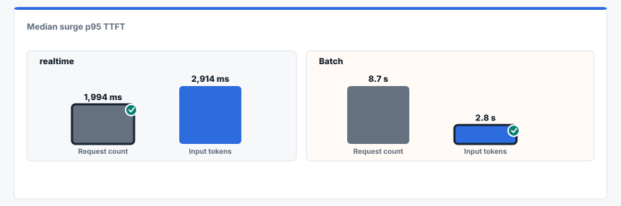

Mixed workload: median surge p95 TTFT across three repeats. Lower is better; the outlined bar is lower within each traffic class.

[Mixed-workload evidence](benchmark-data/upstream-flow-control-v0.9.0/mixed-production-workload/) · [Long-context evidence](benchmark-data/upstream-flow-control-v0.9.0/long-context-admission/)

### Longer output raised first-token latency

Agentic requests generated longer responses and held vLLM capacity longer.
Requests arriving after the longer responses waited longer for their first
token even though time per output token stayed similar.

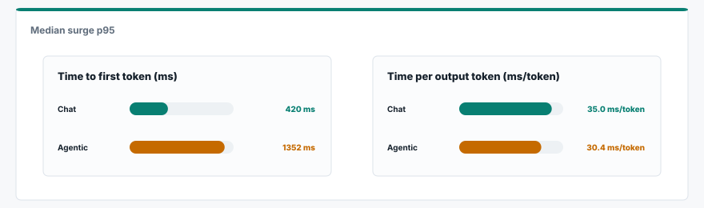

Selected workload shapes: median surge p95 across three single-tenant repeats.

[Workload-shape evidence](benchmark-data/upstream-flow-control-v0.9.0/selected-workload-shapes/)

### Running batch raised real-time latency

Batch already occupying vLLM left no immediate capacity for new real-time
requests. Admission control left work already inside vLLM in place.

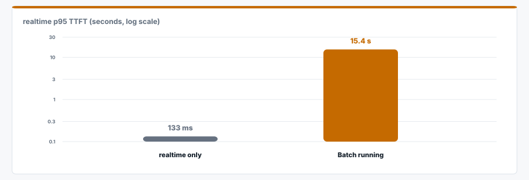

Batch interference test: real-time p95 TTFT with and without batch already inside vLLM. Median across three matched repeats.

[Batch-interference evidence](benchmark-data/upstream-flow-control-v0.9.0/batch-interference/) · [Batch-eviction evidence](benchmark-data/batch-eviction/)

The batch-interference run also supplies the problem statement for the
batch-eviction tests below.

### The queue drained after both surges

Flow control engaged twice. The queue returned to zero after each surge, and
every request completed.

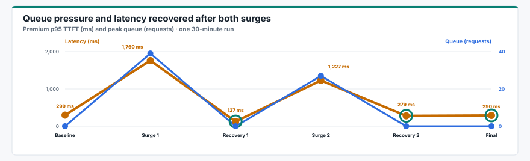

Recovery test: premium p95 TTFT and queue pressure across one 30-minute run.

[Recovery evidence](benchmark-data/upstream-flow-control-v0.9.0/long-stability/)

### Per-GPU throughput held from one to four replicas

Total served throughput increased with the model pool while served throughput
per GPU varied by 0.6%. Adding replicas did not reduce throughput per GPU in
this test. The tests returned five non-200 responses at one replica, one at two
replicas, and zero at four replicas.

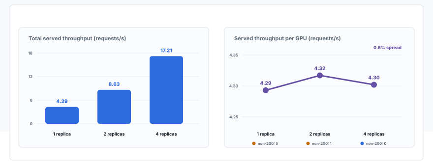

Scale test: total and per-GPU served throughput across one, two, and four replicas. Each point is the median of three repeats.

[Scaling evidence](benchmark-data/upstream-flow-control-v0.9.0/multi-replica-scaling/)

### Prefix-aware routing lowered chat latency and increased route imbalance

Prefix-aware routing lowered latency for real-time chat, agentic, and batch
requests. Standard long-context latency rose, cache-hit rate stayed unchanged,
and requests were distributed less evenly across replicas.

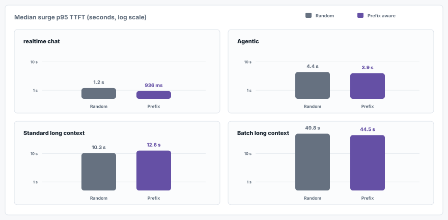

Prefix-routing test: median p95 TTFT across three repeats. Route imbalance was 0.9% with random routing and 19.1% with prefix-aware routing.

| Cost in the routing run | Random routing | Prefix-aware routing |
|---|---:|---:|
| Standard long-context p95 TTFT | 10.3 s | 12.6 s |
| Route imbalance | 0.9% | 19.1% |
| HTTP 429 responses | 4 | 19 |

[Prefix-routing evidence](benchmark-data/upstream-flow-control-v0.9.0/prefix-cache-routing/)

Request shape changed which admission signal kept latency lower. Longer output
and running batch increased first-token wait because they held vLLM capacity.
The queue recovered after repeated surges, and per-GPU throughput stayed stable
as replicas were added. Prefix-aware routing changed latency by workload and
distributed requests less evenly in this run.

## Batch eviction tests

The batch-eviction tests begin with batch work occupying vLLM capacity when
real-time demand arrives.

### Running batch blocked new real-time work

Real-time p95 TTFT rose from 133 ms to 15.4 seconds after batch work occupied
vLLM capacity. Admission control could still govern new requests, but it could
not release work already running inside vLLM.

Batch-interference test: real-time p95 TTFT with and without running batch. Median across three matched repeats.

[Batch-interference evidence](benchmark-data/upstream-flow-control-v0.9.0/batch-interference/)

### Reserved capacity protected real-time traffic

Reserved capacity kept room before dispatch. Eviction released eligible batch
work that had already entered vLLM.

Single-replica test: real-time p95 TTFT across matched 300-second repeats.

[Reserved-capacity evidence](benchmark-data/batch-eviction/single-model-replica/)

### Every observed eviction was retried once

All 38 evictions in the single-replica package and all 57 evictions in the
two-replica package were retried. Each evicted request produced one final result,
and neither package recorded duplicate results.

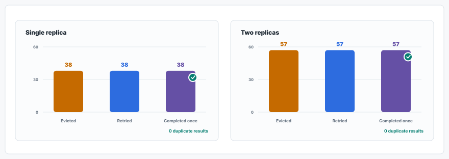

Retry correlation across the retained single- and two-replica proof packages.

[Single-replica retry evidence](benchmark-data/batch-eviction/single-model-replica/) · [Two-replica retry evidence](benchmark-data/batch-eviction/two-model-replicas/)

## Claims and evidence

<strong>Open the claim index</strong>

### Shared capacity

| Claim | Evidence |
|---|---|
| Multiple tenants and workload classes shared one model pool while priority kept higher-priority traffic ahead of a lower-priority burst. | [Tenant consolidation](benchmark-data/upstream-flow-control-v0.9.0/production-scenarios/consolidation/) · [Utilization-detector consolidation](benchmark-data/rhaii-3.4-flow-control/consolidation-gate-on/) |
| Served throughput per GPU stayed stable as the pool grew. Smaller pools returned some HTTP non-200 responses. | [Model-pool scaling](benchmark-data/upstream-flow-control-v0.9.0/multi-replica-scaling/) |

### Priority and admission

| Claim | Evidence |
|---|---|
| Higher-priority requests kept faster access while lower-priority traffic absorbed more queue latency during the surge. | [Priority tiers](benchmark-data/upstream-flow-control-v0.9.0/production-scenarios/priority-tiers/) |
| Excess batch traffic stayed queued at the Endpoint Picker while real-time traffic retained access. | [Batch queued behind real-time traffic](benchmark-data/upstream-flow-control-v0.9.0/production-scenarios/batch-isolation/) · [Utilization-detector batch evidence](benchmark-data/rhaii-3.4-flow-control/batch-gate-on/) |
| Request-count admission kept real-time p95 TTFT lower than queue-depth detection in two directly compared scenarios. | [Detector comparison](benchmark-data/upstream-flow-control-v0.9.0/results.html#production) |
| Fairness was upheld within a priority tier while one tenant sent a larger burst. | [Peer-fairness evidence](benchmark-data/upstream-flow-control-v0.9.0/production-scenarios/same-priority-fairness/) |

### Batch after dispatch

| Claim | Evidence |
|---|---|
| Batch interference raised real-time latency after batch entered vLLM because admission control left occupied capacity in place. | [Batch interference](benchmark-data/upstream-flow-control-v0.9.0/batch-interference/) |
| Reserved capacity kept room for real-time work, and eviction released capacity from eligible running batch requests. | [Single-model proof](benchmark-data/batch-eviction/single-model-replica/) · [Two-model proof](benchmark-data/batch-eviction/two-model-replicas/) |
| Evicted batch requests were retried, and each tested batch job produced one final result. | [Single-replica retry evidence](benchmark-data/batch-eviction/single-model-replica/) · [Two-replica retry evidence](benchmark-data/batch-eviction/two-model-replicas/) |

### Configuration and resilience

| Claim | Evidence |
|---|---|
| The capacity and engine sweeps selected the point where more admitted work stopped improving throughput and started adding latency. | [Operating-point sweep](benchmark-data/rhaii-3.4-flow-control/operating-point-sweep/) · [Engine configuration](benchmark-data/upstream-flow-control-v0.9.0/engine-configuration/) |
| Queue depth and KV-cache thresholds control when model-side pressure activates flow control. | [Utilization calibration](benchmark-data/upstream-flow-control-v0.9.0/utilization-detector-calibration/) |
| Token-aware admission activated queues for long-context prompts in all eight exact-token runs; the 16 ms latency difference fell within run variance. | [Long-context admission](benchmark-data/upstream-flow-control-v0.9.0/long-context-admission/) |
| The selected agentic workload had higher first-token latency than chat while per-token latency stayed close. | [Selected workload shapes](benchmark-data/upstream-flow-control-v0.9.0/selected-workload-shapes/) |
| The queue drained after both sustained surges and every request completed. | [Long stability](benchmark-data/upstream-flow-control-v0.9.0/long-stability/) |

## Walkthrough and reproduction

The [combined evidence page](benchmark-data/results.html) links accepted runs to
their configuration, metrics, checks, and reproduction commands. The
[benchmark walkthrough](walkthrough.html) explains the test order and methods.

- [Flow control guide](learn/flow-control.html)
- [Interactive explainer](https://alexagriffith.github.io/flow-control-benchmarks/learn/flow-control-journey.html)
- [Benchmark data](benchmark-data/)
- [Runner and reproduction guide](pipeline/README.md)
- [Flow Control Flight Recorder](https://github.com/alexagriffith/flow-control-visualizer)

<strong>Scope</strong>

The benchmarks establish measured behavior and comparative baselines. A
deployment service-level objective still needs a named target plus TTFT,
end-to-end latency, time per output token, and success-rate tests at the
deployment's expected load.

Three-repeat comparisons report descriptive medians and ranges. No formal
statistical significance is claimed. The recovery figure is a single
30-minute run; the production comparisons use three-repeat medians.

Most packages disable prefix caching so latency reflects scheduling behavior.
The prefix-routing package enables caching because cache reuse is the behavior
under test.

