# Flow Control Benchmarks for llm-d

Dedicated GPU pools protect latency-sensitive products, but peak-sized pools
sit idle when demand drops. Shared GPU capacity reduces that waste by running
mixed-priority and batch workloads on the same GPUs. The tradeoff is latency
isolation. Realtime products still need SLOs and service guarantees when other
workloads use the same serving capacity.

Flow control manages request admission for shared GPU capacity under pressure.
When the pool is overloaded, flow control applies configured priority and
fairness policy to determine which requests wait and which requests are
dequeued next. Batch eviction extends that control after dispatch by removing
eligible lower-priority batch work already running in vLLM, protecting realtime
latency when batch work has already consumed serving capacity.

The benchmark question is whether latency-sensitive, mixed-priority, and batch
workloads can share GPU capacity without lower-priority work crowding out
higher-priority work.

Each result section states its aggregation, repeat count, units, and evidence
source.

Evidence [claim matrix](docs/readme-claim-matrix.md) · [priority tiers](benchmark-data/upstream-flow-control-v0.9.0/production-scenarios/priority-tiers/) · [detector comparison](benchmark-data/upstream-flow-control-v0.9.0/production-scenarios/consolidation/) · [batch eviction](benchmark-data/batch-eviction/)

## Architecture

### Router Request and Scheduling Path

The Gateway and Envoy own the client connection and the stream to vLLM. They
ask the Endpoint Picker to admit the request and choose a worker, then send the
original request to that selected vLLM replica.

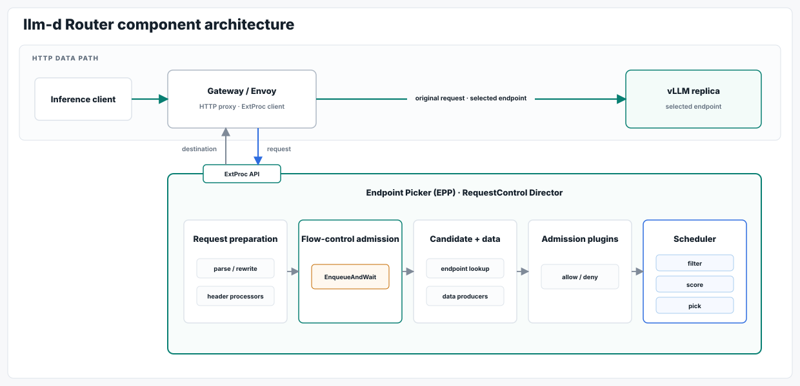

<strong>Router and EPP component guide</strong>

| Component | Role |
|---|---|
| Gateway / Envoy | Owns the HTTP connection, calls the EPP over ExtProc, and proxies the original request to the selected endpoint. |
| ExtProc API | Carries request data to the EPP and returns destination metadata to Envoy. |
| Request preparation | Parses the request, applies model rewrite and header processors, and builds the scheduling request. |
| Flow-control admission | Calls `EnqueueAndWait` and blocks until the request is dispatched or rejected. |
| Candidate + data | Locates eligible endpoints and runs per-request data producers. |
| Admission plugins | Applies request checks before scheduling. |
| Scheduler | Filters endpoints, scores the remaining candidates, and picks a destination. |
| vLLM replica | Serves the original HTTP request after Envoy applies the selected destination. |

### Flow-Control Request Process

This view zooms in on the flow-control path inside the Endpoint Picker. New
requests wait in priority and tenant queues until the dispatch gate admits
them; optional in-flight eviction handles eligible lower-priority work that
has already reached vLLM.

<strong>Flow-control and Async Processor component guide</strong>

| Component | Role |
|---|---|
| Message Queue | Holds queued asynchronous work before dispatch. |
| Async Processor | Owns request dispatch, retry, and exponential backoff. |
| Request Control | The `Director` prepares request context, invokes admission, and runs request lifecycle hooks. |
| Priority Admission | `FlowControlAdmissionController` adapts request control to the flow-control API. |
| Flow Controller | `FlowController` queues the request through `EnqueueAndWait` and waits for a terminal outcome. |
| Dispatch Processor | `Processor` serializes enqueue and dispatch decisions in a single-writer run loop. |
| Priority Queues | `FlowRegistry` maintains priority bands and per-flow queues; fairness selects a flow and ordering selects the request within it. |
| Dispatch Limits | Uses the saturation detector and usage-limit policy to decide whether a priority band may dispatch. |
| In-Flight Eviction | `ReclamationController` sizes and paces eviction; `RequestEvictor` tracks eligible work; `ImmediateResponseEvictor` signals Envoy through ExtProc. |
| Request Lifecycle | Registers dispatched work during `PreRequest` and removes tracking at the end of the response. |
| Gateway / Envoy | Returns the retryable response and resets the evicted vLLM stream. |
| vLLM Replica | Runs admitted work and releases an interrupted sequence after stream reset. |

### Flow-Control Queue Internals

Flow control chooses work in three steps: priority band first, tenant fairness
inside that band, and request order inside the selected tenant queue. The
dispatch gate then decides whether the request may move to worker selection or
must keep waiting in EPP.

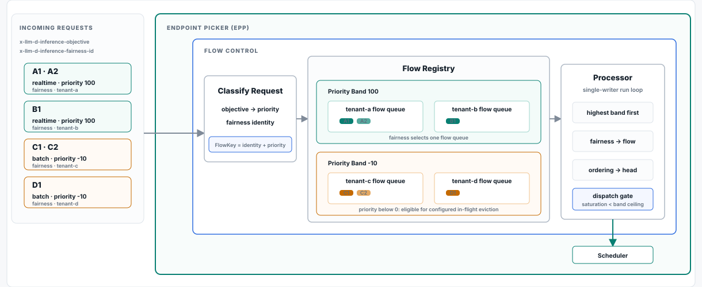

## Results

| Takeaway | Evidence |
|---|---|
| Consolidation preserved realtime priority. | [Tenant consolidation](benchmark-data/upstream-flow-control-v0.9.0/production-scenarios/consolidation/) |
| Flow control protects priority traffic under saturation. | [Priority tiers](benchmark-data/upstream-flow-control-v0.9.0/production-scenarios/priority-tiers/) |
| Lower-priority work absorbs the wait. | [Batch isolation](benchmark-data/upstream-flow-control-v0.9.0/production-scenarios/batch-isolation/) |
| Same-priority fairness prevents one tenant from starving its peers. | [Peer fairness](benchmark-data/upstream-flow-control-v0.9.0/production-scenarios/same-priority-fairness/) |
| Admission tuning changes the latency tradeoff. | [Detector comparison](benchmark-data/upstream-flow-control-v0.9.0/results.html#production) |
| Running batch exposes the boundary of admission control. | [Batch interference](benchmark-data/upstream-flow-control-v0.9.0/batch-interference/) |
| Reserved capacity protected realtime latency after dispatch. | [Batch eviction](benchmark-data/batch-eviction/) |

## Evidence Map

| Suite | Test purpose | Configuration |
|---|---|---|
| [RHAII 3.4 flow control](benchmark-data/rhaii-3.4-flow-control/) | Saturation detector behavior under priority tiers, batch isolation, consolidation, and fairness tests. | Utilization detector with queue-depth saturation. Scheduler image is pinned in the package evidence. |
| [Upstream request-count admission](benchmark-data/upstream-flow-control-v0.9.0/) | Request-count and token-aware admission tests, including `maxConcurrency` tuning and production-shaped scenarios. | Upstream v0.9 was used because request-count admission was not available in the RHAII 3.4 scheduler image. |
| [Batch eviction](benchmark-data/batch-eviction/) | Reserved capacity for realtime latency, plus eviction and retry after lower-priority batch work has entered vLLM. | Experimental PR build with request-count admission, `maxConcurrency=48`, vLLM `max-num-seqs=96`, and batch eviction enabled. |

Each suite covers one test purpose in the larger story.

## Consolidation Preserved Realtime Priority

Multiple tenants used one GPU pool while Realtime tenants stayed ahead. The
first two visuals show how separate tenant queues shared dispatch turns; the
last shows that the lower-priority surge absorbed most of the latency.

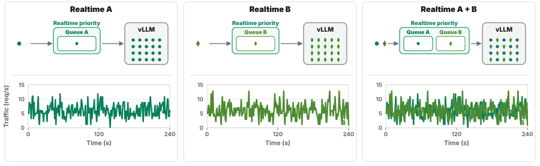

Realtime tenants A and B shared one vLLM replica. Separate tenant queues kept both receiving dispatch turns.

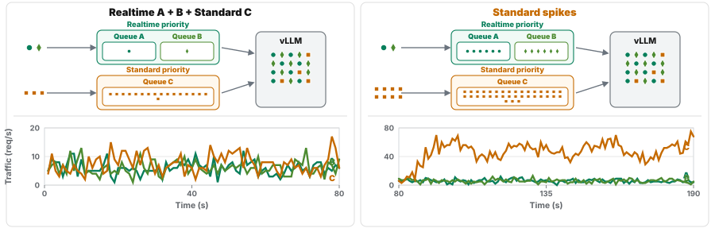

Standard traffic then joined the shared replica and surged. Its lower-priority queue absorbed the backlog while the Realtime queues remained small.

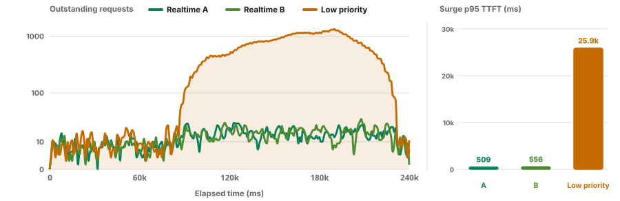

During the surge, both Realtime tenants stayed near 500 ms p95 TTFT. The lower-priority workload absorbed the delay, reaching 25,892 ms.

Upstream v0.9 tenant consolidation, one H100, one model replica, request-count admission with `maxConcurrency=128`. n=3. Median p95 TTFT during the surge window; realtime tenant ranges were 503-558 ms and 505-599 ms. The lower-priority burst range was 22,833-27,307 ms.

Evidence [analysis.json](benchmark-data/upstream-flow-control-v0.9.0/production-scenarios/consolidation/analysis.json) · [summary.csv](benchmark-data/upstream-flow-control-v0.9.0/production-scenarios/consolidation/summary.csv) · [source folder](benchmark-data/upstream-flow-control-v0.9.0/production-scenarios/consolidation/)

## Flow Control Protected Priority Traffic Under Saturation

The priority tiers shared one pool under saturation. Realtime and Standard
stayed below 1,000 ms while the lower-priority Batch tier absorbed the wait,
reaching 13,264 ms p95 TTFT.

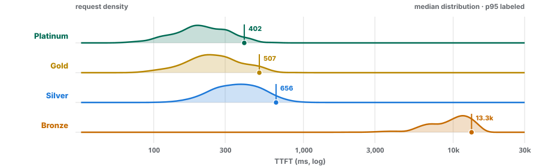

Upstream v0.9 priority tiers, one H100, one model replica, request-count admission with `maxConcurrency=128`. n=3.

Evidence [analysis.json](benchmark-data/upstream-flow-control-v0.9.0/production-scenarios/priority-tiers/analysis.json) · [source folder](benchmark-data/upstream-flow-control-v0.9.0/production-scenarios/priority-tiers/)

## Lower-Priority Work Absorbed the Wait

These two views show the same isolation behavior as a summary and over time.
Realtime and Standard stayed below 1,000 ms while Batch absorbed the surge and
reached 13,077 ms p95 TTFT.

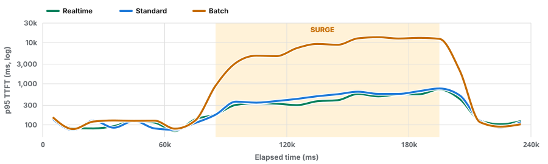

Upstream v0.9 batch isolation, one H100, one model replica, request-count admission with `maxConcurrency=128`. n=3.

Evidence [analysis.json](benchmark-data/upstream-flow-control-v0.9.0/production-scenarios/batch-isolation/analysis.json) · [source folder](benchmark-data/upstream-flow-control-v0.9.0/production-scenarios/batch-isolation/)

## Admission Tuning Changes the Latency Tradeoff

Request-count admission lowered realtime latency in the matched consolidation
comparison. The calibration sweeps show why admission settings must match the
workload and pressure signal.

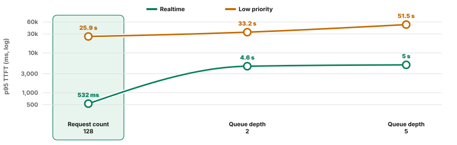

Matched upstream v0.9 consolidation, one H100, one model replica. Request-count admission used `maxConcurrency=128` with 10% headroom; queue-depth thresholds were 2 and 5 waiting requests. Each setting used three repeats. Realtime combines tenants A and B; low priority is tenant C. Points are median surge-window p95 TTFT.

Evidence [analysis.json](benchmark-data/upstream-flow-control-v0.9.0/production-scenarios/consolidation/analysis.json) · [summary.csv](benchmark-data/upstream-flow-control-v0.9.0/production-scenarios/consolidation/summary.csv) · [source folder](benchmark-data/upstream-flow-control-v0.9.0/production-scenarios/consolidation/)

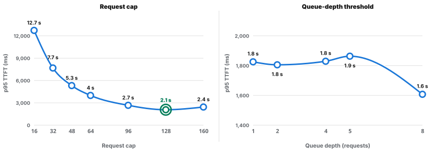

Closed-loop upstream v0.9 calibrations, one H100, one model replica, prefix cache off. The request-count and queue-depth panels used separate workloads and independent millisecond axes. Selected boundaries have three matched runs; intermediate settings are single calibration points.

Evidence [request-count analysis.json](benchmark-data/upstream-flow-control-v0.9.0/request-and-token-admission-calibration/analysis.json) · [request-count summary.csv](benchmark-data/upstream-flow-control-v0.9.0/request-and-token-admission-calibration/summary.csv) · [queue-depth analysis.json](benchmark-data/upstream-flow-control-v0.9.0/utilization-detector-calibration/analysis.json) · [queue-depth summary.csv](benchmark-data/upstream-flow-control-v0.9.0/utilization-detector-calibration/summary.csv)

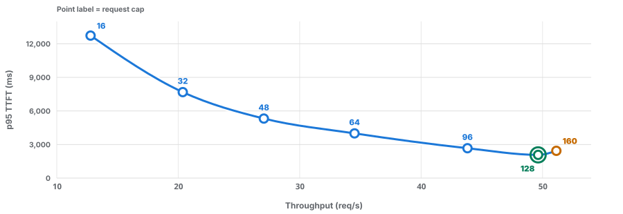

Request-count calibration: cap 160 served 3% more steady throughput than cap 128, while median p95 TTFT increased by 363 ms (17%). Cap 128 was selected for later production tests. n=3 at caps 128 and 160; intermediate caps are single calibration points.

Evidence [analysis.json](benchmark-data/upstream-flow-control-v0.9.0/request-and-token-admission-calibration/analysis.json) · [summary.csv](benchmark-data/upstream-flow-control-v0.9.0/request-and-token-admission-calibration/summary.csv) · [source folder](benchmark-data/upstream-flow-control-v0.9.0/request-and-token-admission-calibration/)

| Policy signal | Appropriate when | Tested observation |
|---|---|---|
| Request count | Request sizes are similar and realtime latency is prioritized | Lowest realtime latency in the matched production comparisons |
| Input tokens | Prompt sizes differ materially | Lower long-context and batch latency in the mixed workload |
| Queue depth | Backend waiting-queue growth is the intended signal | Reactive; responded later in the matched consolidation test |
| KV-cache pressure | Memory pressure is the limiting condition | Verified activation, but not a latency win in calibration |

## Reserved Capacity Gates Priorities; Headroom Gates Replicas

Both controls use tracked in-flight request counts, but they answer different
questions. Reserved capacity compares one pool-wide count with the incoming
request's priority gate; headroom compares each candidate replica's count with
one priority-blind filter.

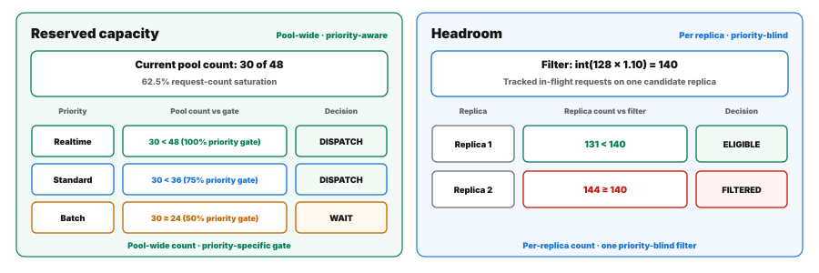

Explanatory states from separate tested configurations. Left: with 30 of 48 requests in flight, realtime and Standard pass their priority gates while Batch waits. Right: 10% headroom moves the per-replica filter from 128 to 140 tracked in-flight requests; a replica at 131 remains eligible and an example replica at 144 is filtered.

## Running Batch Exposes the Boundary of Admission Control

The Realtime arrival pattern was the same in both cases. Realtime p95 TTFT
increased from 133 to 15,378 ms when Batch was already running inside vLLM,
showing what a pre-dispatch gate cannot fix by itself.

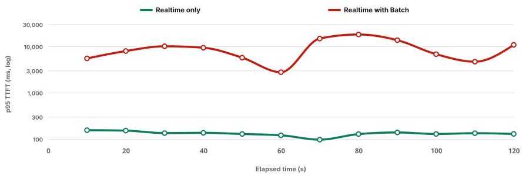

Surge window: 20-100 s elapsed. The reported median p95 TTFT values use this interval.

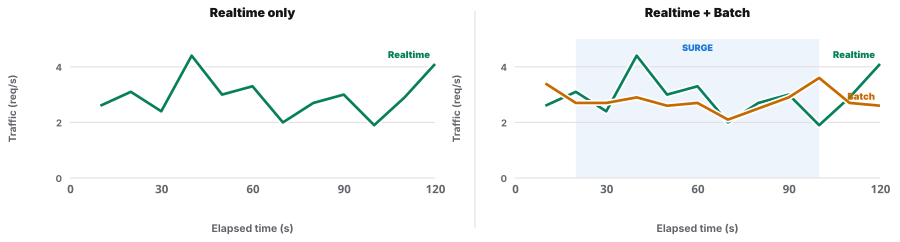

The matched Realtime arrival pattern was unchanged; Batch was already active in the second run.

Upstream v0.9 batch-interference baseline, one H100, one model replica, request-count admission with `maxConcurrency=128`, reserved capacity not configured, eviction not configured. n=3. Median p95 TTFT during the surge window; ranges were 133-137 ms for realtime only and 15,168-15,919 ms with batch already running. This test motivates after-dispatch protection; this test did not measure reserved capacity or eviction.

Evidence [analysis.json](benchmark-data/upstream-flow-control-v0.9.0/batch-interference/analysis.json) · [summary.csv](benchmark-data/upstream-flow-control-v0.9.0/batch-interference/summary.csv) · [source folder](benchmark-data/upstream-flow-control-v0.9.0/batch-interference/)

## Reserved Capacity Protected Realtime Latency After Batch Entered vLLM

The `priority-holdback-policy` is the pre-dispatch gate that creates reserved
capacity. EPP compares the current pool load with a ceiling for the incoming
request's priority band. This lets higher-priority Realtime requests continue
to dispatch while lower-priority Batch waits in EPP. In the matched runs,
Realtime p95 TTFT fell from 561 to 341 ms. The tradeoff was lower Batch
throughput: median completions fell from 2,488 to 1,648 per 300-second run.

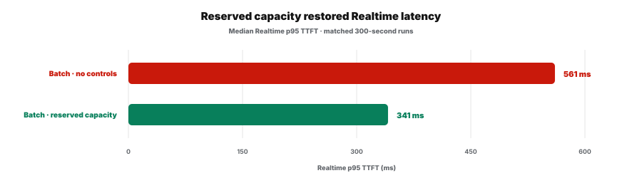

Matched 300-second runs with Batch already active. Reserved capacity lowered median Realtime p95 TTFT by 220 ms, or 39%.

The pre-dispatch gate cannot reclaim a Batch request after EPP has sent it to
vLLM. If lower-priority Batch is already running when Realtime demand arrives,
it can still occupy capacity needed by Realtime. In-flight eviction covers this
case. EPP selects an eligible lower-priority Batch request and signals Envoy to
end its vLLM stream. The Async Processor then safely retries the same request.

With reserved capacity, eviction, and retry, Realtime p95 TTFT stayed near the
Realtime-only baseline at 348 ms. Median Batch completions increased from 1,648
to 1,798 per 300-second run. Together, priority holdback protects new
higher-priority requests before dispatch, while eviction and retry reclaim
capacity from eligible lower-priority work already inside vLLM.

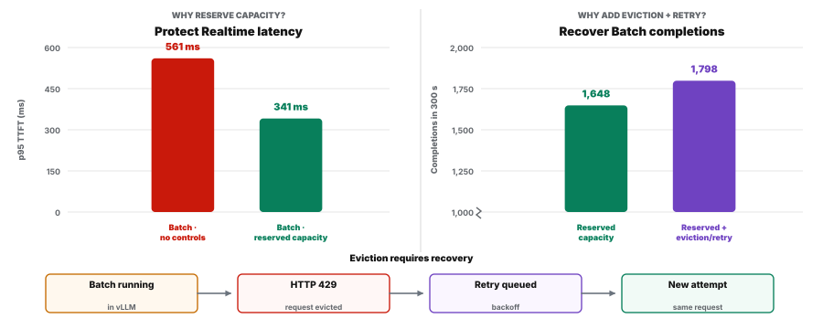

Left: reserved capacity lowered Realtime p95 TTFT from 561 to 341 ms. Right: with reserved capacity held constant, eviction and retry increased median Batch completions from 1,648 to 1,798 per 300-second run.

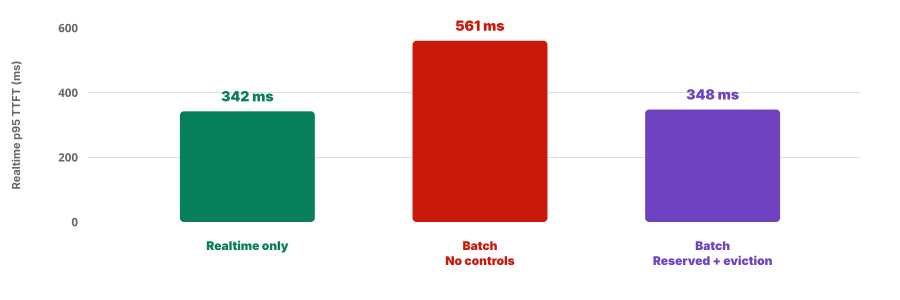

Batch-eviction PR image, one H100, one model replica, request-count admission with `maxConcurrency=48`, vLLM `max-num-seqs=96`. n=3. Median p95 TTFT ranges were 318-345 ms for realtime only, 533-641 ms with Batch and no controls, 324-344 ms with reserved capacity, and 324-472 ms with reserved capacity plus eviction and retry. The two-model package shows eviction and retry across two model replicas.

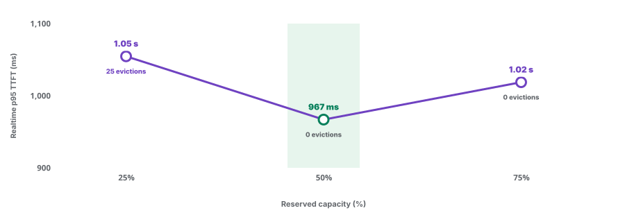

The three-setting sweep held headroom at 0% and kept in-flight eviction enabled. Median Realtime p95 TTFT was 1.05 s at 25% reserved capacity, 967 ms at 50%, and 1.02 s at 75%. The 50% setting was lowest in this sweep.

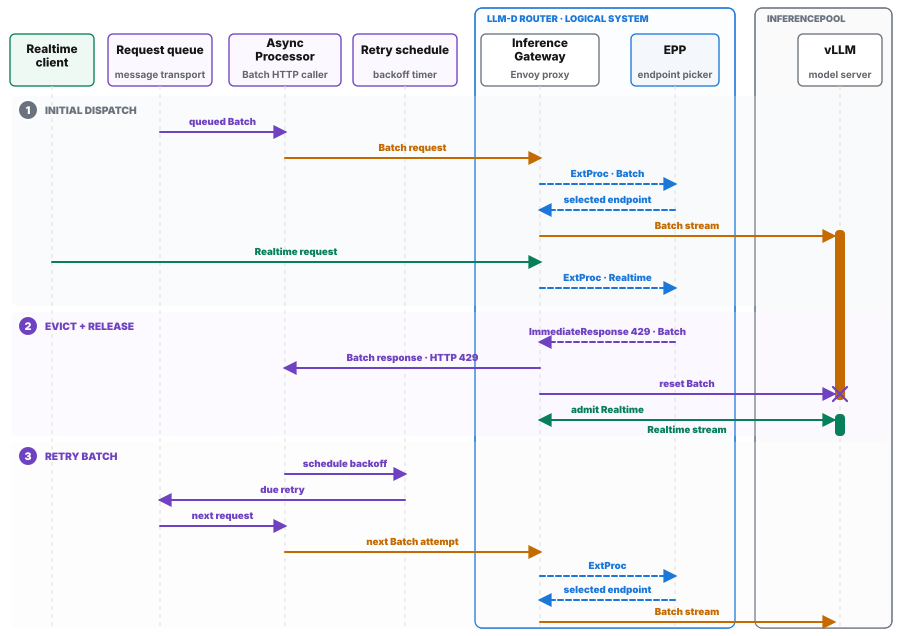

EPP selects the in-flight Batch request and constructs the 429. Envoy returns it to Async Processor and resets the vLLM stream. Async Processor schedules the retry, then consumes it again from the original request queue.

In the single-model proof, all 38 evicted Batch requests were retried; all
5,376 Batch jobs completed with zero duplicate results. Across two model
replicas, all 57 eligible evictions were retried once and produced one final
result.

Evidence [single-model summary.csv](benchmark-data/batch-eviction/single-model-replica/summary.csv) · [two-model analysis.json](benchmark-data/batch-eviction/two-model-replicas/analysis.json) · [source folder](benchmark-data/batch-eviction/)

## Shared Inference Architecture

These diagrams separate the shared inference boundary, Batch job-management
path, sync and async inference paths, and the admission stages inside the
Endpoint Picker.

<strong>Shared inference request boundary</strong>

 

Realtime, direct lower-priority, and expanded Batch requests all enter the same
Inference Gateway. The Endpoint Picker admits each request and selects a vLLM
worker, but Gateway and Envoy own the HTTP stream to that worker.

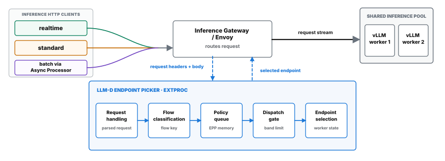

| Component | Responsibility | Operational significance |
|---|---|---|
| Inference request producers | Send realtime, direct lower-priority, or expanded Batch inference requests. | All three request classes converge on the same Inference Gateway; Batch API job submission occurs earlier in a separate path. |
| Inference Gateway / Envoy | Owns the HTTP stream, sends request headers and body chunks to EPP over ExtProc, and applies EPP's response. | Gateway/Envoy—not EPP—opens the selected upstream vLLM stream. |
| Request handling | Reads headers and the parsed inference body, then resolves the routing objective. | This is the first in-process EPP stage, not a separate service. |
| Flow classification | Combines the fairness identity and request priority into a flow key. | The flow key determines which EPP policy queue owns the request. |
| Policy queue | Holds the live request in EPP memory while it waits for admission. | The queue is inside EPP; it is unrelated to the Batch Gateway job queue. |
| Dispatch gate | Compares pool-wide detector saturation with the request's priority-band usage ceiling. | The gate decides whether work waits or advances to worker selection. |
| Endpoint selection | Locates candidates, runs configured data and admission plugins, and schedules a worker after dispatch admission succeeds. | The ExtProc response identifies the worker through destination-header mutation and dynamic metadata. |
| InferencePool | Groups candidate vLLM model-server processes, each with waiting and running scheduler state. | EPP chooses a worker; Envoy sends that worker the request stream. |

<strong>Inside the llm-d Batch Gateway system</strong>

 

Batch job management is separate from inference routing. The Batch API Server
stores the file and job, and the Batch Processor later expands that job into
individual inference requests.

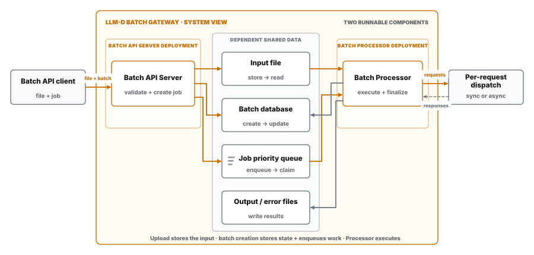

| Component | Responsibility | Operational significance |
|---|---|---|
| Batch API client | Submits files and batch jobs to the Batch API Server. | The client never sends individual inference requests. |
| Batch API Server | Stores the input file; a later call creates the batch record and enqueues a deadline-ordered job. | The API Server and Batch Processor are separate runnable components. |
| Shared data services | Persist input and output files, batch state, progress, and the job priority queue. | These stores connect job submission to later processing; they are not the EPP flow-control queue. |
| Batch Processor | Claims a job, reads its input, expands it into requests, dispatches them, and finalizes results. | It is the HTTP caller in sync mode and publishes requests for Async Processor in async mode. |
| Per-request dispatch | Uses sync HTTP or the configured async request and result queues. | Only expanded inference requests leave Batch Gateway; the original Batch API job does not enter the inference router. |

<strong>How a Batch job reaches inference</strong>

 

A Batch job reaches inference only after the Batch Processor expands it into
individual requests. In sync mode, Batch Processor calls the Inference Gateway
directly; in async mode, Async Processor consumes queued requests and makes the
same HTTP call.

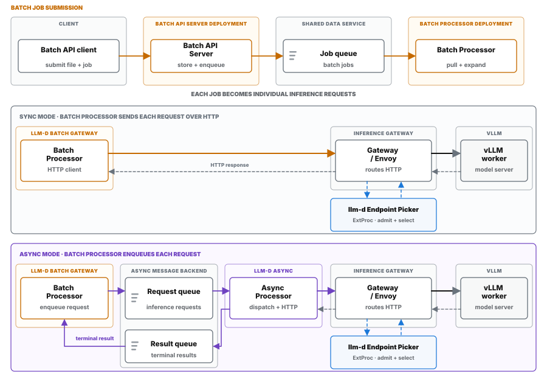

| Component | Responsibility | Operational significance |
|---|---|---|
| Batch API client | Calls the file and batch endpoints. | Job management ends at Batch Gateway; the original job does not enter EPP or vLLM. |
| Batch API Server | Stores the file, records the batch, and enqueues the job. | These are separate API operations, not inference requests. |
| Job queue | Holds whole Batch jobs in external Redis or Valkey storage. | It is separate from EPP's in-memory policy queue. |
| Batch Processor | Pulls a job and expands it into individual inference requests. | Each deployment uses either sync or async dispatch. |
| Sync mode | Batch Processor sends each inference request over HTTP and receives its response. | No Async Processor or external request/result queue participates. |
| Async mode | Batch Processor publishes requests; Async Processor consumes them and calls Inference Gateway over HTTP. | Async Processor is a separate deployment upstream of Inference Gateway. |
| Async request/result queues | Carry individual inference requests and terminal results. | They are external Redis or Valkey structures in the tested integration. |
| Inference Gateway / Envoy | Owns the inference HTTP stream and consults EPP over ExtProc. | Both modes enter the same Gateway data plane. |
| llm-d Endpoint Picker | Admits each request and selects a worker. | EPP selects the worker; Gateway/Envoy owns the stream to vLLM. |
| vLLM | Executes the selected inference request. | It never receives the original Batch API job-management call. |

<strong>Inside EPP: admission and dispatch</strong>

 

Inside EPP, request handling and flow classification place each request in the
right policy queue. The dispatch gate decides when it may advance; endpoint
selection runs only after admission succeeds.

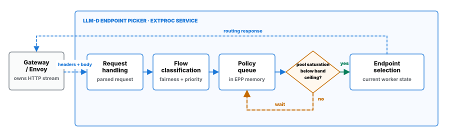

| Component | Responsibility | Operational significance |
|---|---|---|
| Request handling | Reads request headers and the parsed body, then resolves the request objective. | Establishes the policy inputs before queueing. |
| Flow classification | Combines fairness identity with priority. | Determines which policy queue owns the request. |
| Policy queue | Stores the live request in EPP memory until a terminal outcome. | Realtime and lower-priority HTTP share one explicit queueing contract. |
| Dispatch gate | Compares pool saturation with the request's priority-band usage ceiling. | Blocked work stays queued; admitted work advances. |
| Endpoint selection | Locates candidates, runs data and admission plugins, and schedules a worker. | EPP's ExtProc response identifies the selected worker to Gateway/Envoy. |

<strong>Async retry after HTTP 429</strong>

 

Async Processor receives the HTTP 429 because it made the inference request.
It keeps the same internal request for backoff, returns it to the configured
async queue, and starts a new attempt later.

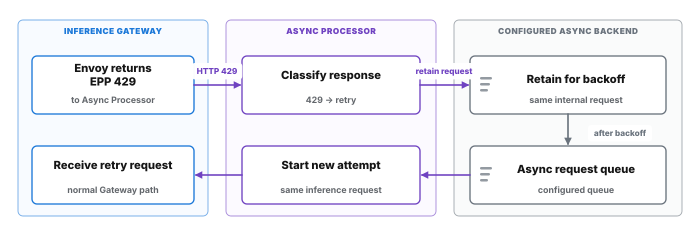

| Stage / owner | Responsibility | Operational significance |
|---|---|---|
| HTTP caller · Async Processor | Initiates the inference request and receives Envoy's HTTP 429 response. | Gateway does not invoke Async Processor. |
| Retry decision · Async Processor | Classifies 429 as retryable and retains the same internal inference request for backoff. | Batch Gateway does not reconstruct the Batch job. |
| Requeue · configured async backend | Returns the request to the configured async request queue for a new HTTP attempt. | The benchmark proves successful retry, but not which version-specific retry-storage implementation was deployed. |

The benchmark package did not record the Async Processor image digest or source
commit. Current llm-d Async uses a retry schedule and mover, while the released
v0.9 implementation requeued directly. The diagram shows the behavior shared
by both paths.

## Claim Boundaries

| Claim | Boundary |
|---|---|
| Flow control protected higher-priority traffic under saturation. | The result applies to the tested model, hardware, traffic shape, detector, and settings. |
| Lower-priority work waited instead of crowding out realtime traffic. | Queue limits, retry behavior, and capacity planning still matter. |
| Consolidation preserved realtime priority. | Cost savings depend on workload mix, utilization targets, and the platform team's service objectives. |
| Admission settings changed where latency landed. | Admission policy controls request ordering. Serving capacity still comes from vLLM and the GPU pool. |
| Reserved capacity protected realtime traffic after batch work had entered vLLM. | The single-model data shows latency protection at the tested load. The two-model data shows eviction and retry across model replicas, not latency scaling. |

The `slo_proof_valid` flag in package analysis means the scenario passed the
benchmark data-quality gate. A production SLO proof remains separate. A full
SLO proof needs a named target, declared load, success-rate target, end-to-end
latency, time per output token, backend pressure metrics, and enough repeats
for the claim being made.

## Evidence Links

| Topic | Status | Note | Link |
|---|---|---|---|
| Combined evidence page | ⚠️ Review or retire | It duplicates the README and predates the latest narrative. | [benchmark-data/results.html](benchmark-data/results.html) |
| RHAII 3.4 saturation detector | ✅ Current | The accepted saturation-detector package remains the source of record. | [benchmark-data/rhaii-3.4-flow-control/](benchmark-data/rhaii-3.4-flow-control/) |
| Upstream v0.9 tuning and scenarios | 🟡 In progress | Package summaries and tuning scenarios are being refreshed. | [benchmark-data/upstream-flow-control-v0.9.0/](benchmark-data/upstream-flow-control-v0.9.0/) |
| Batch eviction | 🟡 In progress | The evidence is published; the narrative and visuals are still being refined. | [benchmark-data/batch-eviction/](benchmark-data/batch-eviction/) |
| Claim matrix | ✅ Current | Claims, evidence, and boundaries match the current README. | [docs/readme-claim-matrix.md](docs/readme-claim-matrix.md) |
| Runner and reproduction | ✅ Current | The runner, artifact contract, validation, and reproduction paths are documented. | [pipeline/README.md](pipeline/README.md) |
| SLO proof protocol | 📋 Reference | This defines the evidence required for a future production SLO claim; it is not a completed benchmark result. | [docs/slo-proof-test.md](docs/slo-proof-test.md) |
| Benchmark | 🔎 Needs audit | This standalone narrative overlaps the README and has not been reconciled with the latest architecture and eviction work. | [benchmark.html](benchmark.html) |
| Flow-control guide | 🔎 Needs audit | The guide is useful, but its architecture and capacity-control explanations need a final consistency pass. | [learn/flow-control.html](learn/flow-control.html) |
| Interactive journey | ✅ Current | The interactive mechanism walkthrough remains usable as published. | [learn/flow-control-journey.html](learn/flow-control-journey.html) |
| Flow Control Flight Recorder | ✅ Current | The linked repository is active and supports the published benchmark-package format. | [flow-control-visualizer](https://github.com/alexagriffith/flow-control-visualizer) |
