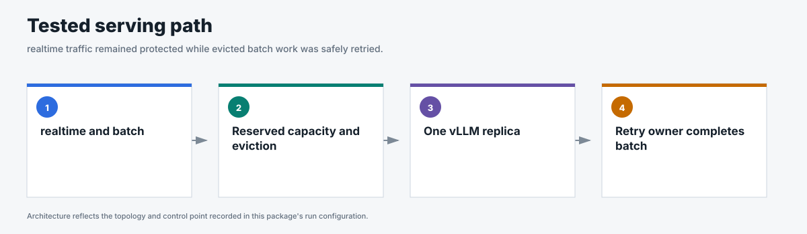
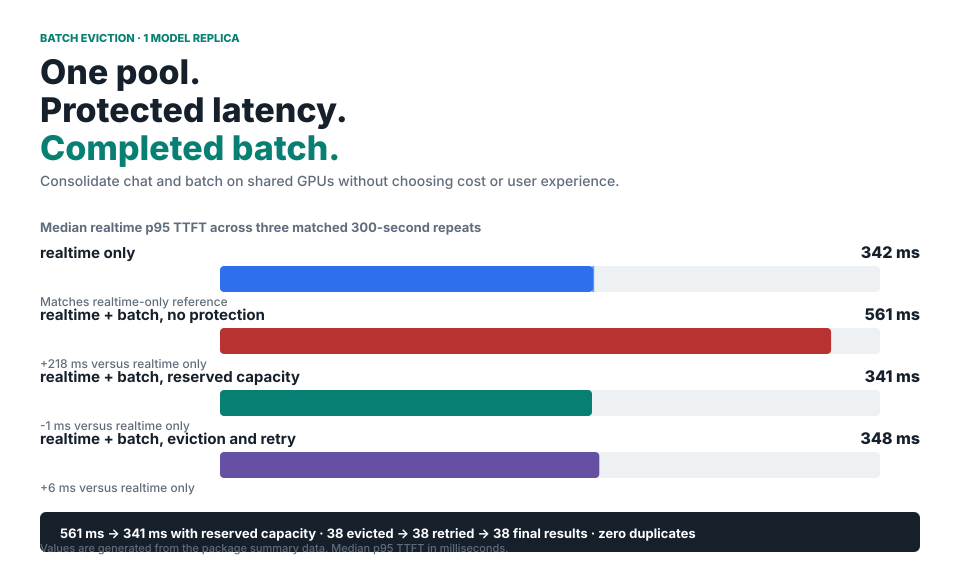

# Batch eviction and retry

This benchmark tests whether flow control protects higher-priority realtime p95
TTFT while lower-priority batch workloads share the same GPU. When realtime
demand needed capacity, batch work was evicted, retried, and completed later.

<!-- generated:package-visuals -->

## Visual summary

[Tested configuration](tested-config.yaml)

<!-- /generated:package-visuals -->

## What the benchmark showed

- The median realtime p95 time to first token was 342 ms with realtime traffic alone.
- The median realtime p95 time to first token increased to 561 ms when batch could use
  all request capacity.
- The median realtime p95 time to first token was 341 ms with capacity reserved for
  realtime traffic.
- The median realtime p95 time to first token was 348 ms with reserved capacity,
  batch eviction, and retry enabled. The three repeats ranged from 324 to 472 ms.
- All 38 evicted batch requests were retried and completed.
- The eviction-and-retry runs completed 5,376 batch jobs with zero duplicate results.

The latency values are medians of the per-run p95 across three matched 300-second
repeats. All 12 runs passed the data audit. Ten runs completed every offered
realtime request; the two single-request misses remain in the published data.

## Matched scenarios

| Scenario | Batch condition | Protection | Question |
|---|---|---|---|
| Realtime only | No batch traffic | None required | What is the realtime latency reference? |
| Realtime with batch and no protection | Batch starts first and can use all request capacity | None | How much does running batch affect realtime latency? |
| Realtime with reserved capacity | Batch starts first | Capacity remains available for realtime | Can admission policy prevent the interference? |
| Realtime with batch eviction and retry | Batch starts first | Reserved capacity, eviction, and retry | Can running batch be reclaimed and completed later? |

Reserved capacity produced the latency result. Eviction added recovery when
batch was already running: the Endpoint Picker ended selected batch streams,
and the Async Processor retried those requests to completion.

## Fixed configuration

- One NVIDIA H100 GPU serving GPT-OSS 20B with Red Hat AI 3.4 vLLM.
- vLLM `max-num-seqs=96` and `max-num-batched-tokens=8192`.
- Endpoint Picker concurrency detector in request mode with
  `maxConcurrency=48` for the protected scenarios.
- Priority holdback used a linear rank policy with `minCeiling=0.50`.
- Realtime traffic began with a 32-request burst and continued as a seeded
  open-loop Poisson process with a sinusoidally varying request rate for
  300 seconds.
- Batch began 60 seconds before realtime traffic and maintained an Async
  Processor backlog.
- Prefix caching was disabled and verified through zero cache-query and
  cache-hit deltas.
- Three repeats used matched traffic seeds and counterbalanced scenario order.

The complete configuration is in [`run-config.json`](run-config.json).

## Evidence

- [`summary.csv`](summary.csv) contains the 12 accepted runs with metric names
  and units in the column headers.
- [`eviction-retry-correlation.csv`](eviction-retry-correlation.csv) contains
  one sanitized row for each of the 38 evicted requests and records the observed
  issue, abort, retry, and single final result.
- [`batch-completion-index.csv`](batch-completion-index.csv) contains one
  sanitized row for each of the 5,376 batch jobs in the eviction-and-retry
  runs.
- [`results-brief.html`](results-brief.html) is the full visual report: matched
  proof, retry path, 20-scenario inventory, capability boundary, run database,
  filtering, and CSV export.
- [`takeaways.html`](takeaways.html) is a shorter narrative with architecture,
  reclaim timing, and ceiling-sweep charts.
- [`results.html`](results.html) mirrors `results-brief.html` for older links.
- [`run-config.json`](run-config.json) records the fixed traffic, vLLM,
  Endpoint Picker, and Async Processor settings.

## Scope

This package covers one model replica. The separate
[`two-model-replicas/`](../two-model-replicas/) package tests the same
eviction-and-retry mechanism across two model replicas. Neither package sets a
fixed service-level objective.
