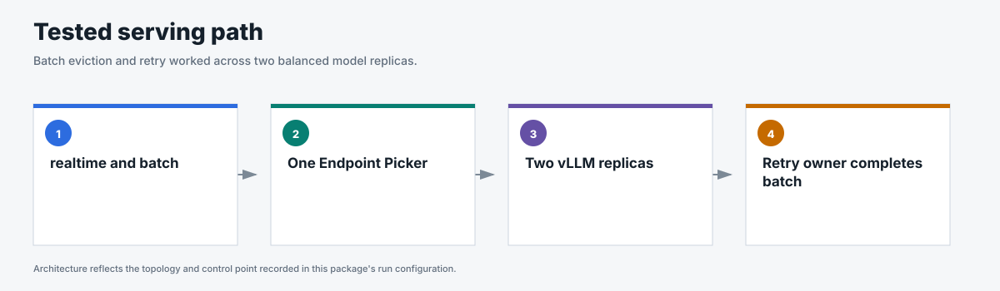
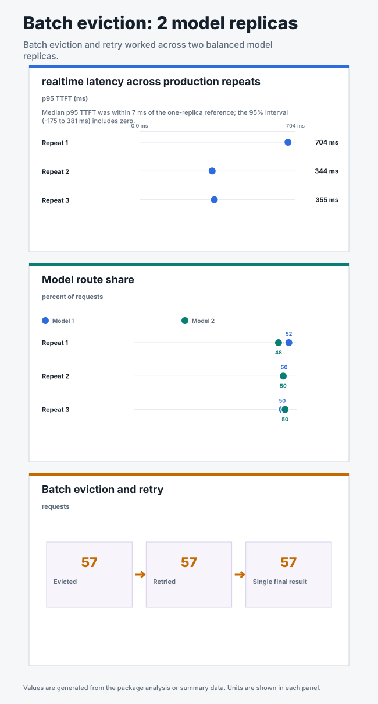
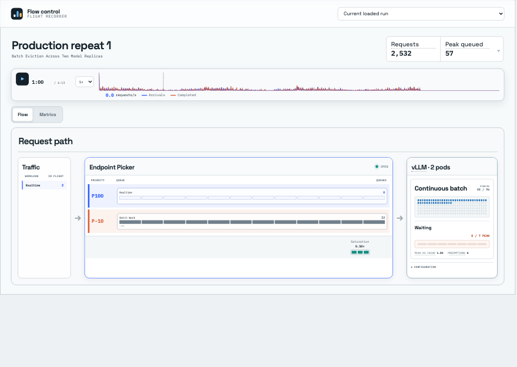

# Batch eviction across two model replicas

This benchmark tests whether one Endpoint Picker can protect higher-priority
realtime traffic while batch workloads run across two model replicas. When
realtime demand needed capacity, lower-priority batch work was evicted and
retried.

## Business question

Does batch eviction and retry continue to work when one Endpoint Picker serves
two model replicas?

**Answer.** Eviction and retry worked across both model replicas; run-to-run
variance leaves the small latency difference from the single-model reference
inconclusive.

<!-- generated:package-visuals -->

## Visual summary





[Tested configuration](tested-config.yaml)

[Replay this package with Flow Control Flight Recorder](https://github.com/alexagriffith/flow-control-visualizer#replay-a-published-benchmark-package)

<!-- /generated:package-visuals -->

## Recorded replay

[](replay.mp4)

Accepted production repeat 1, replayed from 45 to 75 seconds at 1× speed. The replay shows one Endpoint Picker, two model replicas, the batch queue, and recorded model pressure. Eviction and retry outcomes remain in [`eviction-retry-correlation.csv`](eviction-retry-correlation.csv).

## What the benchmark showed

- Flow control engaged in all three production repeats.
- All 57 evicted batch requests were retried, and each produced one final result.
- Both model replicas received realtime and batch requests. Each processed 48%
  to 52% of the request and token load.
- The realtime success rate was 99.987% across 7,690 offered requests. One
  request received an HTTP 429 response during the first repeat.
- The median realtime p95 TTFT was 355 ms across the two-model repeats. The
  single-model reference was 348 ms at the same per-GPU load.

The measured p95 TTFT difference was 7 ms. Its 95% confidence interval ranged
from -175 ms to 381 ms, so the benchmark does not establish a latency scaling
improvement or regression. The three production repeats measured 704 ms,
344 ms, and 355 ms. A separate same-seed follow-up measured 561 ms after the
model replicas were redeployed; the replica labels identify positions within
each run, not the same physical pods across runs.

## Why the p95 varied

The traffic begins with a 64-request burst while batch work already occupies
both models. The initial burst produced higher TTFT than the later noisy traffic.
The slow requests were distributed across both model replicas, which rules out
persistent routing imbalance. The benchmark did not capture vLLM scheduler-step
composition, so it does not attribute the variation to a specific scheduling
decision.

## Method

- One Endpoint Picker served two vLLM model replicas on two NVIDIA H100 GPUs.
- Aggregate traffic doubled from the single-model reference: realtime increased
  from 4 to 8 requests per second, the initial burst increased from 32 to 64
  requests, and the batch backlog increased from 64 to 128 jobs.
- Each model used `max-num-seqs=96` and
  `max-num-batched-tokens=8192`.
- The Endpoint Picker used request-concurrency detection with
  `maxConcurrency=48` per model replica and `minCeiling=0.50`.
- Batch started 60 seconds before realtime traffic. Realtime then ran for 300
  seconds as seeded open-loop Poisson traffic with a sinusoidally varying rate.
- Prefix caching was disabled. Cache counters remained zero, and vLLM recorded
  no preemptions.
- Two direct requests to each model checked readiness. A separate 60-second
  uncounted full-load probe warmed and validated the complete request path before
  the three production repeats.

The complete configuration is in [`run-config.json`](run-config.json).

## Evidence

| File | Contents |
|---|---|
| [`summary.csv`](summary.csv) | Run-level latency, throughput, routing, queue, KV cache, and retry metrics with units in the headers. |
| [`realtime-requests.csv`](realtime-requests.csv) | One sanitized row per realtime request, including traffic phase, dispatch lag, latency, queue state, and routed model replica. |
| [`traffic-samples.csv`](traffic-samples.csv) | Endpoint Picker, per-model vLLM, Async Processor, and Redis measurements collected during each run. |
| [`eviction-retry-correlation.csv`](eviction-retry-correlation.csv) | One row per eviction showing the Endpoint Picker issue, Envoy retry signal, vLLM abort, retry, and final-result count. The running-request drop is sampled; its cell is blank when the gauge did not capture a drop within the observation window. |
| [`batch-completion-index.csv`](batch-completion-index.csv) | One sanitized row per batch job, including completion status, latency, eviction count, and duplicate-result check. |
| [`analysis.json`](analysis.json) | Statistical comparison, confidence intervals, burst timing, and the claim boundary. |

## Scope

This package establishes the tested eviction-and-retry mechanism with one
Endpoint Picker and two model replicas. It does not test multiple Endpoint Picker
replicas, set an absolute service-level objective, or establish a small latency
scaling difference with three repeats.

## Verify the published package

From the repository root:

```bash
python3 pipeline/generate_package_configs.py --check
python3 pipeline/generate_package_visuals.py --check
python3 pipeline/validate_batch_eviction_packages.py
```

These commands confirm that the tested configuration, visual summary, and
published evidence agree with the accepted data.
