# Original RHAII 3.4 flow-control campaign

This historical overview retains the original tables and figures for provenance. The corrected 300-second service-tier result below uses per-repeat percentiles. The older batch, consolidation, fairness, output-length, and multi-replica percentile figures are historical and are not current validated latency headlines; see the [restated walkthrough](../../benchmark-walkthrough.html) and [RHAII 3.5 takeaways](../../benchmark.html) for their respective scopes.

Flow control is the Endpoint Picker's policy layer for multi-tenant inference. Priority is resolved before admission, independently of pool pressure. With room and no backlog, dispatch can be prompt. Under congestion, work waits in policy-aware queues, and the saturation gate determines when the selected request can dispatch.

This repo holds the measured evidence, the charts drawn from it, the per-request data, and the runner that produced it. Everything ran on one H100 serving GPT-OSS 20B behind the llm-d inference gateway, with automatic prefix caching off. This removes reused prompt-prefix effects; measured latency still includes both router and engine work.

Public display labels and claim boundaries for the run folders live in
[`./RUN-METADATA.json`](./RUN-METADATA.json), so tools can show
readable scenario names instead of raw repeat ids.

## What flow control does, in one screen

The gate-on and gate-off comparisons used the same configured client-concurrency schedules and GPU. These closed-loop clients generated different request counts when rejection or queueing changed response times, so the comparisons do not hold arrival rate fixed. Premium is the interactive tier, standard is normal traffic, batch is deferrable background work.

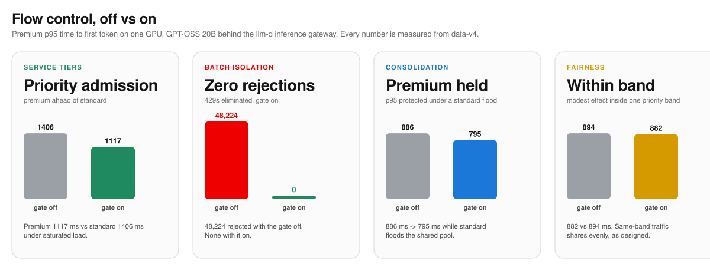

- **A surge that isn't yours no longer gets equal priority.** Under a saturated standard surge, flow control on held premium p95 time to first token at 1117 ms versus 1406 ms for standard, with a 1056-1211 ms range across three 300 s repeats. Standard had the higher measured TTFT; end-to-end TTFT alone does not locate the extra wait.
- **Batch overload shifted toward queueing in these runs.** Across three repeats, the runs without flow control returned 48,224 batch HTTP 429 rejections. With flow control on, zero. The platform held the deferrable work until capacity existed instead of pushing retries back to the application.
- **A calm pool provides a baseline.** Low-load comparisons help measure policy overhead. They do not establish zero cost across deployments.

**How to read the numbers.** The pool is one GPU, so the absolute latencies track that hardware, model shape, and offered load. The measured finding is priority admission: premium is served ahead of standard under saturation, and deferrable work waits instead of failing. A hard SLO claim needs a named objective and tests that report TTFT, end-to-end latency, TPOT, and success rate under the target load; see [SLO proof tests](../../docs/slo-proof-tests.md) and the [execution plan](../../docs/slo-proof-execution-plan.md).

## How we chose the operating point and configuration

Before any scenario, we swept a single tenant from 32 to 200 concurrent requests to find where this pool saturates. Throughput peaked at 128 concurrent requests, then fell: past that point the closed loop piled on latency without more goodput, and vLLM's running batch stayed pinned at its 128 limit with a real queue behind it. The sweep selected 128 concurrent clients as an operating point; it kept the engine cap fixed at 128. This is not a measurement of the effect of changing the engine cap.

The rest of the configuration follows from making the measurement honest rather than flattering:

| Choice | Value | Why |
|---|---|---|
| Request shape | 512 in / 128 out | A single fixed shape so every number is comparable; the output ladder (64, 128, 512) is varied separately |
| `max-num-seqs` | 128 | The GPU's running-batch limit; saturation means offered load beyond this, not that the H100 was exhausted |
| Prefix caching | off | Removes prompt-prefix reuse from this comparison; router and engine work still contribute to latency |
| Repeats | 3 counted; 300 s for corrected SLO-sensitive runs | Repeats capture run-to-run variance; SLO-sensitive claims use per-repeat p95 with a min-max range, never pooled repeats |
| Priority | verified per run | Premium had to resolve to priority 100 in the flow-control queue metric before a run counted |

The sweep was run at 180 s per point over two passes in randomized order, and the two passes agreed. Data in [`./operating-point-sweep`](./operating-point-sweep).

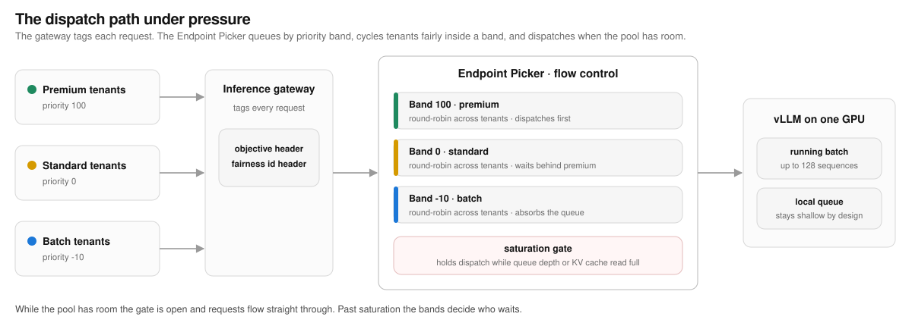

## Service tiers under mixed load

**What it proves.** When the pool saturates, priority decides who waits. Premium stays ahead while standard absorbs more of the queue.

**What we saw.** Standard traffic surged past what the GPU could absorb, so vLLM ran a full batch of 128 with requests waiting behind it. The corrected 300 s gate-on rerun held premium p95 TTFT at 1117 ms, with a 1056-1211 ms range across repeats, while standard landed at 1406 ms. This is measured tier separation in the gate-on configuration, not a direct measurement of which queue produced the difference.

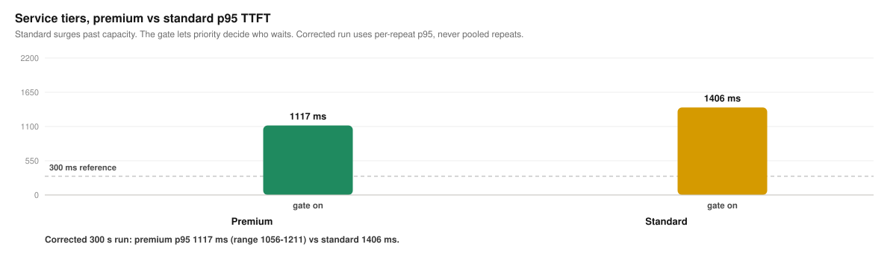

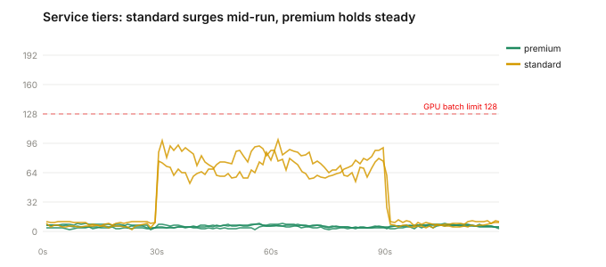

The arrivals are noisy sinusoidal, so the load looks like production rather than a flat synthetic ramp. Standard surges past the GPU batch limit mid-run; premium holds a low steady rate throughout.

| tier | p50 on | p90 on | p95 on | p95 range |
|---|---|---|---|---|
| premium | 374 ms | 914 ms | 1117 ms | 1056-1211 ms |
| standard | 593 ms | 1240 ms | 1406 ms | 1250-1488 ms |

An earlier cut pooled all repeats into one percentile and produced a 251 ms tiers headline. That number is withdrawn. The corrected method computes p95 per repeat and reports the median with the min-max range, so run-to-run variance cannot disappear inside a pooled percentile.

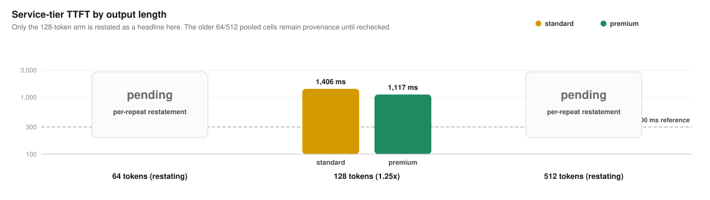

Corrected 300 s gate-on data is in [`./tiers-gate-on-300s`](./tiers-gate-on-300s). The older 64- and 512-output cells remain in `./` for provenance, but their pooled output-length ratios are not used as headline SLO evidence until restated with the same per-repeat method.

**Why it matters.** A latency-sensitive product gets preferential admission through a surge it did not cause. That is a necessary part of enforcing tiered service objectives on shared capacity, but not the whole SLO proof by itself.

*Noisy priority run, 512 input / 128 output tokens, three counted 300 s repeats. Premium resolved to priority 100, verified in the flow-control queue metric before counting. Data in [`./tiers-gate-on-300s`](./tiers-gate-on-300s).*

## Batch isolation under surge

**What it shows.** In this closed-loop comparison, flow control shifted batch overload from rejections to queueing. That does not by itself prove unchanged interactive latency or eliminate retry needs in other conditions.

**What we saw.** Batch traffic ramped past what the pool could serve. Without flow control, the saturation shed load, and 48,224 requests returned HTTP 429. With flow control on, zero requests were rejected. Batch queued behind the interactive tiers. The historical percentiles below are retained for provenance and do not establish unchanged interactive latency. Because clients waited longer before issuing their next requests, the arms did not receive equal request counts.

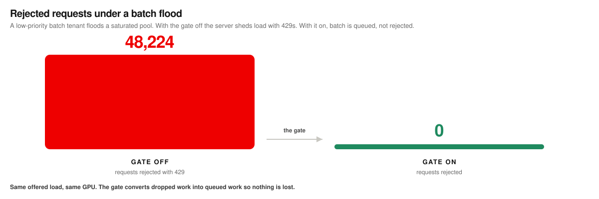

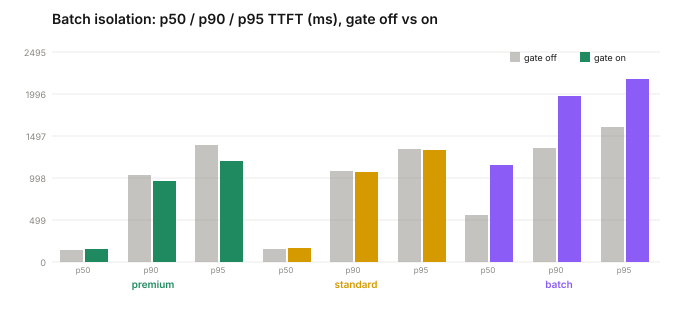

| tier | p50 off | p90 off | p95 off | p50 on | p90 on | p95 on |
|---|---|---|---|---|---|---|
| premium | 145 ms | 1030 ms | 1394 ms | 154 ms | 968 ms | 1196 ms |
| standard | 155 ms | 1082 ms | 1347 ms | 164 ms | 1069 ms | 1328 ms |
| batch | 559 ms | 1354 ms | 1605 ms | 1148 ms | 1975 ms | 2173 ms |

Gate off, 48,224 batch requests were rejected with HTTP 429. Gate on, zero. Batch's TTFT rises because it is queued behind the interactive tiers instead of being shed.

**Why it matters.** Without the gate, application teams build retry and backoff for the requests the platform refuses. With it, overnight document and report pipelines can fill the same GPUs that serve interactive traffic by day, and the platform holds the work until capacity exists. That is what lets a consolidated pool run hot.

*Batch isolation run, three counted repeats. Premium and batch priorities verified before counting. Data in [`./batch-gate-on`](./batch-gate-on) and [`./batch-gate-off`](./batch-gate-off).*

## Historical consolidation comparison

**What it tests.** Whether two premium tenants sharing one GPU retain acceptable latency when a standard tenant floods the pool.

**What we saw.** Two premium tenants ran together while a standard tenant ramped in and pushed the pool to a full batch of 128 with requests waiting. The original pooled figures were premium p95 TTFT 795 ms and standard 1062 ms. These percentile headlines are withdrawn pending per-repeat restatement; they do not establish preserved latency or an SLA.

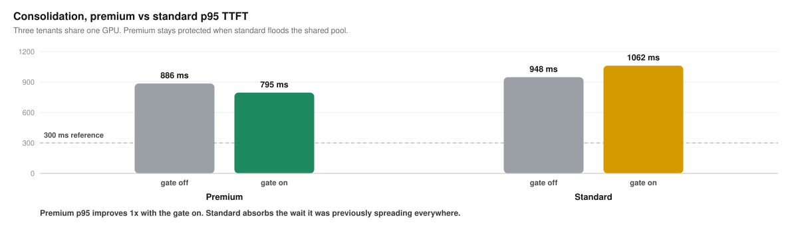

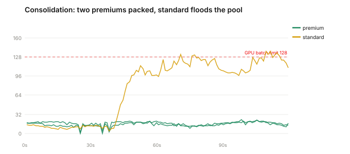

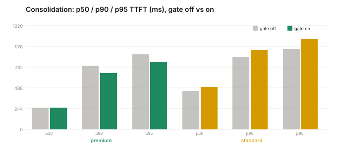

| tier | p50 off | p90 off | p95 off | p50 on | p90 on | p95 on |
|---|---|---|---|---|---|---|
| premium | 256 ms | 750 ms | 886 ms | 256 ms | 664 ms | 795 ms |
| standard | 455 ms | 849 ms | 948 ms | 499 ms | 935 ms | 1062 ms |

**Why it matters.** A consolidation decision needs validated latency targets and capacity evidence for the intended workloads. The historical figures alone establish neither an SLA nor hardware savings.

*Saturated consolidation run, three counted repeats. Data in [`./consolidation-gate-on`](./consolidation-gate-on) and [`./consolidation-gate-off`](./consolidation-gate-off).*

## The boundary: priority acts across tiers, not among equals

Flow control decides which priority band is served first. That is where its leverage is, and it is also where the leverage ends. Two runs mark the edge.

**Same-band fairness.** We ran three tenants at the same priority and had one of them burst to several times the load of the other two, to see whether the greedy tenant could starve its well-behaved peers. Round-robin shares available dispatch turns among nonempty tenant queues within the selected band. It does not guarantee equal token throughput or a latency target. Peer latency can improve when a burster loses exclusive access to dispatch turns; the historical table below is not proof that fairness cannot improve latency.

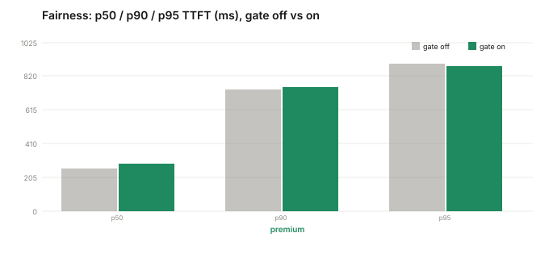

| tier | p50 off | p90 off | p95 off | p50 on | p90 on | p95 on |
|---|---|---|---|---|---|---|
| premium, all three at priority 100 | 258 ms | 740 ms | 894 ms | 290 ms | 752 ms | 882 ms |

**A calm pool.** With capacity available and little backlog, requests may spend little time waiting. A matched low-load comparison is needed to quantify overhead.

Both results scope the strong ones. Flow control changes who waits when tiers contend for a full pool. Same-priority tenants still share dispatch turns through the configured fairness policy; with room and little backlog, the visible effect may be small.

## The concurrency detector, and the limit of a latency SLO

Every result above uses the shipped **utilization detector**, which compares vLLM queue depth and KV-cache utilization with their thresholds. An alternative **concurrency detector**, from upstream llm-d, caps in-flight concurrency directly. The two answer the saturation question differently, so we swept the concurrency detector to see whether it does better on an absolute latency target. We swept its `maxConcurrency` from 32 to 128 to find whether any setting holds premium under 300 ms at a saturating load.

The premium p95 TTFT traces a U: it bottoms at 461 ms at `maxConcurrency` 48, then rises as the cap loosens and premium competes with more admitted standard traffic. Standard improves as the cap loosens, from 12.7 s down to 2.7 s.

What the sweep tells a platform team:

- **The cap is a tuning dial, not a switch.** `maxConcurrency` sets where the pain lands between premium and standard, and the two move in opposite directions across it.
- **The premium-optimal point is not the tightest one.** Premium is best at `maxConcurrency` 48, not 32. Below the optimum, even premium starts to queue; above it, premium's tail climbs as more standard traffic is admitted alongside it.
- **Tightening the cap trades standard's latency for premium's.** At 32, premium is protected and standard waits 12.7 s; at 128 they converge. You pick the point your SLAs demand.
- **A concurrency cap is a separation control, not a latency-SLO control.** No tested setting reached premium p95 under 300 ms at this load. That result calls for further workload, capacity, and configuration testing; it does not prove that reducing load is the only way to meet the target.

*Upstream concurrency-detector sweep, matched load, premium resolved to priority 100. Data in [`./upstream-sweep`](./upstream-sweep).*

## SLO proof tests

The results above show priority admission and batch deferral. To claim that a deployment keeps a specific SLO, the benchmark has to define that SLO and pass it on all required axes: TTFT, end-to-end latency, TPOT, and success rate. The test design is in [`docs/slo-proof-tests.md`](../../docs/slo-proof-tests.md), with the public evidence protocol in [`docs/slo-proof-execution-plan.md`](../../docs/slo-proof-execution-plan.md). The short version:

- **Closed-loop priority admission test:** confirms the gate puts premium ahead of standard under saturation.
- **Open-loop SLO test:** drives a named request rate with Poisson arrivals and checks whether premium meets the target at p95/p99.
- **Success-rate test:** treats 429, 503, and timeout as SLO failures, not just latency exclusions.
- **Decode and memory test:** reports TPOT and KV/preemption metrics so a fast first token cannot hide slow generation.
- **Detector comparison:** compares utilization gating with concurrency caps at matched offered demand and checks the same latency and success targets.

## Scope

Every run above is a single replica, so cross-pod scoring was not the subject; what is measured is priority admission control on one pool. A two-replica pass reported a legacy pooled premium p95 TTFT of 177 ms, withdrawn pending per-repeat restatement (data in [`./multi-replica-tiers`](./multi-replica-tiers)). The multi-replica behavior of the endpoint picker is a separate study.

A verification gap earlier in this campaign sent tenants to pools without priority objectives, so the gate saw every request at priority 0 and the tier results collapsed to no effect. Every counted run here was re-run with the priority resolution verified in the flow-control queue metric before the data was kept. The invalidated runs are archived, not deleted, and the correction is recorded in the run log.

## The benchmark

**[How we got the numbers, one pass at a time](../../benchmark-walkthrough.html)** is the longer story behind the results above: what was tested in what order, where a measurement turned out to be measuring the wrong thing, and how the campaign landed on numbers that survive scrutiny.

## Learn flow control

**[Open the interactive explainer](https://alexagriffith.github.io/flow-control-benchmarks/learn/flow-control-interactive.html)**

Explore the dispatch path, admission gates, and policy behavior under pressure, then change the load in the playground. It supports guided playback and light or dark themes. Source is at [`learn/flow-control-interactive.html`](../../learn/flow-control-interactive.html). [The written explainer](https://alexagriffith.github.io/flow-control-benchmarks/learn/flow-control-written.html) is the same material as a page to read.

## Pipeline

`pipeline/benchmark_v4.py` is the runner that produced every accepted run. It drives multi-tenant traffic through the gateway with per-tenant objective and fairness headers, verifies priority resolution and gate state before counting, logs every request, scrapes vLLM and Endpoint Picker metrics, and writes one directory per repeat with `client_samples.csv`, `metric_samples.csv`, and `summary.json`. `pipeline/gen_charts.py` draws every chart in `assets/` from those CSVs. Same data in, identical charts out.

The first campaign's report and its run-level data are archived in [`archive/`](../../archive/) so the progression is visible. The corrected per-repeat service-tier result supersedes its earlier headline; other historical percentiles remain subject to the limitations above.

## Other resources

- [First pressure campaign report](../../report/flow-control-under-pressure.html) — the 2026-07-21 run, kept for the progression. It ran with prefix caching on, so its latencies reflect a warm cache; the report carries that note at the top. Use the corrected per-repeat result and the claim boundaries above when comparing campaigns.
