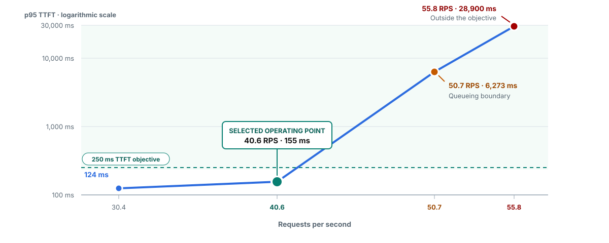
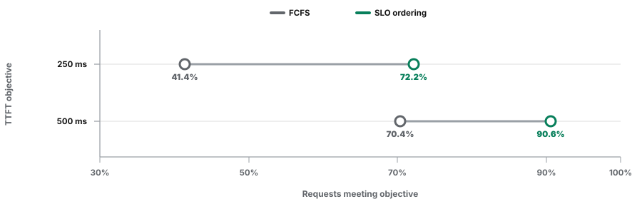

# Red Hat AI Inference 3.5 flow-control campaign

This package documents Red Hat AI Inference 3.5 running pinned OpenDataHub
builds of the llm-d router Endpoint Picker. It contains normalized results,
two reviewed evidence charts, focused analyses for soft provisioned
throughput (PT) and prefill/decode (P/D) flow control, and the sanitized active
configuration for the P/D recipe. The Batch eviction study uses a separately
labeled experimental Endpoint Picker build.

## Business question

How should a shared inference service protect requests with tighter latency
objectives while still using available GPU capacity for other work?

**Answer:** first measure the service's capacity against its latency objective.
Then apply the control at the point where pressure occurs: SLO deadline
ordering inside one flow, priority holdback across service classes,
metrics-gated Async Batch before dispatch, eviction for retry-owned work
already inside vLLM, and stage-aware hybrid admission for P/D serving.

## Tested stack

| Component | Tested identity |
| --- | --- |
| Product stack | Red Hat AI Inference 3.5 |
| Primary router source | llm-d router v0.10, commit `e1029b30a12a89312752aef345c6be36c36828cd` |
| Primary router build | OpenDataHub Endpoint Picker build |
| Primary router image | `quay.io/opendatahub/odh-llm-d-router-endpoint-picker@sha256:275037b7611b2d51faedae4437321014ebac349920c0440a2afb688e82430585` |
| Batch eviction exception | Experimental Endpoint Picker digest `sha256:12552e243168ebc9ccd6905acda939adc7cf55ccc9214097e91ab569cc648c01` with the in-flight eviction implementation |
| P/D Endpoint Picker | OpenDataHub stage-aware build `quay.io/opendatahub/odh-llm-d-router-endpoint-picker@sha256:05e5510b46136f7d02eaa602cd1223ae77c2d67e807d4222324215d74280670d` |
| P/D topology | GPT-OSS 20B with one tensor-parallelism-1 prefill pod and one tensor-parallelism-1 decode pod, each on one H100 on the same node, with NVIDIA Inference Xfer Library (NIXL) KV transfer |
| Model and accelerator | GPT-OSS 20B on one H100 unless a result states otherwise |
| Prefix caching | Off |

The primary results characterize the OpenDataHub router build on the Red Hat AI
Inference 3.5 stack. The Batch eviction result is scoped to its experimental
router digest. Both identities remain explicit so readers can distinguish
research evidence from a certified-product-image claim.

## What the campaign tested

[`results.json`](results.json) is the normalized public result record, and
[`manifest.json`](manifest.json) records a Secure Hash Algorithm 256-bit
(SHA-256) hash for every published file. A hash is a file fingerprint: the
validator recalculates it and reports if a file changed after review. The soft
PT and P/D rows also have focused analyses. The P/D row includes the exact
active plugin graph used by the accepted recipe.

| Evidence group | Tested comparison | Public record | Configuration |
| --- | --- | --- | --- |
| Calibration | Capacity and service-level-objective (SLO) sweep | [`results.json`](results.json) | Values in result record |
| Reproduction | Priority tiers, Batch isolation, consolidation, and same-priority fairness | [`results.json`](results.json) | Values in result record |
| Calibration | Request concurrency versus queue-depth utilization (QD2 and QD5) | [`results.json`](results.json) | Values in result record |
| New | First-come, first-served (FCFS) versus SLO deadline ordering | [`results.json`](results.json) | Values in result record |
| New | Fixed priority holdback versus soft-reflective ceilings | [`results.json`](results.json) | Values in result record |
| New | Fixed synchronous, synchronous additive-increase/multiplicative-decrease (AIMD), and metrics-gated Async Batch dispatch | [`results.json`](results.json) | Values in result record |
| New | Eviction off versus on at 25% and 50% reserve | [`results.json`](results.json) | Values in result record |
| New | Request-cost response metadata | [`results.json`](results.json) | Values in result record |
| New | No quota, classifying quota, and blocking quota | [`analysis.json`](features/soft-pt/analysis.json) | Policy values in analysis record |
| New | Stage-aware P/D admission, fairness, priority reserve, and eviction | [`analysis.json`](features/pd-flow-control/analysis.json) | [`selected-recipe.yaml`](features/pd-flow-control/configuration/selected-recipe.yaml) |
| Supporting boundary | One-replica versus two-replica routing and 30-minute replay | [`results.json`](results.json) | Values in result record |

## What the campaign showed

### From calibration and reproduction runs

These runs repeated the established capacity and production-scenario tests on
the Red Hat AI Inference 3.5 stack with the OpenDataHub v0.10 router build. They
establish the operating point and confirm the established priority, Batch,
consolidation, and fairness mechanisms before the new feature results.

Reference packages:

- [Red Hat AI Inference 3.4 flow control](../rhaii-3.4-flow-control/)
- [Upstream llm-d router v0.9 flow control](../upstream-flow-control-v0.9.0/)

#### Capacity calibration

**Takeaway:** 40.6 requests per second was the highest tested rate that met the
250 ms p95 TTFT objective consistently, so later feature tests used it as the
operating point. At 50.7 requests per second, p95 TTFT rose to 6,273 ms; that
run identifies the queueing boundary and explains why peak throughput is not a
safe operating target.

| Requests per second | p95 TTFT | Interpretation |
| ---: | ---: | --- |
| 30.4 | 124 ms | Inside the objective |
| 40.6 | 155 ms | Selected operating point |
| 50.7 | 6,273 ms | Queueing boundary |
| 55.8 | 28,900 ms | Deep overload |

Request cap 128 with 10% headroom passed all three accepted repeats at 40.6
requests per second. Request cap 96 passed one of three repeats.



The logarithmic scale keeps the two points inside the objective readable while
also showing how sharply queueing grew at the two higher offered loads. This is
exploratory accepted sweep evidence for this model and topology.

#### Four-scenario reproduction

**Takeaway:** the OpenDataHub v0.10 build reproduced the earlier mechanism-level
results across priority, Batch isolation, consolidation, and peer fairness.
The accepted matrix contains 36 runs and 303,093 successful requests.

The results concurred with the earlier benchmark in four ways:

- Higher-priority requests retained lower latency while every priority band
  completed.
- Deferrable Batch work absorbed more waiting while interactive work continued.
- Two protected flows retained service differentiation during a
  standard-priority surge.
- Peer flow IDs continued to make progress when one peer offered more work.

This campaign added three matched detector configurations: request concurrency,
utilization QD2, and utilization QD5. The comparison selects a detector for this
workload; it does not compare exact latency values with the Red Hat AI
Inference 3.4 utilization-only package.

<sub>Four scenarios × three detector configurations × three accepted repeats
= 36 accepted runs. The earlier packages remain linked above as the historical
references.</sub>

#### Detector calibration

**Takeaway:** request concurrency produced the lowest protected-class p95 TTFT
for the fixed-size production traces. QD2 and QD5 remain relevant when backend
queue or KV-cache pressure, rather than request count, best represents load.

Choose a detector whose signal represents the constrained resource, then
calibrate its limit for the model, request shape, and topology.

<sub>Request concurrency is the primary setting for this package. QD2 and QD5
are one-run calibration points, not customer-facing p95 evidence or universal
detector guidance.</sub>

### From new feature runs

The new runs turn the reproduced mechanism into configuration choices:

| New evidence | Operator takeaway |
| --- | --- |
| SLO capacity envelope | Select operating load from the latency objective, not the physical throughput knee. |
| SLO deadline ordering | Favor requests with tighter deadlines inside one flow when callers provide meaningful SLO headers. |
| Priority usage-limit policies | Choose fixed holdback for stronger interactive protection or soft-reflective ceilings for more lower-tier progress. |
| Metrics-gated Async Batch | Hold Batch outside serving and dispatch it from measured capacity. |
| Batch eviction rerun | Use eviction as retry-safe overflow recovery after Batch has entered vLLM. |
| Request-cost metadata | Export measured completed-token cost for a future quota or provisioned-throughput layer. |
| Soft PT | Use a trusted external quota classifier to give in-budget work higher priority while forwarding overage at standard priority. |
| P/D flow control | Combine stage-aware hybrid admission, flow identity, round-robin fairness, and measured priority reserve. |

## Define capacity from the SLO

**Takeaway:** the latency objective selected both the 40.6 requests-per-second
operating point and the request cap of 128. This leaves measured headroom
before queueing grows rapidly.

- Objective: p95 TTFT at or below 250 ms and p95 time per output token at or
  below 25 ms.
- Request cap 128 with 10% headroom passed three of three accepted repeats.
- Request cap 96 passed one of three accepted repeats.

The capacity chart above shows the selected operating point and the onset of
queueing on the same scale.

## Order queued work by SLO deadline

**Takeaway:** SLO deadline ordering increased the share of requests meeting the
250 ms and 500 ms TTFT objectives inside one flow by moving queue time to
requests without an objective. Every request still completed and the queue
drained.

| Result | FCFS | SLO deadline ordering |
| --- | ---: | ---: |
| 250 ms objective: median p95 TTFT | 870 ms | 413 ms |
| 250 ms objective: requests meeting target | 41.4% | 72.2% |
| 500 ms objective: median p95 TTFT | 827 ms | 591 ms |
| 500 ms objective: requests meeting target | 70.4% | 90.6% |
| Requests without an objective: median p95 TTFT | 826 ms | 1,495 ms |



Use this policy when callers send meaningful deadlines and the service accepts
lower precedence for requests without deadlines.

<sub>Values are medians from three accepted matched runs; raw request
percentiles were not pooled. Every request completed and each class
drained.</sub>

## Choose a priority usage-limit policy

**Takeaway:** fixed holdback and soft-reflective ceilings serve different
operating goals. Fixed holdback produced the stronger interactive protection;
soft-reflective ceilings produced more lower-tier progress and a smaller queue.

| Policy | Interactive p95: Platinum / Gold | Lower-tier waiting: Bronze p95 / peak queue |
| --- | ---: | ---: |
| Fixed holdback 0.50 | 135 ms / 133 ms | 66,045 ms / 1,250 |
| Soft-reflective ceilings | 200 ms / 318 ms | 6,219 ms / 143 |

<sub>Values are medians from three accepted runs per policy; request samples
were not pooled. Peak Endpoint Picker queue depth was 1,250 requests with fixed
holdback and 143 with soft-reflective ceilings. The result describes a
workload-scoped tradeoff, not policy equivalence or a universal threshold.</sub>

## Protect prefill/decode serving across request shapes

**Takeaway:** the tested P/D recipe combines stage-aware hybrid admission,
separate flow identities, round-robin fairness, and rank-based priority
holdback. This configuration covered both prefill-heavy and decode-heavy
pressure, while each single-signal detector covered one of the two shapes.

| Saturation detector | Prefill-heavy peak | Decode-heavy peak | Tested coverage |
| --- | ---: | ---: | --- |
| Request count, cap 64 | 0.094 | 1.016 | Decode |
| Token count, cap 80,000 | 1.884 | 0.640 | Prefill |
| Hybrid, cap 64 and 80,000 tokens | 1.885 | 1.031 | Prefill and decode |

The qualification boundary was 0.90. The Endpoint Picker calculated prefill,
decode, and effective saturation independently and used the highest stage
value for admission.

The policy tests then added the controls that determine which queued request
runs next:

- Round-robin fairness kept both equal-priority flows making progress. Every
  request completed, and no accepted run contained a 60-second starvation
  interval.
- Priority `100` identified the protected flow. Priority `0` identified the
  standard flow, and priority `-10` identified retry-owned work. With all
  three bands configured, rank-based holdback assigned ceilings of 1.0, 0.75,
  and 0.5. The selected holdback recipe passed every protected recipe run
  across the prefill-heavy and decode-heavy blocks.
- Priority `-10` identified retry-owned work eligible for optional eviction.
  All three eviction-enabled repeats completed the cancellation, retry, and
  drain path across the P/D boundary.

The published recipe preserves the exact three configured bands from the
accepted runs: priority `100` at a 1.0 ceiling, priority `0` at 0.75, and
priority `-10` at 0.5. A two-class service sends only priorities `100` and `0`;
the `-10` band remains unused. Send `-10` only for retry-owned work that may be
shed. In-flight eviction remains a separate opt-in setting.

The tested numerical limits describe this model and topology. Recalculate the
request ceiling, token ceiling, and reserve from the measured prefill and
decode knees for another deployment.

- [Sanitized tested Endpoint Picker recipe](features/pd-flow-control/configuration/selected-recipe.yaml)
- [Sanitized P/D analysis](features/pd-flow-control/analysis.json)

<sub>The detector table reports matched configuration screens. Priority
results use three counted repeats per traffic shape. Eviction uses three
matched reserve-only versus reserve-plus-eviction pairs. Run-level percentiles
remain separate.</sub>

## Dispatch Batch from measured capacity

**Takeaway:** metrics-gated Async Batch was the only tested dispatch control to
meet the predeclared realtime target in two of three blocks. It drained Batch
53 seconds faster than synchronous AIMD at the median.

| Dispatch control | Realtime during surge | Median Batch drain |
| --- | ---: | ---: |
| Fixed synchronous | 0/3 passes · 546 ms p95 · 47 HTTP 429 | 212 s |
| Synchronous AIMD | 1/3 passes · 305 ms p95 · 12 HTTP 429 | 287 s |
| Metrics-gated Async | 2/3 passes · 249 ms p95 · 42 HTTP 429 | 234 s |

A target pass means realtime p95 TTFT remained at or below 250 ms during the
declared surge window. All three controls completed every planned Batch
request. Synchronous AIMD produced 12 realtime HTTP 429 responses across the
matrix; metrics-gated Async produced 42.

Batch dispatch and Batch eviction act at different points. Dispatch decides
when queued work enters serving. Eviction recovers capacity after Batch is
already running inside vLLM.

<sub>Values are medians across three accepted counterbalanced blocks per
control. The selection applies to this retry-safe shared-pool workload and
includes the Redis and Async Processor durability requirements below.</sub>

### Async durability requirements

Clean operation, queued cancellation, Async worker replacement, Endpoint
Picker replacement, and temporary Redis connectivity loss retained request
attribution. Restart-safe operation requires durable Redis, reconstructable
Processor ownership, and startup reconciliation.

## Recover capacity with Batch eviction and retry

The earlier Batch eviction benchmark showed that lower-priority work could be
interrupted and retried. This campaign retested the mechanism with longer
20,000-token Batch jobs, heavier overlap, matched eviction-off/on pairs, and
both 25% and 50% reserved capacity. The larger design separates the benefit of
reserved capacity from the additional effect of evicting work already inside
vLLM. The canonical [eviction-and-retry sequence](../../assets/readme/batch-eviction-mechanism.svg)
documents the runtime mechanism separately from the measured result below.

**Takeaway:** eviction provided retry-safe overflow recovery. At both reserve
levels, eviction removed the realtime non-200 outcomes seen without eviction,
and every Batch job completed exactly once. Reserve provides the normal
protection; eviction provides the overflow path and adds retry cost.

| Reserve | Reliability with eviction | Batch p95 completion change |
| --- | ---: | ---: |
| 25% | 15 → 0 realtime non-200 · 452 events affecting 385 requests | +18.7%: 58.69 s to 69.66 s |
| 50% | 11 → 0 realtime non-200 · 189 events | +9.4%, or +5.41 s |

The higher completion cost at 25% reserve coincided with more eviction and
recomputation.

This section uses the experimental eviction Endpoint Picker digest named in
the tested-stack table, which contains the in-flight eviction implementation
used in these runs.

<sub>Each reserve level contains 12 accepted matched eviction-off/on pairs.
Neither block established a stable successful-response p95 TTFT improvement;
the figures show the supported reliability and retry-cost result.</sub>

## Expose measured request cost

**Takeaway:** the tested plugin exported prompt tokens plus completion tokens
to Gateway metadata exactly. A later quota or provisioned-throughput service
can consume this measured signal without placing accounting policy inside the
Endpoint Picker.

- All 200 usage-bearing requests matched the expected token cost.
- All 20 requests without usage completed and correctly omitted the cost.
- Downstream accounting services can consume the measured signal for tenant
  attribution, reservation, settlement, or enforcement.

<sub>The functional test proves exact metadata propagation on this Gateway
path. It does not establish identity, pricing, a billing ledger, quota
enforcement, or a hard provisioned-throughput guarantee.</sub>

## Create a soft preference from quota and priority

**Takeaway:** a trusted external quota classifier gave in-budget work higher
priority while forwarding overage at standard priority. The quota-eligible
stream completed more successfully in all three matched blocks, and every
Batch backlog completed.

| Policy | Quota-eligible success | Quota-eligible p95 TTFT | Background success | Batch drain |
| --- | ---: | ---: | ---: | ---: |
| No quota | 97.80% | 459 ms | 98.44% | 304 s |
| Classifying quota | 99.01% | 318 ms | 97.73% | 308 s |
| Blocking quota | 84.68% | 304 ms | 97.66% | 300 s |

Classifying quota increased quota-eligible success by 1.21 to 1.63 percentage
points across the three matched blocks. It lowered quota-eligible p95 TTFT in
two blocks. Background success decreased by 0.35 to 1.28 percentage points,
which is the measured cost of the preference on this shared pool.

Blocking quota rejected 207 to 208 overage requests per run. Those rejected
requests are absent from its successful-request latency percentile, so the
lower median p95 TTFT does not represent all offered quota-eligible work.

This composition creates an enforceable preference. It does not reserve
dedicated capacity or establish a provisioned-throughput guarantee. The token
weights and limits remain specific to the tested fixed request shape.

### What the soft-PT proxy did

The Realtime test path was GuideLLM → test-only PT proxy → Envoy Gateway →
vLLM. Envoy consulted the Endpoint Picker over ExtProc for flow-control and
endpoint advice; the Endpoint Picker was not a serial HTTP hop. Concurrent
Batch traffic bypassed the proxy: the Async Processor assigned it priority
`-10` before it joined the same Envoy and vLLM request path.

For the quota-eligible test tenant, the proxy stripped caller-supplied
objective headers and atomically reserved a fixed estimate of 895 normalized
tokens from Redis. It assigned priority `100` when the reservation succeeded
and priority `0` to overflow and background traffic. In the blocking arm, it
returned HTTP 429 for overage instead of forwarding it.

In this test, **settlement meant committing the fixed estimate**, not
reconciling measured usage. An upstream HTTP 200 changed the reservation state
from `reserved` to `settled` and kept the 895-token deduction. A non-200
response changed it to `released` and refunded all 895 tokens. The proxy did
not parse `response.usage`, calculate actual normalized cost, or charge or
refund the difference. The request-cost metadata test above proves the
measured-cost signal separately; the campaign did not connect the two halves
into one reserve-and-reconcile loop.

- [Sanitized soft PT analysis](features/soft-pt/analysis.json)

<sub>Values are medians of three per-run values. The comparison contains nine
accepted runs across three counterbalanced blocks. Each Batch backlog completed
4,752 of 4,752 items with no failed terminal items.</sub>

## Match settings to the operating objective

**Takeaway:** each operating objective maps to a tested set of settings. The
settings work together at different points in the request path.

| Operating objective | Configuration set |
| --- | --- |
| Define SLO capacity | Request-concurrency cap, headroom, static usage ceiling, and selected operating load |
| Order one flow by deadline | Shared priority and fairness identity plus SLO deadline ordering |
| Hold stronger interactive reserve | Request-concurrency detector plus fixed priority holdback |
| Keep the shared pool more work-conserving | Request-concurrency detector plus soft-reflective ceilings |
| Dispatch Batch from spare capacity | External request queue, measured-capacity gate, Async Processor, and retry ownership |
| Recover exceptional overflow | Adequate priority reserve plus eligible in-flight eviction and Async retry |
| Prefer work inside a token budget | Trusted external quota classification plus llm-d priority; forward overage at standard priority |
| Protect P/D serving across request shapes | Stage-aware hybrid detector, separate flow identities, round-robin fairness, and measured priority reserve |

A deployment selects the configuration set that matches its operating
objective. These rows are alternatives and extensions, not stages in one
required runtime path.

## Public configuration examples

The [`examples/`](examples/) directory contains complete, sanitized Kubernetes
manifests. Start with the two-priority scored-routing example for normal
multi-replica operation. Use the random-routing file only to reproduce the
campaign's controlled one-versus-two-replica comparison.

- [Two priorities with scored multi-replica routing](examples/getting-started/01-two-priority-scored-routing.yaml)
- [SLO deadline ordering](examples/getting-started/02-slo-deadline-ordering.yaml)
- [Same-priority fairness](examples/getting-started/03-same-priority-fairness.yaml)
- [Protected, standard, and retryable Batch work](examples/getting-started/04-priority-standard-batch.yaml)
- [Soft-reflective priority ceilings with scored routing](examples/getting-started/05-soft-reflective-scored-routing.yaml)
- [Prefill/decode flow control with hybrid admission](examples/getting-started/06-prefill-decode-hybrid.yaml)
- [Tested random-routing replica baseline](examples/benchmark-reproduction/03-two-replica-random-baseline.yaml)
- [Tested P/D Endpoint Picker recipe](features/pd-flow-control/configuration/selected-recipe.yaml)

- Use the `llm-d.ai/v1alpha1` Endpoint Picker configuration shape tested by the
  OpenDataHub v0.10 build.
- Declare named plugin instances in `plugins[]`, then reference each instance
  from the subsystem that uses it.
- Replace model, namespace, service, route, and workload-specific capacity
  values with documented placeholders.
- Keep Async Batch configuration separate because it configures the Batch
  subsystem rather than an Endpoint Picker plugin.
- Mark experimental plugins and required feature flags beside each example.

## Supporting scale and recovery evidence

**Takeaway:** the six-run routing block supported the one-to-two-replica scale
result. The 30-minute replay completed, and its repeatability result remains a
documented boundary.

- One-to-two replica routing completed all six counterbalanced runs. Served
  requests per second per GPU changed by +0.39%, and premium burst p95 TTFT
  changed by +7.35%.
- The stability replay ran for 30 minutes, completed 14,889 of 14,889
  requests, and drained after both surges. Its second-surge p95 increased by
  31.5%, above the 20% repeatability guardrail. This is stability boundary
  evidence.

## Evidence status

| Result | Evidence role |
| --- | --- |
| SLO capacity envelope | Headline result for choosing an operating point from a latency objective |
| SLO deadline ordering | Headline conditional policy for flows with meaningful deadline metadata |
| Priority usage-limit comparison | Headline tradeoff between stronger protection and lower-tier progress |
| Metrics-gated Async Batch | Headline architecture result with its durability requirements |
| Batch eviction | Headline retry-safe recovery result scoped to the experimental image |
| Soft PT | Headline composition result for enforceable preference without a hard capacity guarantee |
| P/D flow control | Headline recipe scoped to the tested same-node topology |
| Four-scenario reproduction, detector calibration, request-cost metadata, and routing scale | Supporting evidence |
| Stability boundary evidence | The 30-minute replay proves completion and drain; repeatability exceeded its guardrail |

The normalized record in [`results.json`](results.json) preserves the scope
and claim boundary for each result.

## Verify this package

Run the public validator from the repository root:

```bash
ruby pipeline/validate_rhaii35_public_package.rb
```

The validator checks the published file list, file hashes, JSON and YAML
syntax, required evidence fields, approved asset list, and common secret or
infrastructure identifiers. A passing check confirms that the reviewed files
are unchanged and that the public package follows its publication rules.
