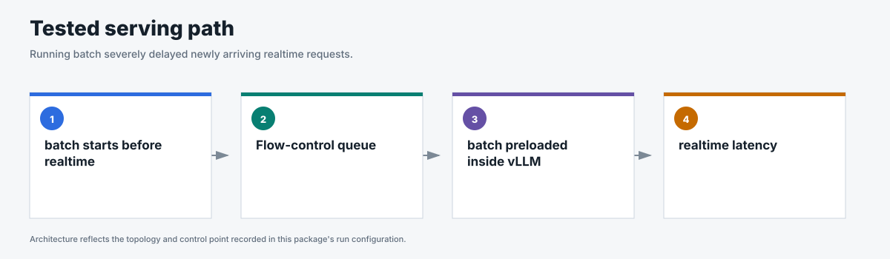
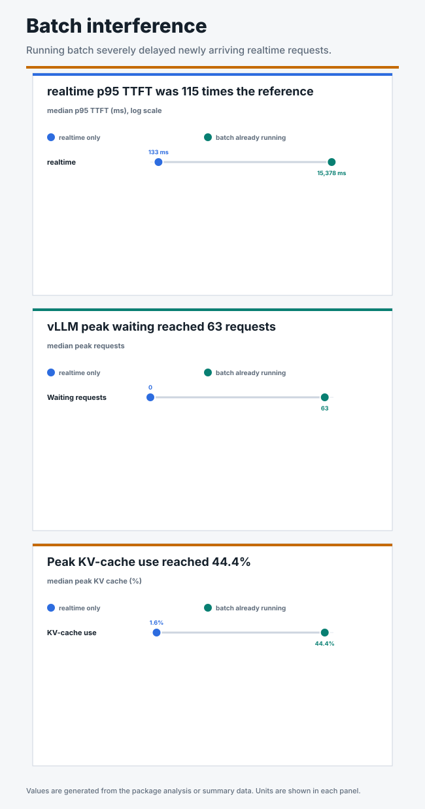

# Batch interference baseline

## Business question

How much can batch work already running in vLLM increase realtime latency?

**Answer.** Under request-count admission, running batch increased realtime
median p95 TTFT from 133 ms to 15,378 ms, or 115 times the realtime-only
reference.

<!-- generated:package-visuals -->

## Visual summary





[Tested configuration](tested-config.yaml)

[Replay this package with Flow Control Flight Recorder](https://github.com/alexagriffith/flow-control-visualizer#replay-a-published-benchmark-package)

<!-- /generated:package-visuals -->

## Result

Realtime median p95 TTFT increased from 133 ms to 15,378 ms when batch work was
already running in vLLM. The increase was 15,245 ms, or 115.3x the
realtime-only reference.

| Realtime result | Realtime only | Batch already running |
|---|---:|---:|
| Median p95 TTFT | 133 ms | 15,378 ms |
| Median p99 TTFT | 147 ms | 18,294 ms |
| Median p95 TPOT | 7.7 ms/token | 267.1 ms/token |
| Median p95 end-to-end latency | 989 ms | 34,189 ms |

All 3,600 requests completed without errors or rejections. Flow control held
batch work in its queue longer than realtime work, but it could not reclaim
batch requests that were already running inside vLLM. During the interference
runs, vLLM reached 128 running requests and 63 median peak waiting requests.

## Why request-count admission was used

The earlier admission sweep selected a cap of 128 requests as the general
default. This test then held that setting constant to isolate one question:
can priority queues protect realtime traffic after batch work has already
entered vLLM?

Request-count admission treats each request as one slot. In this test, a
4,096-input realtime request and a 20,000-input batch request each consumed one
admission slot. The policy could hold additional batch requests in the Endpoint
Picker, but it could not account for their different sizes or reclaim batch
requests already running in vLLM.

Input-token admission was tested separately with matched mixed traffic. It
lowered batch p95 TTFT from 8,654 ms to 2,832 ms, while realtime p95 TTFT
increased from 1,994 ms to 2,914 ms. See the
[mixed production workload](../mixed-production-workload/) for that comparison.

## Method

- One Endpoint Picker served one vLLM model replica on one NVIDIA H100 GPU.
- The realtime-only test was configured for 4,096 input and 128 output tokens
  at a noisy sinusoidal rate centered on 3 requests/s.
- The interference test started 20,000-input, 128-output batch traffic first at
  a rate centered on 2.75 requests/s, then replayed the same realtime trace.
- Each test ran three matched 240-second repeats.
- The Endpoint Picker used request-concurrency detection with
  `maxConcurrency=128`, 10% headroom, and priority-aware queues.
- Reserved capacity and batch eviction were not configured.
- Prefix caching was disabled, cache counters remained zero, and vLLM recorded
  no preemptions.

The complete configuration is in [`run-config.json`](run-config.json).

## Evidence

| File | Contents |
|---|---|
| [`summary.csv`](summary.csv) | Run-level realtime latency, queue, vLLM, KV cache, and flow-control results. |
| [`request-results.csv`](request-results.csv) | One sanitized row per realtime or batch request. |
| [`traffic-samples.csv`](traffic-samples.csv) | Issued, completed, and outstanding requests by workload over time. |
| [`system-metrics.csv`](system-metrics.csv) | Curated Endpoint Picker and vLLM metrics collected during every run. |
| [`run-evidence.csv`](run-evidence.csv) | Schedule, header, route, metric, cache, flow-control, and data-quality gates. |
| [`analysis.json`](analysis.json) | Three-repeat medians, ranges, comparison, and claim boundary. |

## Scope

This is an interference baseline. It shows why priority queues alone cannot
reclaim capacity from batch work already running in vLLM. It does not test
reserved capacity or batch eviction. It also does not compare request-count and
input-token admission under this exact batch-first traffic pattern.

The evidence includes queue, saturation, vLLM running and waiting, KV cache,
and preemption data. Exact Endpoint Picker in-flight plugin-state samples are
not part of this package.

## Reproduce

This package used GuideLLM 0.7.0, one Endpoint Picker, one model replica, request-count admission at 128 requests, 10% headroom, random routing, and cache off. Each test ran three times with the same realtime trace.

```bash
for scenario in batch_realtime_only_4k batch_realtime_with_batch_20k_no_holdback_rate_2_75; do
  python3 pipeline/guidellm_trace.py --scenario-file benchmark-data/upstream-flow-control-v0.9.0/batch-interference/scenarios.json --scenario "$scenario" --out-dir "/tmp/$scenario" --traffic-seed 42
  python3 pipeline/run_guidellm_scenario.py --manifest "/tmp/$scenario/manifest.json" --run-dir "results/$scenario" --prefix "$scenario" --namespace "${NAMESPACE:-flow-control}" --runner-pod "${RUNNER_POD:-flow-control-benchmark-runner}" --expected-detector concurrency-detector --expected-concurrency-mode requests --expected-max-concurrency 128 --expected-headroom 0.10 --expected-picker random-picker --expected-prefix-cache off --expected-model-replicas 1 --http-version 1 --guidellm-worker-processes 4 --drain-after-done --recover-multiline-sse
done
```

The traffic phases and token sizes are in [`scenarios.json`](scenarios.json). The deployed images, engine settings, and topology are in [`run-config.json`](run-config.json).
