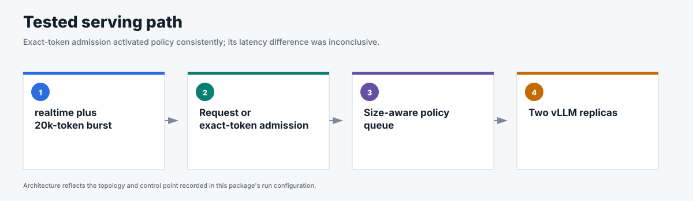
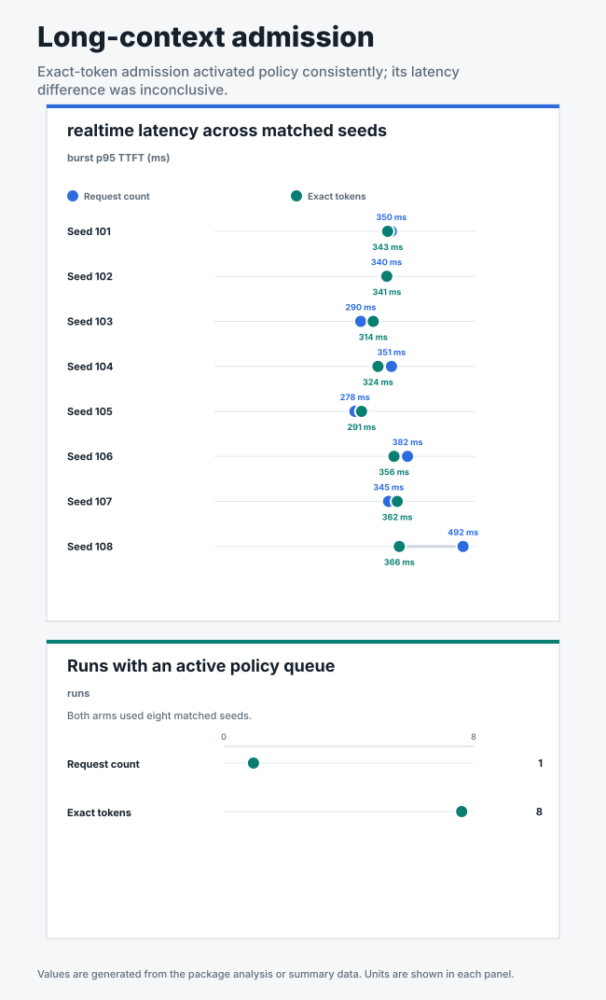

# Long-context admission comparison

## Business question

Does exact input-token admission protect realtime latency from a burst of large
requests better than request-count admission?

**Answer.** Exact input-token admission detected large-request pressure in all
eight runs, but it did not produce a statistically significant realtime
latency improvement over request-count admission.

<!-- generated:package-visuals -->

## Visual summary





[Tested configuration](tested-config.yaml)

[Replay this package with Flow Control Flight Recorder](https://github.com/alexagriffith/flow-control-visualizer#replay-a-published-benchmark-package)

<!-- /generated:package-visuals -->

## Result

Exact-token admission made large-request pressure visible to flow control. It
formed a policy queue in all eight runs, compared with one of eight
request-count runs.

| Measure | Request-count admission | Exact-token admission |
|---|---:|---:|
| Mean realtime burst p95 TTFT | 354 ms | 337 ms |
| Runs with an active policy queue | 1 / 8 | 8 / 8 |
| Successful requests | 18,453 / 18,453 | 18,453 / 18,453 |

The 16 ms p95 TTFT difference was small relative to run variance. The paired
test returned `p=0.367`, and the 95% confidence interval ranged from -24 ms to
57 ms. This data supports the detector behavior and does not establish a
general latency advantage.

## Decision

Keep request-count admission at 128 requests with 10% headroom as the default.
Use exact-token admission when request sizes vary enough to require size-aware
queue activation.

## Method

- One Endpoint Picker served two vLLM model replicas, each on one NVIDIA H100.
- Realtime chat used 1,024 input tokens and 128 output tokens at a steady noisy
  rate.
- Standard-priority pressure used a timed burst of 20,000 input tokens and 128
  output tokens.
- Request-count admission used 128 requests per model replica and 10% headroom.
- Exact-token admission used the vLLM tokenizer, a 20,000 input-token cap per
  model replica, and 25% headroom.
- The same open-loop noisy sinusoidal trace was replayed for both methods across
  eight frozen seeds.
- Prefix caching was disabled and verified by configuration and counters.

The complete configuration is in [`run-config.json`](run-config.json).

## Evidence

| File | Contents |
|---|---|
| [`summary.csv`](summary.csv) | Per-run realtime and long-context latency, queue, KV-cache, and response counts. |
| [`request-results.csv`](request-results.csv) | One sanitized row per request across all 16 runs. |
| [`traffic-samples.csv`](traffic-samples.csv) | Issued, completed, and outstanding requests over time. |
| [`system-metrics.csv`](system-metrics.csv) | Curated Endpoint Picker and per-model vLLM metrics. |
| [`run-evidence.csv`](run-evidence.csv) | Schedule, headers, routes, request shapes, cache state, metrics, and flow-control engagement. |
| [`analysis.json`](analysis.json) | Paired seed results, confidence interval, statistical test, decision, and claim boundary. |

All 16 runs passed the data-quality, schedule, request-shape, header, route,
stream, metric, cache, preemption, and restart checks. The flow-control proof
gate records queue activation separately, so inactive request-count runs remain
usable detector-boundary evidence.

## Scope

The result applies to this model, hardware, two-replica topology, and tested
traffic shape. Exact-token admission counts input size more accurately. It does
not measure KV-memory use directly, so KV-cache and preemption metrics remain
part of the evidence.

## Reproduce

This package used GuideLLM 0.7.0 with two model replicas, random routing, cache off, and eight paired traffic seeds. It compared request-count admission at 128 requests and 10% headroom with exact input-token admission at 20,000 tokens per replica and 25% headroom.

```bash
for SEED in 101 102 103 104 105 106 107 108; do
  TRACE_DIR="/tmp/long-context-$SEED"
  python3 pipeline/guidellm_trace.py \
    --scenario-file benchmark-data/upstream-flow-control-v0.9.0/long-context-admission/scenario.json \
    --scenario premium_with_long_context_burst --out-dir "$TRACE_DIR" \
    --traffic-seed "$SEED"

  python3 pipeline/run_guidellm_scenario.py \
    --manifest "$TRACE_DIR/manifest.json" \
    --run-dir "results/long-context/request-count/seed-$SEED" \
    --prefix "long-context-request-count-seed-$SEED" \
    --namespace "${NAMESPACE:-flow-control}" \
    --runner-pod "${RUNNER_POD:-flow-control-benchmark-runner}" \
    --expected-detector concurrency-detector \
    --expected-concurrency-mode requests --expected-max-concurrency 128 \
    --expected-add-estimated-output-tokens false --expected-headroom 0.10 \
    --expected-picker random-picker --expected-prefix-cache off \
    --expected-model-replicas 2 --http-version 1 \
    --guidellm-worker-processes 10 --drain-after-done \
    --recover-multiline-sse

  python3 pipeline/run_guidellm_scenario.py \
    --manifest "$TRACE_DIR/manifest.json" \
    --run-dir "results/long-context/input-token/seed-$SEED" \
    --prefix "long-context-input-token-seed-$SEED" \
    --namespace "${NAMESPACE:-flow-control}" \
    --runner-pod "${RUNNER_POD:-flow-control-benchmark-runner}" \
    --expected-detector concurrency-detector \
    --expected-concurrency-mode tokens --expected-max-token-concurrency 20000 \
    --expected-add-estimated-output-tokens false --expected-headroom 0.25 \
    --expected-picker random-picker --expected-prefix-cache off \
    --expected-model-replicas 2 --http-version 1 \
    --guidellm-worker-processes 10 --drain-after-done \
    --recover-multiline-sse
done
```

[`scenario.json`](scenario.json) defines the matched traffic. [`run-config.json`](run-config.json) defines both admission configurations without placeholders.
