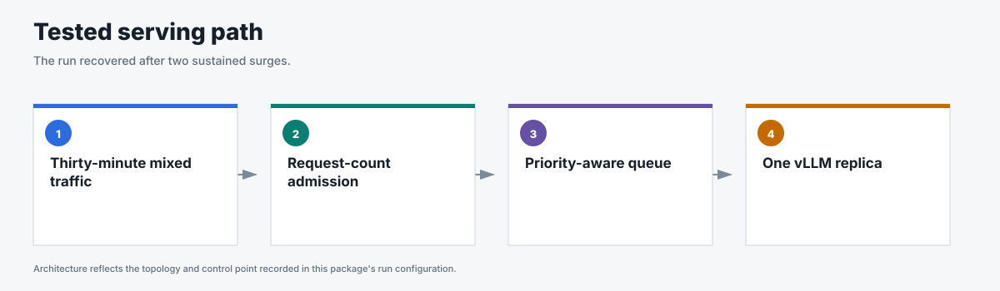

# Long stability

## Business question

Does the selected priority-protection configuration recover after repeated
production-shaped surges?

**Answer.** Yes; the queue drained after both surges, realtime latency returned
to its earlier range, and all 14,889 requests completed.

<!-- generated:package-visuals -->

## Visual summary




[Tested configuration](tested-config.yaml)

[Replay this package with Flow Control Flight Recorder](https://github.com/alexagriffith/flow-control-visualizer#replay-a-published-benchmark-package)

<!-- /generated:package-visuals -->

## Result

All 14,889 requests completed during the 30-minute mixed-workload run. Flow
control engaged in both surges, and the policy queue returned to zero afterward.

Premium p95 TTFT reached 1,760 ms in the first surge and 1,227 ms in the second.
It returned to 127 ms and 279 ms in the two recovery windows and ended at 290 ms.
Both surges remained below the predeclared 3,000 ms test guardrail.

| Window | Premium p95 TTFT | Maximum policy queue |
|---|---:|---:|
| Baseline | 299 ms | 0 requests |
| Surge 1 | 1,760 ms | 39 requests |
| Recovery 1 | 127 ms | 8 requests |
| Surge 2 | 1,227 ms | 27 requests |
| Recovery 2 | 279 ms | 41 requests |
| Final | 290 ms | 0 requests |

Peak vLLM waiting was 29 requests, peak KV-cache use was 23.8%, and vLLM
recorded no preemptions. The Endpoint Picker did not restart.

## Method

- One Endpoint Picker served one vLLM model replica on one NVIDIA H100 GPU.
- Premium chat, agentic, standard long-context, and batch long-context traffic
  ran together for 30 minutes.
- Open-loop Poisson arrivals used noisy sinusoidal phases with two matched
  surges and two recovery periods.
- The Endpoint Picker used request-concurrency detection with
  `maxConcurrency=128`, 10% headroom, four priority bands, and round-robin
  fairness within each band.
- vLLM used `max-num-seqs=128`, `max-num-batched-tokens=8192`, and a 32,768-token
  model limit.
- Prefix caching was disabled and cache counters remained zero.

The complete traffic and system configuration is in
[`run-config.json`](run-config.json).

## Evidence

| File | Contents |
|---|---|
| [`summary.csv`](summary.csv) | Overall latency, throughput, and status results by workload. |
| [`window-summary.csv`](window-summary.csv) | Latency, throughput, and status results for each surge and recovery window. |
| [`request-results.csv`](request-results.csv) | One sanitized row per request with TTFT, TPOT, latency, token counts, and status. |
| [`traffic-samples.csv`](traffic-samples.csv) | Issued, completed, and outstanding requests by workload over time. |
| [`system-metrics.csv`](system-metrics.csv) | Curated Endpoint Picker and vLLM metrics throughout the run. |
| [`run-evidence.csv`](run-evidence.csv) | Schedule, header, route, metric, cache, flow-control, and data-quality gates. |
| [`analysis.json`](analysis.json) | Stability decision, window results, and claim boundary. |

## Scope

This is one 30-minute, single-model, cache-off run. It supports recovery after
repeated surges but does not promise a fixed TTFT for every load.

## Reproduce

This package used GuideLLM 0.7.0 for one 1,800-second run. The configuration was request-count admission at 128 requests, 10% headroom, random routing, one model replica, four GuideLLM workers per tenant, and cache off.

```bash
python3 pipeline/guidellm_trace.py --scenario-file benchmark-data/upstream-flow-control-v0.9.0/long-stability/scenario.json --scenario mixed_workload_long_stability --out-dir /tmp/long-stability --traffic-seed 20260809
python3 pipeline/run_guidellm_scenario.py --manifest /tmp/long-stability/manifest.json --run-dir results/long-stability --prefix long-stability --namespace "${NAMESPACE:-flow-control}" --runner-pod "${RUNNER_POD:-flow-control-benchmark-runner}" --expected-detector concurrency-detector --expected-concurrency-mode requests --expected-max-concurrency 128 --expected-headroom 0.10 --expected-picker random-picker --expected-prefix-cache off --expected-model-replicas 1 --http-version 1 --guidellm-worker-processes 4 --drain-after-done --drain-timeout-s 600 --recover-multiline-sse
```

[`scenario.json`](scenario.json) contains both surges and the recovery windows. [`run-config.json`](run-config.json) records the full service configuration.
