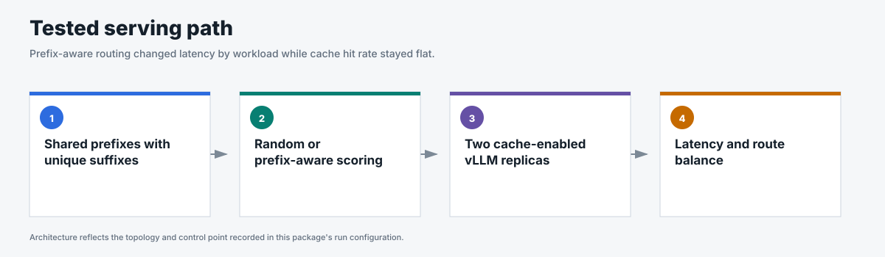
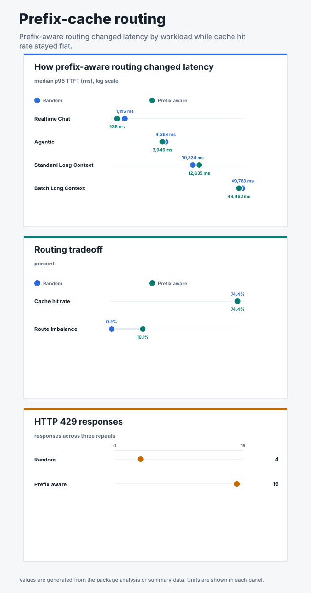

# Prefix-cache routing comparison

## Business question

Does prefix-aware routing improve service under a saturated mixed workload when
prefix caching is enabled?

<!-- generated:package-visuals -->

## Visual summary





[Tested configuration](tested-config.yaml)

[Replay this package with Flow Control Flight Recorder](https://github.com/alexagriffith/flow-control-visualizer#replay-a-published-benchmark-package)

<!-- /generated:package-visuals -->

## Result

Prefix-aware routing lowered the overall median realtime p95 TTFT from 1,195 ms
to 936 ms, but the effect was not consistent enough to select it as the default.
It did not increase the measured prefix-cache hit rate and sent measurably more
traffic to one model replica.

| Tier | Random routing median p95 TTFT | Prefix-aware routing median p95 TTFT | Change |
|---|---:|---:|---:|
| Premium chat (priority 100) | 1,195 ms | 936 ms | -21.7% |
| Agentic (priority 50) | 4,364 ms | 3,946 ms | -9.6% |
| Standard long context (priority 0) | 10,324 ms | 12,635 ms | +22.4% |
| Batch (priority -10) | 49,763 ms | 44,462 ms | -10.7% |

Values are medians across three matched repeats. Lower TTFT is better.

| System measure | Random routing | Prefix-aware routing |
|---|---:|---:|
| Prefix-cache hit rate (median) | 74.4% | 74.4% |
| Route imbalance (median) | 0.9% | 19.1% |
| Peak EPP policy queue (median) | 211 | 192 |
| Peak vLLM waiting requests (median) | 26 | 24 |
| HTTP 429 responses (total across 3 repeats) | 4 | 19 |
| vLLM preemptions | 0 | 0 |

The premium tier showed a directional improvement with high repeat-to-repeat
variance: one prefix-aware repeat reached 1,804 ms. Standard-long-context p95
TTFT was 22.4% higher under prefix-aware routing. The measured prefix-cache hit
rate was 74.42% with random routing and 74.41% with prefix-aware routing.

## Decision

Keep random routing as the control configuration. The next cache test should
use more distinct shared prefixes, where affinity routing has a clearer
opportunity to increase cache reuse.

## Method

- One Endpoint Picker served two vLLM model replicas, each on one NVIDIA H100
  GPU.
- Prefix caching was intentionally enabled. Each tenant shared 75% of its prompt
  as a common prefix and used a unique suffix per request.
- Four tenant tiers shared one model pool: premium chat (priority 100), agentic
  (priority 50), standard long context (priority 0), and batch (priority -10).
- The same deterministic 7,480-request noisy sinusoidal trace was replayed in
  both arms.
- The Endpoint Picker used request-concurrency detection with `maxConcurrency=128`
  and 10% headroom, with flow control and priority-aware queues in both arms.
- Random arm: random picker ignores prefix scores. Prefix-aware arm: max-score
  picker selects the replica with the highest approximate prefix-match score.
- Each arm ran three matched 180-second repeats.

The complete configuration is in [`run-config.json`](run-config.json).

## Evidence

| File | Contents |
|---|---|
| [`summary.csv`](summary.csv) | Per-run latency by tier, cache hit rate, queue, vLLM, and rejection counts. |
| [`request-results.csv`](request-results.csv) | One sanitized row per request across all six runs. |
| [`traffic-samples.csv`](traffic-samples.csv) | Issued, completed, and outstanding requests by workload over time. |
| [`system-metrics.csv`](system-metrics.csv) | Curated Endpoint Picker and vLLM metrics collected during every run. |
| [`run-evidence.csv`](run-evidence.csv) | Schedule, header, route, metric, cache, flow-control, and data-quality gates. All six runs passed. |
| [`routing-balance.csv`](routing-balance.csv) | Per-run request distribution across both model replicas. |
| [`analysis.json`](analysis.json) | Three-repeat medians, ranges, arm comparison, and claim boundary. |

All six runs passed schedule, request-shape, header, metric, memory, and restart
gates. Flow control engaged in every run.

## Scope

This comparison characterizes one shared-prefix workload shape with two model
replicas. With a single dominant prefix per tenant, vLLM's local KV cache
already achieves high hit rates on both replicas, leaving little opportunity
for routing affinity to add value. Results do not generalize to workloads with
many distinct prefixes distributed across replicas.

Sparse HTTP 429 responses are preserved as measured admission outcomes. Every
other non-200 response, timeout, and client error was zero.

## Reproduce

This package used GuideLLM 0.7.0 with two model replicas, request-count admission at 128 requests, 10% headroom, and prefix caching on. Three matched repeats compared random routing with max-score prefix-aware routing. Each tenant reused a shared prefix for 75% of requests.

```bash
python3 pipeline/guidellm_trace.py \
  --scenario-file benchmark-data/upstream-flow-control-v0.9.0/prefix-cache-routing/scenario.json \
  --scenario two_replica_prefix_mix --out-dir /tmp/prefix-routing \
  --traffic-seed 42

for PICKER in random-picker max-score-picker; do
  for REPEAT in 1 2 3; do
    python3 pipeline/run_guidellm_scenario.py \
      --manifest /tmp/prefix-routing/manifest.json \
      --run-dir "results/prefix-routing/$PICKER/repeat-$REPEAT" \
      --prefix "prefix-routing-$PICKER-repeat-$REPEAT" \
      --namespace "${NAMESPACE:-flow-control}" \
      --runner-pod "${RUNNER_POD:-flow-control-benchmark-runner}" \
      --expected-detector concurrency-detector \
      --expected-concurrency-mode requests --expected-max-concurrency 128 \
      --expected-headroom 0.10 --expected-picker "$PICKER" \
      --expected-prefix-cache on --expected-model-replicas 2 \
      --shared-prefix-fraction 0.75 --shared-prefix-group shared-context \
      --http-version 1 --guidellm-worker-processes 8 \
      --drain-after-done --drain-timeout-s 300 --recover-multiline-sse
  done
done
```

The workload is in [`scenario.json`](scenario.json). Prefix scorer and routing settings are in [`run-config.json`](run-config.json).
