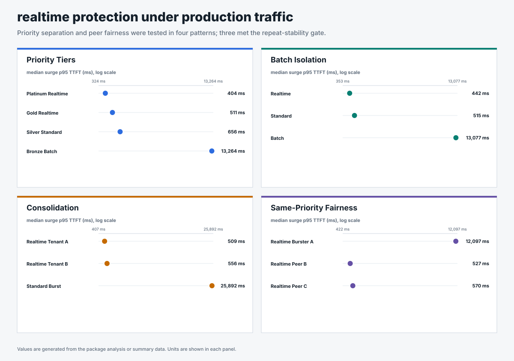

# Production scenarios

## Business question

Can one shared model server protect priority traffic across four production
patterns while lower-priority or overloaded work absorbs the queue?

<!-- generated:package-visuals -->

## Visual summary




[Tested configuration](tested-config.yaml)

<!-- /generated:package-visuals -->

## Scenario packages

Each scenario has its own folder. No request, traffic, metric, or proof CSV is
aggregated across scenarios.

| Scenario | Question | Evidence |
|---|---|---|
| [Priority tiers](priority-tiers/) | Does dispatch order preserve the four configured priority bands during a surge? | 3 selected repeats |
| [Batch isolation](batch-isolation/) | Can realtime and standard work retain lower TTFT while batch absorbs more of the queue? | 3 selected repeats; 1 queue-depth calibration |
| [Consolidation](consolidation/) | Can two realtime tenants retain lower TTFT while standard traffic surges? | 3 matched repeats for each of 3 detector settings |
| [Same-priority fairness](same-priority-fairness/) | Can peer tenants keep receiving service while one tenant in the same band overloads the shared model? | 3 matched repeats for each of 2 detector settings; 1 calibration |

## Selected configuration

The request-count detector kept median realtime p95 TTFT below 700 ms in the
priority, batch-isolation, and consolidation scenarios. In the same-priority
scenario, the overloaded tenant absorbed most of the delay. Peer median p95
TTFT was 527 and 570 ms; repeat ranges extended to 619 and 675 ms.

| Scenario | Measured result during the surge |
|---|---|
| Priority tiers | Platinum 404 ms; Gold 511 ms; Silver 656 ms; Batch 13,264 ms p95 TTFT |
| Batch isolation | Realtime 442 ms; Standard 515 ms; Batch 13,077 ms p95 TTFT |
| Consolidation | Realtime tenants 509 and 556 ms; Standard burst 25,892 ms p95 TTFT |
| Same-priority fairness | Overloaded tenant 12,097 ms; peers 527 and 570 ms p95 TTFT |

Each of the four selected scenario results uses three repeats. All requests
succeeded, flow control engaged during every retained run, and the prefix cache
remained off.

## Detector comparison

The matched comparison covers consolidation and same-priority fairness. The
request-count detector kept realtime p95 TTFT ranges below the ranges measured
with queue-depth 2 and queue-depth 5 in every matched consolidation run. It
also kept both same-priority peers below 700 ms while queue-depth 2 produced
peer p95 TTFT above 4,400 ms.

| Scenario | Detector | Realtime p95 TTFT |
|---|---|---:|
| Consolidation | Request count 128, 10% headroom | 509 and 556 ms |
| Consolidation | Queue depth 2 | 4,711 and 4,567 ms |
| Consolidation | Queue depth 5 | 5,117 and 4,906 ms |
| Same-priority peers | Request count 128, 10% headroom | 527 and 570 ms |
| Same-priority peers | Queue depth 2 | 5,023 and 4,519 ms |

The comparison uses three repeats per detector. The p95 TTFT ranges do not
overlap, but three repeats support descriptive medians and ranges rather than a
formal statistical-significance claim.

## Method

- One llm-d Endpoint Picker v0.9.0 served one vLLM model replica on one NVIDIA
  H100.
- vLLM used `max-num-seqs=128` and `max-num-batched-tokens=8192`.
- The selected detector used request cap 128 with 10% headroom, or 15% for
  batch isolation.
- Traffic used open-loop Poisson arrivals with noisy sinusoidal phases, a timed
  surge, and recovery.
- Each request used 511 input tokens and 128 output tokens.
- Prefix caching was disabled and verified with zero query and hit counters.
- Pool saturation is a detector-normalized score. A value of 1.0 marks the
  configured boundary within each detector; raw values are not compared across
  request-count and utilization detectors.
- Every retained run captured request results, traffic, policy queues, vLLM
  running and waiting requests, KV-cache utilization, preemptions, route
  counts, headers, and flow-control engagement.

## Evidence scope

The batch queue-depth-2 and same-priority queue-depth-5 runs are retained as
single-run calibrations. The priority queue-depth controls failed route-count
proof, and the batch queue-depth-5 control failed its response-outcome gate;
those attempts are not included. Detector claims are limited to the matched
consolidation and same-priority evidence.

## Shared configuration and analysis

| File | Contents |
|---|---|
| [`run-config.json`](run-config.json) | Images, topology, engine settings, detector settings, and traffic method. |
| [`analysis.json`](analysis.json) | Matched medians, ranges, exclusions, and claim boundary. |

Each scenario folder contains its own `summary.csv`, `window-summary.csv`,
`request-results.csv`, `traffic-samples.csv`, `system-metrics.csv`,
`run-evidence.csv`, `run-config.json`, and `analysis.json`.

## Reproduce

All four scenarios used GuideLLM 0.7.0, open-loop Poisson arrivals, noisy sinusoidal phases, seed 42, one Endpoint Picker, one model replica, random routing, and cache off. The selected arm used request-count admission at 128 requests with 10% headroom. Consolidation and same-priority fairness also ran matched utilization-detector arms at queue depth 2; consolidation included queue depth 5.

```bash
for SCENARIO in priority_tiers batch_isolation consolidation same_priority_fairness; do
  HEADROOM=0.10
  if [[ "$SCENARIO" == batch_isolation ]]; then HEADROOM=0.15; fi
  python3 pipeline/guidellm_trace.py \
    --scenario-file benchmark-data/upstream-flow-control-v0.9.0/production-scenarios/scenarios.json \
    --scenario "$SCENARIO" --out-dir "/tmp/$SCENARIO" --traffic-seed 42

  for REPEAT in 1 2 3; do
    python3 pipeline/run_guidellm_scenario.py \
      --manifest "/tmp/$SCENARIO/manifest.json" \
      --run-dir "results/$SCENARIO/request-count/repeat-$REPEAT" \
      --prefix "$SCENARIO-request-count-repeat-$REPEAT" \
      --namespace "${NAMESPACE:-flow-control}" \
      --runner-pod "${RUNNER_POD:-flow-control-benchmark-runner}" \
      --expected-detector concurrency-detector \
      --expected-concurrency-mode requests \
      --expected-max-concurrency 128 \
      --expected-headroom "$HEADROOM" \
      --expected-picker random-picker \
      --expected-prefix-cache off \
      --expected-model-replicas 1 \
      --http-version 1 --guidellm-worker-processes 4 \
      --drain-after-done --drain-timeout-s 300 --recover-multiline-sse
  done
done
```

Batch isolation used `--expected-headroom 0.15`; the other selected scenarios used `0.10`. The child READMEs contain the exact utilization-detector comparison commands. [`scenarios.json`](scenarios.json) contains the executable traffic definitions; each scenario folder contains only its own traffic and evidence.
