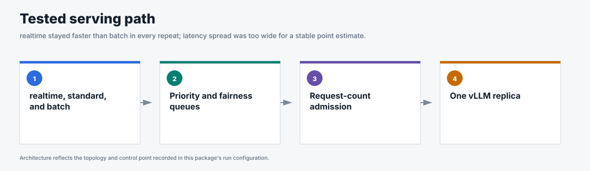
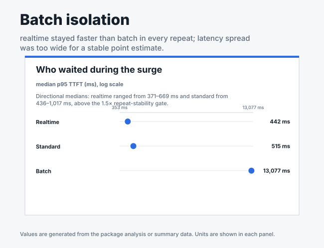

# Batch isolation

## Business question

Can realtime and standard work retain lower TTFT while batch traffic shares the
same model server?

**Answer.** Yes; realtime and standard p95 TTFT stayed near 0.5 seconds while
batch absorbed substantially more delay.

<!-- generated:package-visuals -->

## Visual summary





[Tested configuration](tested-config.yaml)

[Replay this package with Flow Control Flight Recorder](https://github.com/alexagriffith/flow-control-visualizer#replay-a-published-benchmark-package)

<!-- /generated:package-visuals -->

## What the benchmark showed

| Workload | Median surge p95 TTFT |
|---|---:|
| Realtime | 442 ms |
| Standard | 515 ms |
| Batch | 13,077 ms |

Realtime and standard traffic retained lower TTFT while batch absorbed more of
the queue. The selected result uses three repeats. Every request succeeded,
flow control engaged during each run, and prefix caching remained off.

## Run inventory

- Selected detector: request count 128 with 15% headroom; 3 repeats
- Calibration: utilization queue depth 2; 1 run
- Traffic: open-loop Poisson arrivals with noisy sinusoidal phases, a timed
  surge, and recovery
- Request shape: 511 input tokens and 128 output tokens
- Topology: 1 Endpoint Picker, 1 vLLM model replica, 1 NVIDIA H100

## Evidence

| File | Contents |
|---|---|
| [`summary.csv`](summary.csv) | Per-run outcomes, throughput, TTFT, end-to-end latency, and TPOT. |
| [`window-summary.csv`](window-summary.csv) | Baseline, surge, and recovery metrics. |
| [`request-results.csv`](request-results.csv) | One sanitized row per request. |
| [`traffic-samples.csv`](traffic-samples.csv) | Issued, completed, and outstanding requests over time. |
| [`system-metrics.csv`](system-metrics.csv) | Queue, saturation, vLLM, KV-cache, preemption, and cache metrics. |
| [`run-evidence.csv`](run-evidence.csv) | Headers, route counts, cache state, flow-control engagement, and proof gates. |
| [`run-config.json`](run-config.json) | Images, topology, engine settings, detector settings, and traffic method. |
| [`analysis.json`](analysis.json) | Medians, ranges, run inventory, and claim boundary. |

The queue-depth-2 result is a single-run calibration. The package does not use
it as a matched detector comparison.

## Reproduce

This scenario used GuideLLM 0.7.0 with request-count admission at 128 requests,
15% headroom, random routing, one model replica, and cache off. Three selected
repeats used the same deterministic traffic schedule.

```bash
python3 pipeline/guidellm_trace.py --scenario-file benchmark-data/upstream-flow-control-v0.9.0/production-scenarios/batch-isolation/scenario.json --scenario batch_isolation --out-dir /tmp/batch-isolation --traffic-seed 42
python3 pipeline/run_guidellm_scenario.py --manifest /tmp/batch-isolation/manifest.json --run-dir results/batch-isolation --prefix batch-isolation --namespace "${NAMESPACE:-flow-control}" --runner-pod "${RUNNER_POD:-flow-control-benchmark-runner}" --expected-detector concurrency-detector --expected-concurrency-mode requests --expected-max-concurrency 128 --expected-headroom 0.15 --expected-picker random-picker --expected-prefix-cache off --expected-model-replicas 1 --http-version 1 --guidellm-worker-processes 4 --drain-after-done --drain-timeout-s 300 --recover-multiline-sse
```

[`scenario.json`](scenario.json) contains only the batch-isolation traffic. [`run-config.json`](run-config.json) records the tested images and settings.
