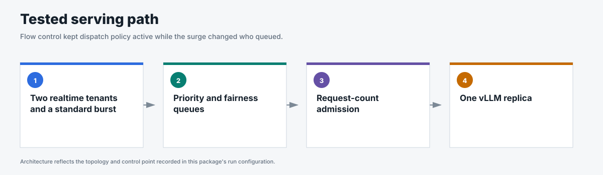
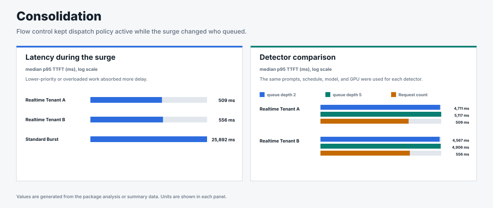

# Consolidation

## Business question

Can two realtime tenants retain lower TTFT while standard traffic surges on the
same model server?

**Answer.** With request-count admission, both realtime tenants stayed
below 600 ms p95 TTFT while the standard burst absorbed the delay.

<!-- generated:package-visuals -->

## Visual summary





[Tested configuration](tested-config.yaml)

[Replay this package with Flow Control Flight Recorder](https://github.com/alexagriffith/flow-control-visualizer#replay-a-published-benchmark-package)

<!-- /generated:package-visuals -->

## What the benchmark showed

With request-count admission, the two realtime tenants had median surge p95
TTFT of 509 ms and 556 ms. The standard burst had median surge p95 TTFT of
25,892 ms.

The matched utilization-detector runs produced realtime p95 TTFT between
4,567 ms and 5,117 ms. The observed ranges did not overlap across the tested
detectors. Three repeats support descriptive medians and ranges rather than a
formal statistical-significance claim.

## Run inventory

- Request count 128 with 10% headroom: 3 repeats
- Utilization queue depth 2: 3 repeats
- Utilization queue depth 5: 3 repeats
- Traffic: open-loop Poisson arrivals with noisy sinusoidal phases, a timed
  surge, and recovery
- Request shape: 511 input tokens and 128 output tokens
- Topology: 1 Endpoint Picker, 1 vLLM model replica, 1 NVIDIA H100

Every request succeeded, flow control engaged during all nine runs, and prefix
caching remained off.

## Evidence

| File | Contents |
|---|---|
| [`summary.csv`](summary.csv) | Per-run outcomes, throughput, TTFT, end-to-end latency, and TPOT. |
| [`window-summary.csv`](window-summary.csv) | Baseline, surge, and recovery metrics. |
| [`request-results.csv`](request-results.csv) | One sanitized row per request. |
| [`traffic-samples.csv`](traffic-samples.csv) | Issued, completed, and outstanding requests over time. |
| [`system-metrics.csv`](system-metrics.csv) | Queue, saturation, vLLM, KV-cache, preemption, and cache metrics. |
| [`run-evidence.csv`](run-evidence.csv) | Headers, route counts, cache state, flow-control engagement, and proof gates. |
| [`run-config.json`](run-config.json) | Images, topology, engine settings, detector settings, and traffic method. |
| [`analysis.json`](analysis.json) | Matched detector medians, ranges, run inventory, and claim boundary. |

## Reproduce

This scenario used GuideLLM 0.7.0, random routing, one model replica, and cache off. Three matched repeats compared request-count admission at 128 requests and 10% headroom with utilization detection at queue depths 2 and 5.

```bash
python3 pipeline/guidellm_trace.py \
  --scenario-file benchmark-data/upstream-flow-control-v0.9.0/production-scenarios/consolidation/scenario.json \
  --scenario consolidation --out-dir /tmp/consolidation --traffic-seed 42

for REPEAT in 1 2 3; do
  python3 pipeline/run_guidellm_scenario.py \
    --manifest /tmp/consolidation/manifest.json \
    --run-dir "results/consolidation/request-count/repeat-$REPEAT" \
    --prefix "consolidation-request-count-repeat-$REPEAT" \
    --namespace "${NAMESPACE:-flow-control}" \
    --runner-pod "${RUNNER_POD:-flow-control-benchmark-runner}" \
    --expected-detector concurrency-detector \
    --expected-concurrency-mode requests --expected-max-concurrency 128 \
    --expected-headroom 0.10 --expected-picker random-picker \
    --expected-prefix-cache off --expected-model-replicas 1 \
    --http-version 1 --guidellm-worker-processes 4 \
    --drain-after-done --drain-timeout-s 300 --recover-multiline-sse

  for QUEUE_DEPTH in 2 5; do
    python3 pipeline/run_guidellm_scenario.py \
      --manifest /tmp/consolidation/manifest.json \
      --run-dir "results/consolidation/queue-depth-$QUEUE_DEPTH/repeat-$REPEAT" \
      --prefix "consolidation-queue-depth-$QUEUE_DEPTH-repeat-$REPEAT" \
      --namespace "${NAMESPACE:-flow-control}" \
      --runner-pod "${RUNNER_POD:-flow-control-benchmark-runner}" \
      --expected-detector utilization-detector \
      --expected-concurrency-mode requests --expected-queue-depth "$QUEUE_DEPTH" \
      --expected-headroom 0.00 --expected-picker random-picker \
      --expected-prefix-cache off --expected-model-replicas 1 \
      --http-version 1 --guidellm-worker-processes 4 \
      --drain-after-done --drain-timeout-s 300 --recover-multiline-sse
  done
done
```

[`scenario.json`](scenario.json) contains only the consolidation traffic.
[`run-config.json`](run-config.json) defines the three detector configurations.
