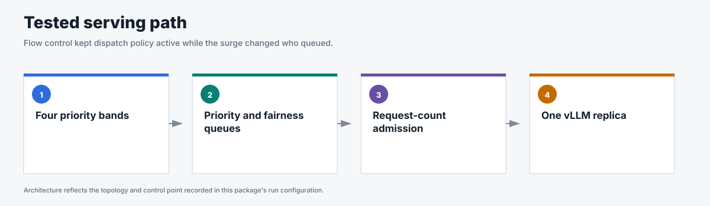
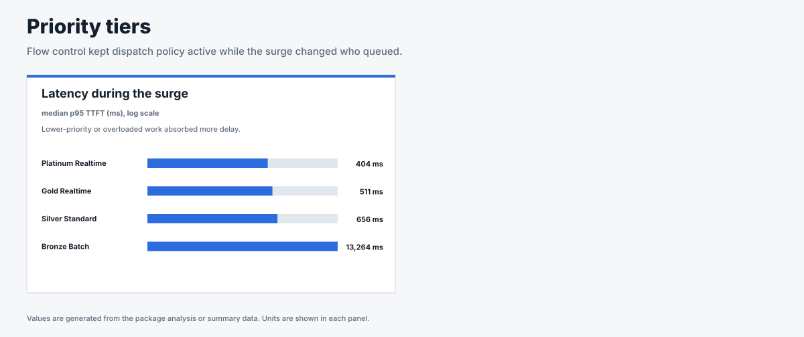
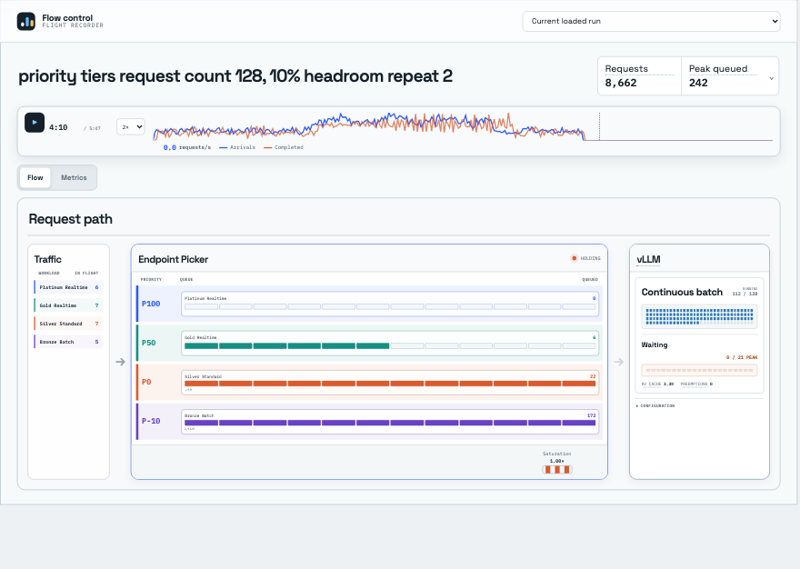

# Priority tiers

## Business question

Does flow control preserve dispatch order across four priority bands during a
shared-model surge?

**Answer.** Yes; p95 TTFT increased as priority decreased, with lower-priority
batch absorbing most of the delay.

<!-- generated:package-visuals -->

## Visual summary





[Tested configuration](tested-config.yaml)

[Replay this package with Flow Control Flight Recorder](https://github.com/alexagriffith/flow-control-visualizer#replay-a-published-benchmark-package)

<!-- /generated:package-visuals -->

## Recorded replay

[](replay.mp4)

Accepted repeat 2, replayed from 220 to 280 seconds at 2× speed. Lower-priority batch work remains queued while the higher-priority queues stay nearly empty and vLLM remains full.

## What the benchmark showed

| Priority band | Median surge p95 TTFT |
|---|---:|
| Platinum realtime | 404 ms |
| Gold realtime | 511 ms |
| Silver standard | 656 ms |
| Bronze batch | 13,264 ms |

Higher-priority traffic retained lower TTFT while batch absorbed more of the
queue. The result uses three selected repeats. Every request succeeded, flow
control engaged during each run, and prefix caching remained off.

## Run inventory

- Detector: request count 128 with 10% headroom
- Repeats: 3
- Traffic: open-loop Poisson arrivals with noisy sinusoidal phases, a timed
  surge, and recovery
- Request shape: 511 input tokens and 128 output tokens
- Topology: 1 Endpoint Picker, 1 vLLM model replica, 1 NVIDIA H100

## Evidence

| File | Contents |
|---|---|
| [`summary.csv`](summary.csv) | Per-run outcomes, throughput, TTFT, end-to-end latency, and TPOT. |
| [`window-summary.csv`](window-summary.csv) | Baseline, surge, and recovery metrics. |
| [`request-results.csv`](request-results.csv) | One sanitized row per request. |
| [`traffic-samples.csv`](traffic-samples.csv) | Issued, completed, and outstanding requests over time. |
| [`system-metrics.csv`](system-metrics.csv) | Queue, saturation, vLLM, KV-cache, preemption, and cache metrics. |
| [`run-evidence.csv`](run-evidence.csv) | Headers, route counts, cache state, flow-control engagement, and proof gates. |
| [`run-config.json`](run-config.json) | Images, topology, engine settings, detector setting, and traffic method. |
| [`analysis.json`](analysis.json) | Medians, ranges, run inventory, and claim boundary. |

This package does not include a matched utilization-detector comparison because
the retained priority-tier controls did not pass route-count proof.

## Reproduce

This scenario used GuideLLM 0.7.0 with request-count admission at 128 requests, 10% headroom, random routing, one model replica, and cache off. Three selected repeats used the same deterministic traffic schedule.

```bash
python3 pipeline/guidellm_trace.py --scenario-file benchmark-data/upstream-flow-control-v0.9.0/production-scenarios/priority-tiers/scenario.json --scenario priority_tiers --out-dir /tmp/priority-tiers --traffic-seed 42
python3 pipeline/run_guidellm_scenario.py --manifest /tmp/priority-tiers/manifest.json --run-dir results/priority-tiers --prefix priority-tiers --namespace "${NAMESPACE:-flow-control}" --runner-pod "${RUNNER_POD:-flow-control-benchmark-runner}" --expected-detector concurrency-detector --expected-concurrency-mode requests --expected-max-concurrency 128 --expected-headroom 0.10 --expected-picker random-picker --expected-prefix-cache off --expected-model-replicas 1 --http-version 1 --guidellm-worker-processes 4 --drain-after-done --drain-timeout-s 300 --recover-multiline-sse
```

[`scenario.json`](scenario.json) contains only the priority-tier traffic. [`run-config.json`](run-config.json) records the tested images and settings.
