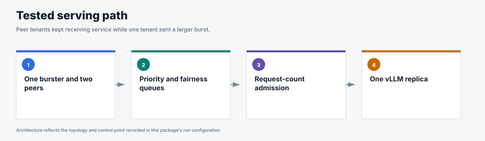
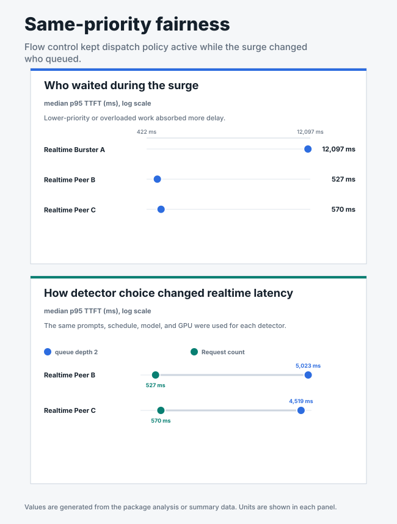
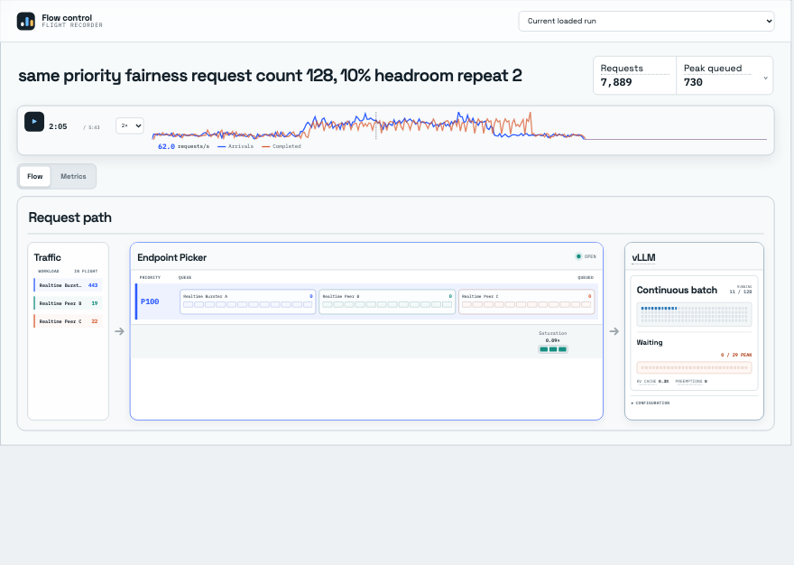

# Same-priority fairness

## Business question

Can peer tenants keep receiving service while one tenant in the same priority
band overloads the shared model?

**Answer.** Yes; both peers stayed below 700 ms p95 TTFT while the overloaded
tenant absorbed most of the delay under request-count admission.

<!-- generated:package-visuals -->

## Visual summary





[Tested configuration](tested-config.yaml)

[Replay this package with Flow Control Flight Recorder](https://github.com/alexagriffith/flow-control-visualizer#replay-a-published-benchmark-package)

<!-- /generated:package-visuals -->

## Recorded replay

[](replay.mp4)

Accepted repeat 2, replayed from 95 to 155 seconds at 2× speed. The overloaded tenant's queue grows while the two peer queues remain near zero.

## What the benchmark showed

With request-count admission, the overloaded tenant had median surge p95 TTFT
of 12,097 ms. The two peers had median surge p95 TTFT of 527 ms and 570 ms.
Their repeat ranges extended to 619 ms and 675 ms.

The matched queue-depth-2 runs produced peer median p95 TTFT of 5,023 ms and
4,519 ms. The observed ranges did not overlap across the tested detectors.
Three repeats support descriptive medians and ranges rather than a formal
statistical-significance claim.

## Run inventory

- Request count 128 with 10% headroom: 3 repeats
- Utilization queue depth 2: 3 repeats
- Utilization queue depth 5: 1 calibration run
- Traffic: open-loop Poisson arrivals with noisy sinusoidal phases, a timed
  surge, and recovery
- Request shape: 511 input tokens and 128 output tokens
- Topology: 1 Endpoint Picker, 1 vLLM model replica, 1 NVIDIA H100

Every request succeeded, flow control engaged during all seven runs, and prefix
caching remained off.

## Evidence

| File | Contents |
|---|---|
| [`summary.csv`](summary.csv) | Per-run outcomes, throughput, TTFT, end-to-end latency, and TPOT. |
| [`window-summary.csv`](window-summary.csv) | Baseline, surge, and recovery metrics. |
| [`request-results.csv`](request-results.csv) | One sanitized row per request. |
| [`traffic-samples.csv`](traffic-samples.csv) | Issued, completed, and outstanding requests over time. |
| [`system-metrics.csv`](system-metrics.csv) | Queue, saturation, vLLM, KV-cache, preemption, and cache metrics. |
| [`run-evidence.csv`](run-evidence.csv) | Headers, route counts, cache state, flow-control engagement, and proof gates. |
| [`run-config.json`](run-config.json) | Images, topology, engine settings, detector settings, and traffic method. |
| [`analysis.json`](analysis.json) | Matched detector medians, ranges, run inventory, and claim boundary. |

The queue-depth-5 result is a single-run calibration. Round-robin fairness
within the priority band prevents starvation; peer TTFT still depends on how
much work vLLM admits during the burst.

## Reproduce

This scenario used GuideLLM 0.7.0, random routing, one model replica, and cache off. Three matched repeats compared request-count admission at 128 requests and 10% headroom with utilization detection at queue depth 2. Queue depth 5 was retained only as a single calibration run.

```bash
python3 pipeline/guidellm_trace.py \
  --scenario-file benchmark-data/upstream-flow-control-v0.9.0/production-scenarios/same-priority-fairness/scenario.json \
  --scenario same_priority_fairness --out-dir /tmp/same-priority-fairness \
  --traffic-seed 42

for REPEAT in 1 2 3; do
  python3 pipeline/run_guidellm_scenario.py \
    --manifest /tmp/same-priority-fairness/manifest.json \
    --run-dir "results/same-priority-fairness/request-count/repeat-$REPEAT" \
    --prefix "same-priority-request-count-repeat-$REPEAT" \
    --namespace "${NAMESPACE:-flow-control}" \
    --runner-pod "${RUNNER_POD:-flow-control-benchmark-runner}" \
    --expected-detector concurrency-detector \
    --expected-concurrency-mode requests --expected-max-concurrency 128 \
    --expected-headroom 0.10 --expected-picker random-picker \
    --expected-prefix-cache off --expected-model-replicas 1 \
    --http-version 1 --guidellm-worker-processes 4 \
    --drain-after-done --drain-timeout-s 300 --recover-multiline-sse

  python3 pipeline/run_guidellm_scenario.py \
    --manifest /tmp/same-priority-fairness/manifest.json \
    --run-dir "results/same-priority-fairness/queue-depth-2/repeat-$REPEAT" \
    --prefix "same-priority-queue-depth-2-repeat-$REPEAT" \
    --namespace "${NAMESPACE:-flow-control}" \
    --runner-pod "${RUNNER_POD:-flow-control-benchmark-runner}" \
    --expected-detector utilization-detector \
    --expected-concurrency-mode requests --expected-queue-depth 2 \
    --expected-headroom 0.00 --expected-picker random-picker \
    --expected-prefix-cache off --expected-model-replicas 1 \
    --http-version 1 --guidellm-worker-processes 4 \
    --drain-after-done --drain-timeout-s 300 --recover-multiline-sse
done

python3 pipeline/run_guidellm_scenario.py \
  --manifest /tmp/same-priority-fairness/manifest.json \
  --run-dir results/same-priority-fairness/queue-depth-5/calibration \
  --prefix same-priority-queue-depth-5-calibration \
  --namespace "${NAMESPACE:-flow-control}" \
  --runner-pod "${RUNNER_POD:-flow-control-benchmark-runner}" \
  --expected-detector utilization-detector \
  --expected-concurrency-mode requests --expected-queue-depth 5 \
  --expected-headroom 0.00 --expected-picker random-picker \
  --expected-prefix-cache off --expected-model-replicas 1 \
  --http-version 1 --guidellm-worker-processes 4 \
  --drain-after-done --drain-timeout-s 300 --recover-multiline-sse
```

[`scenario.json`](scenario.json) contains only the fairness traffic.
[`run-config.json`](run-config.json) defines the matched detector configurations.
