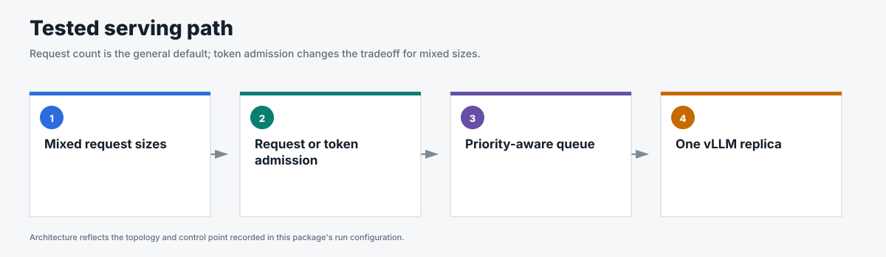
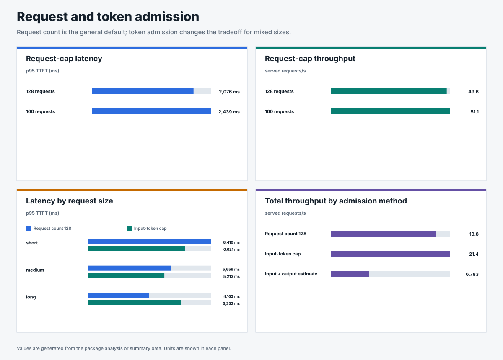

# Request and token admission calibration

## Business question

How many requests should enter vLLM, and when should request size affect that
decision?

**Answer.** In this one-GPU calibration, a 128-request cap preserved lower
first-token latency with a small throughput tradeoff; input-token admission
became useful when request sizes varied materially.

<!-- generated:package-visuals -->

## Visual summary





[Tested configuration](tested-config.yaml)

[Replay this package with Flow Control Flight Recorder](https://github.com/alexagriffith/flow-control-visualizer#replay-a-published-benchmark-package)

<!-- /generated:package-visuals -->

## Request-count result

Request cap 128 was selected for the later production tests. Cap 160 served 3.0% more steady traffic, but its
median p95 TTFT was 363 ms higher and its p99 TTFT was 543 ms higher.

| Request cap | Repeats | Steady RPS | p95 TTFT | p99 TTFT | 429 rate |
|---:|---:|---:|---:|---:|---:|
| 128 | 3 | 49.6 | 2,076 ms | 2,548 ms | 1.9% |
| 160 | 3 | 51.1 | 2,439 ms | 3,091 ms | 1.4% |

The 429 responses are measured backpressure at the selected boundary. This
closed-loop sweep identifies capacity; it does not define an acceptable
production rejection rate.

## Mixed-size result

Input-token admission served more total work and improved short-request p95
TTFT in this mixed-size calibration. It also increased long-request p95 TTFT.

| Admission setting | Repeats | Total steady RPS | Short p95 TTFT | Medium p95 TTFT | Long p95 TTFT |
|---|---:|---:|---:|---:|---:|
| Request count 128 | 3 | 18.81 | 8,419 ms | 5,659 ms | 4,163 ms |
| Input-token cap 148,480 | 3 | 21.40 | 6,621 ms | 5,213 ms | 6,352 ms |
| Input plus output estimate | 1 | 6.78 | 41,909 ms | 27,952 ms | 13,962 ms |

Use request count 128 as the tested starting point for this one-GPU workload.
Input-token admission is a workload-specific option when request sizes vary
enough to require size-aware control. The tested output estimator assumed too
much future work and does not advance.

## Important tradeoff

Token admission estimates request size, not KV-memory use. Large prompts can
still create memory pressure, so every production run also records KV-cache
utilization and preemptions.

## Method

- One llm-d Endpoint Picker v0.9.0 served one vLLM model replica on one NVIDIA
  H100.
- Prefix caching was disabled and verified by configuration and counters.
- The request-count sweep tested caps 16, 32, 48, 64, 96, 128, and 160.
- The mixed-size sweep combined 512-, 2,048-, and 8,192-token inputs with
  128-token outputs.
- Selected boundaries have three matched runs. Other values are labeled
  calibration points.
- Every retained run captured request rows, traffic, policy queues, in-flight
  requests and tokens, vLLM waiting, KV utilization, preemptions, route counts,
  and cache counters.

## Evidence

| File | Contents |
|---|---|
| [`summary.csv`](summary.csv) | Per-run and per-request-shape throughput and latency. |
| [`admission-comparison.csv`](admission-comparison.csv) | Matched mixed-size comparison with explicit units and capacity metrics. |
| [`request-results.csv`](request-results.csv) | One sanitized row per request. |
| [`traffic-samples.csv`](traffic-samples.csv) | Issued, completed, and outstanding requests over time. |
| [`system-metrics.csv`](system-metrics.csv) | Curated admission, queue, vLLM, KV-cache, and preemption metrics. |
| [`run-evidence.csv`](run-evidence.csv) | Metrics, routes, headers, cache state, engagement, and proof gates. |
| [`analysis.json`](analysis.json) | Matched medians, decision, and claim boundary. |

## Scope

These are closed-loop admission calibrations. The selected settings are tested
separately with open-loop noisy traffic before any production SLO claim.

## Reproduce

These cache-off closed-loop sweeps used the current `pipeline/benchmark.py`. Request-count caps were 16, 32, 48, 64, 96, 128, and 160. Token admission tested input-token limits at 0.8, 1.0, and 1.2 times measured capacity, plus a fixed output-token estimate. Selected points and boundaries ran three times.

```bash
OUTPUT_DIR=${OUTPUT_DIR:-results/request-and-token-admission-calibration}
PROMPT_CACHE_DIR=${PROMPT_CACHE_DIR:?Set the generated prompt-cache directory}
SCENARIO_FILE=${SCENARIO_FILE:-benchmark-data/upstream-flow-control-v0.9.0/request-and-token-admission-calibration/request-concurrency-scenario.json}
SCENARIO_FILTER=${SCENARIO_FILTER:-request_concurrency_calibration}

pipeline/run-in-cluster.sh \
  "$OUTPUT_DIR" "$OUTPUT_DIR/live-status.json" "$PROMPT_CACHE_DIR" \
  "$SCENARIO_FILE" -- --scenario-filter "$SCENARIO_FILTER" \
  --prompt-pool-size 24 --warmup-duration 30 --warmup-concurrency 2 \
  --steady-state-trim-s 30 --metric-sample-interval-s 0.5 \
  --vllm-prefix-caching off --traffic-seed 42 --arrival-mode closed_loop
```

For token admission, set `SCENARIO_FILE` to `token-admission-scenario.json` and `SCENARIO_FILTER` to `token_admission_calibration`. Set the tested request or token cap in the Endpoint Picker before each point. Both traffic definitions are published beside this README; [`run-config.json`](run-config.json) records the images and metric cadence.
