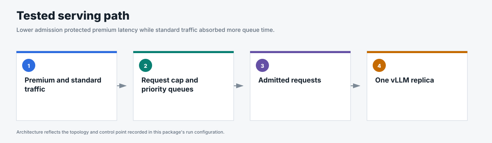
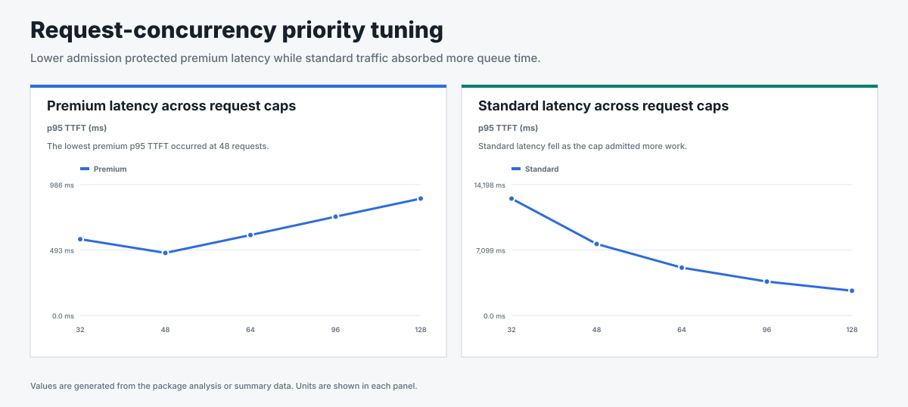

# Request-concurrency priority tuning

## Business question

How does the request cap trade realtime latency against lower-priority latency?

**Answer.** A cap of 48 produced the lowest premium p95 TTFT in this two-repeat
study, while tighter caps made standard traffic wait longer.

This package measures how `maxConcurrency` changes latency under one fixed
traffic pattern on Endpoint Picker v0.9.0. The run metrics record build commit
`5f4e762f341a5196393ce79f8a57c3e1900c4a6b`. The sweep used GPT-OSS 20B,
512 input tokens, 128 output tokens, prefix caching off, and two 120-second
repeats at each cap.

| `maxConcurrency` | Premium p95 TTFT | Standard p95 TTFT |
|---:|---:|---:|
| 32 | 568 ms | 12,722 ms |
| 48 | 461 ms | 7,808 ms |
| 64 | 582 ms | 5,207 ms |
| 96 | 761 ms | 3,714 ms |
| 128 | 907 ms | 2,697 ms |

The result is a tuning curve: tighter admission reduced premium latency while
standard traffic waited longer. The lowest premium p95 TTFT in this sweep was
461 ms at `maxConcurrency=48`.

Use this package to tune the request-concurrency cap within v0.9.0. It does not
compare v0.9.0 with RHAII 3.4 because those campaigns used different traffic
and detector configurations. A direct implementation comparison requires the
same deterministic traffic, model image, engine settings, and at least three
counterbalanced repeats.

<!-- generated:package-visuals -->

## Visual summary





[Tested configuration](tested-config.yaml)

<!-- /generated:package-visuals -->

## Reproduce

This historical July package used [`pipeline/archive/benchmark-2026-07.py`](../../../pipeline/archive/benchmark-2026-07.py), not the current runner. The public copy changes only deployment-specific defaults; its traffic and measurement logic matches the executed runner. Both hashes are recorded in [`run-config.json`](run-config.json). The sweep tested `maxConcurrency` 32, 48, 64, 96, and 128 with two 120-second closed-loop repeats per point, 512 input tokens, 128 output tokens, seed 42, a 384-prompt pool, and cache off.

```bash
OUTPUT_DIR=${OUTPUT_DIR:-results/request-concurrency-priority-tuning}
python3 pipeline/archive/benchmark-2026-07.py \
  --output-dir "$OUTPUT_DIR" --input-tokens 512 --output-tokens 128 \
  --prompt-pool-size 384 --skip-sweep --test2-noisy \
  --scenario-duration 120 --repeats 2 --stabilization-repeats 0 \
  --warmup-duration 0 --warmup-concurrency 16 --steady-state-trim-s 20 \
  --traffic-seed 42 --vllm-prefix-caching off
```

Set the Endpoint Picker request-concurrency cap before each point. Every run folder retains its exact [`benchmark_config.json`](us_sweep_maxc48/benchmark_config.json).
