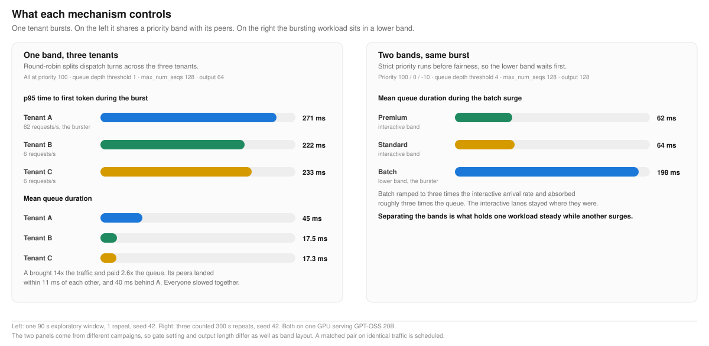

# What fairness controls, and what priority controls

Flow control gives a shared pool two separate tools, and they answer two different questions. Fairness answers how a band's capacity is divided among the tenants inside it. Priority answers which band gets served first. Laying out bands well means knowing which question a workload is asking.

**What it proves.** Round-robin fairness bounds how much of a band one tenant can take, so a burst cannot starve its neighbors. Holding one workload's latency steady while another surges is what a separate priority band delivers, because priority is the first tier of the dispatch cycle and runs before the fairness policy sees the queues.

**What we saw.** With three tenants in one band, the bursting tenant sent 82 requests per second against 6 for each peer, roughly fourteen times the load. It accrued 45 ms of mean queue duration against 17.5 and 17.3 ms, about 2.6 times the queue. Its two peers finished within 11 ms of each other and about 40 ms ahead of the burster. The pool was saturated, with vLLM running a full batch of 128 and 26 requests queued. No tenant was starved, and every tenant in the band slowed together, because each dispatched request joins the same continuous batch inside vLLM.

With the bursting workload in a lower band, the surge ramped to three times the interactive arrival rate and absorbed 198 ms of mean queue duration while premium held at 62 ms and standard at 64 ms.

**Why it matters.** A workload with a tighter latency objective than its neighbor needs its own band. Fairness will not produce that separation at any setting, and the gap only becomes visible under saturation, which is the moment it costs the most to discover. Two workloads that genuinely share an objective are correct to degrade together, and that objective belongs at the saturated operating point the capacity sweep identified rather than at the idle one.

## Configuration

| | One band | Two bands |
|---|---|---|
| Priorities | Three tenants at 100 | Premium 100, standard 0, batch -10 |
| Fairness policy | Round-robin, one flow per tenant | Round-robin inside each band |
| Queue depth threshold | 1 | 4 |
| KV cache utilization threshold | 0.8 | 0.8 |
| `max_num_seqs` | 128 | 128 |
| Input and output tokens | 512 and 64 | 512 and 128 |
| Duration | One 90 s window, 1 repeat | 300 s per repeat, 3 counted repeats |
| Traffic seed | 42 | 42 |

The two panels come from different campaigns, so the gate setting and the output length differ alongside the band layout. The left panel is exploratory evidence from a single window rather than an accepted run. A matched pair, identical traffic and identical gate with band layout as the only variable, is scheduled and will replace the left panel when it lands.

## Operating this in production

Three levers sit between the two layouts. The priority holdback policy lowers a band's usage ceiling as saturation climbs, which admits a burst while headroom exists and throttles it as headroom disappears. A tighter queue depth threshold moves waiting out of the engine and into the endpoint picker where policy still applies, and pays for that in peak throughput. Queue caps and a request time to live bound how large one burst can grow.

None of the three adds capacity. Replicas do that. Flow control governs who absorbs the wait during the seconds before autoscaling catches up, and keeps generation speed predictable for the requests already running.

*Left panel: `probe-s3-p7`, 2026-07-28. Right panel: Test 4 of the clean pressure pass, 2026-07-21. Both on one GPU serving GPT-OSS 20B behind the llm-d inference gateway.*
