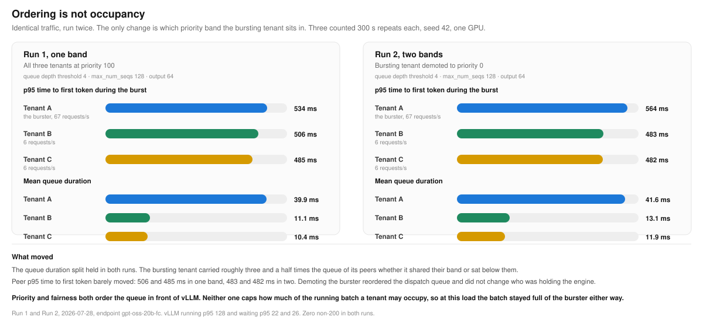
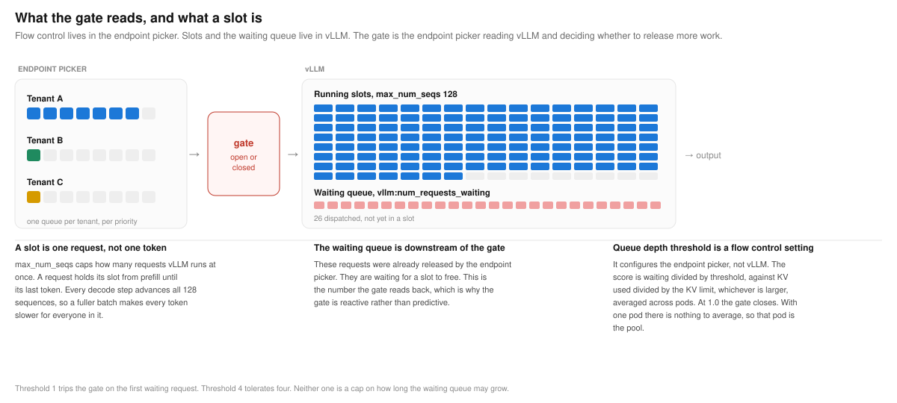
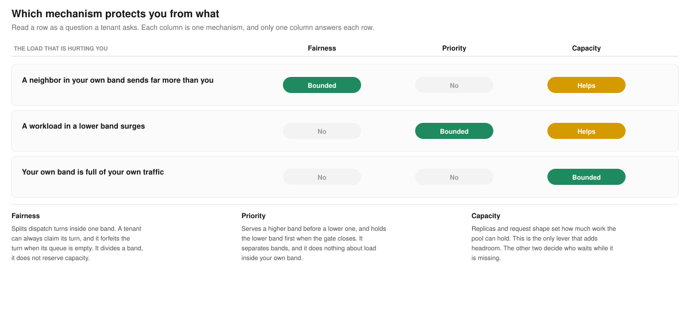

# Ordering is not occupancy

What fairness controls, what priority controls, and what neither one controls.

Flow control gives a shared pool two separate tools, and they answer two different questions. Fairness answers how a band's capacity is divided among the tenants inside it. Priority answers which band is served first. Laying out bands well means knowing which question a workload is asking.

**What it proves.** Both mechanisms order the queue that sits in front of the model servers. Fairness decides the order among tenants inside one band, priority decides the order between bands, and neither one limits how much of the running batch a tenant may occupy. Under saturation that distinction sets what each mechanism can and cannot do for a latency objective.

**What we saw.** With three tenants in one band, the bursting tenant sent 82 requests per second against 6 for each peer, roughly fourteen times the load. It accrued 45 ms of mean queue duration against 17.5 and 17.3 ms, about 2.6 times the queue. Its two peers finished within 11 ms of each other and about 40 ms ahead of the burster. The pool was saturated, with vLLM running a full batch of 128 and 26 requests queued. No tenant was starved, and every tenant in the band slowed together.

Running the same traffic again with the bursting tenant demoted to a lower band changed the ordering and not the outcome. Its queue duration stayed roughly three and a half times its peers', and peer p95 time to first token moved from 506 and 485 ms to 483 and 482 ms.

A separate campaign, where the interactive tiers carried real load of their own and a batch tier surged on top of them, did separate: batch carried 198 ms of queue against 62 and 64 ms, and 976 ms p95 time to first token against 608 and 660 ms. The difference between the two results is demand. Priority reorders dispatch at the moment two bands both have work queued. A band sending 6 requests per second is almost never queued when its turn arrives, so there is nothing to reorder, and the batch stays full of whoever does have work.

**Why it matters.** Separating bands is necessary for a tighter latency objective and it is not sufficient. Ordering only helps a band that has work queued at the moment of contention, and it never evicts work already running in the engine. Protecting a low-volume workload from a high-volume neighbor takes an admission limit or more capacity, not a reordering.

## Walking one request through

Follow a single request from a tenant that is not the one bursting.

**One. The flow queues.** Each tenant at each priority gets its own queue, keyed on the pair of fairness identity and priority. Three tenants at priority 100 means three queues.

**Two. The dispatch turn.** Round-robin cycles across the queues that have work. An empty queue forfeits its turn rather than holding up the cycle, which means fairness is not giving the bursting tenant a third of the pool. It is giving that tenant everything its neighbors do not ask for. A tenant sending 6 requests per second is usually empty when its turn comes around, so the turns pass to whoever has something to send. The guarantee is that a tenant can always claim its turn, not that a third of the pool is reserved for it.

**Three. The gate.** The endpoint picker reads vLLM and decides whether to release more work. When the pool is under capacity the gate is open and nothing queues, so fairness is invisible because there is nothing to divide. When the score reaches 1.0 the gate closes and requests hold in their flow queues, which is the first moment fairness is observable at all.

**Four. The engine.** A released request enters vLLM, takes a running slot if one is free, and waits in vLLM's own queue if none is. Its prefill shares the GPU with every sequence already decoding.

**Five. The two waits.** Time to first token is the dispatch wait plus everything after it, and fairness governs only the first. In the measured run the peer tenants waited 17.5 and 17.3 ms for dispatch, which is fairness working correctly, and their time to first token rose from 45 ms to 222 ms. Roughly 17 ms of that 177 ms rise happened in the flow queue. The rest happened inside an engine the bursting tenant had already filled.

That is the whole result. Fairness bounds hogging inside a band. Priority is what separates a tenant from its neighbor. Fairness does not have the second lever.

## What the gate reads, and what a slot is

`queueDepthThreshold` configures the endpoint picker, not vLLM. It is the divisor in the saturation score: waiting requests divided by the threshold, against KV cache used divided by the KV threshold, whichever is larger, averaged across pods. At 1.0 the gate closes. Threshold 1 trips on the first waiting request and threshold 4 tolerates four, and neither one caps how long the waiting queue may grow. With a single pod there is nothing to average, so that pod's score is the pool's score. A pod whose metrics are stale counts as fully saturated, which fails safe rather than optimistic.

The saturation detector is pluggable, and the choice changes what the score means. A utilization detector reads queue depth and KV cache utilization back from the model servers, so it responds to a queue that already exists. A concurrency detector scores in-flight load against a declared pool capacity instead, which makes it an admission limit rather than a reading. Every run in this repo used the utilization detector.

`max_num_seqs` configures vLLM. A slot is one request in flight, not one token. A request holds its slot from prefill until its final token, and every decode step advances all running sequences, so a fuller batch makes every token slower for everyone in it. Requests released by the gate that find no free slot wait in vLLM's own queue, and that count is the number the gate reads back, which is why the gate reacts to saturation rather than predicting it.

## Which mechanism protects you from what

Priority separates bands, and it does nothing about load inside your own band. A single premium band carrying a heavy backlog behaves exactly like the same-band case above, because a tenant's requests compete with each other for turns and its own traffic fills the batch. Priority protects a tenant from lower bands. It does not protect a tenant from itself.

This is also why a lightly loaded lower band looks identical to no separation at all. Priority only changes an outcome when there is a backlog to order, and a backlog only exists once the gate has closed.

## Sizing the active batch

`max_num_seqs` is the first of the three limits and the one that sets how heavy the shared batch can get. The capacity sweep is how to choose it. On this pool, at 512 input and 128 output tokens, p95 time to first token was 69 ms at 16 concurrent, 197 ms at 48, 289 ms at 64, 323 ms at 96, and 559 ms at 128. Against a 300 ms objective that puts the active batch limit near 64, not the 128 these runs used.

Sizing it that way holds the objective while offered load stays inside capacity. It does not hold the objective through a sustained overload, and the runs show why. Endpoint B set the limit to 64 and the priority split became obvious, while premium p95 rose above 700 ms. A smaller batch clears less work per second, so the queue in front of it grows, and time to first token is queue duration plus engine time. Past the point where offered load exceeds what the pool can clear, the only bounds left are rejection and more replicas.

The practical reading is that the batch limit governs latency in the regime you planned for, and the queue limits govern behavior in the regime you did not.

There is a further consequence worth stating, because it is a boundary rather than a tuning gap. A policy that controls the latency tail needs most of the waiting to happen upstream, which means an active batch small relative to offered load. Interactive absolute latency needs the opposite, because a small batch clears less work per second. On one pool those two goals compete for the same capacity, and the measurements here show the shape of the tradeoff: queue duration separates strongly under policy, median separates moderately, and the tail stays coupled. Holding both at once is a capacity decision rather than a configuration one.

## Queue limits, and what actually rejects a request

`queueDepthThreshold` never rejects anything. Three separate settings decide how much the endpoint picker will hold and for how long.

| Setting | What it bounds | What happens at the limit |
|---|---|---|
| `maxRequests` | Requests held in a band's queues | 429 with `rejected-saturated` |
| `maxBytes` | Bytes held, globally or per band | 429 with `rejected-saturated` |
| `defaultRequestTTL` | How long a request may sit queued | 503 with `rejected-ttl-expired` |

These are independent of the gate, which is what makes the combination useful. A tight `queueDepthThreshold` with a generous `maxRequests` engages policy at the first sign of queueing and still absorbs a large burst. A loose threshold with a small `maxRequests` does the opposite, letting the servers fill before policy engages and then rejecting quickly once it does.

The runs in this repo used `defaultRequestTTL: 60s` and `maxBytes: 10737418240` with no per-band request cap, so no run here exercised `maxRequests`.

## Configuration

| | One band | Two bands |
|---|---|---|
| Priorities | Three tenants at 100 | Premium 100, standard 0, batch -10 |
| Fairness policy | Round-robin, one flow per tenant | Round-robin inside each band |
| Queue depth threshold | 1 | 4 |
| KV cache utilization threshold | 0.8 | 0.8 |
| `max_num_seqs` | 128 | 128 |
| Input and output tokens | 512 and 64 | 512 and 128 |
| Duration | One 90 s window, 1 repeat | 300 s per repeat, 3 counted repeats |
| Traffic seed | 42 | 42 |

The two panels come from different campaigns, so the gate setting and the output length differ alongside the band layout. The left panel is exploratory evidence from a single window rather than an accepted run. A matched pair, identical traffic and identical gate with band layout as the only variable, is scheduled and will replace the left panel when it lands.

## Operating this in production

Three levers sit between the two layouts. The priority holdback policy lowers a band's usage ceiling as saturation climbs, which admits a burst while headroom exists and throttles it as headroom disappears. A tighter queue depth threshold moves waiting out of the engine and into the endpoint picker where policy still applies, and pays for that in peak throughput. Queue caps and a request time to live bound how large one burst can grow.

None of the three adds capacity. Replicas do that. Flow control governs who absorbs the wait during the seconds before autoscaling catches up, and keeps generation speed predictable for the requests already running.

*Left panel: `probe-s3-p7`, 2026-07-28. Right panel: Test 4 of the clean pressure pass, 2026-07-21. Both on one GPU serving GPT-OSS 20B behind the llm-d inference gateway.*
