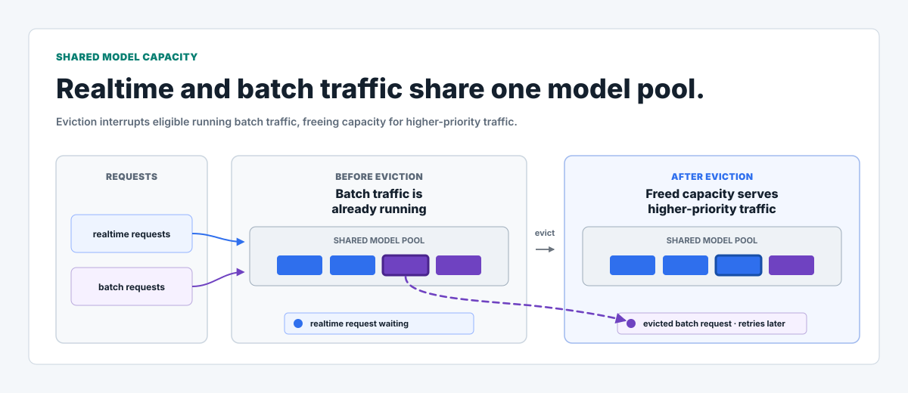
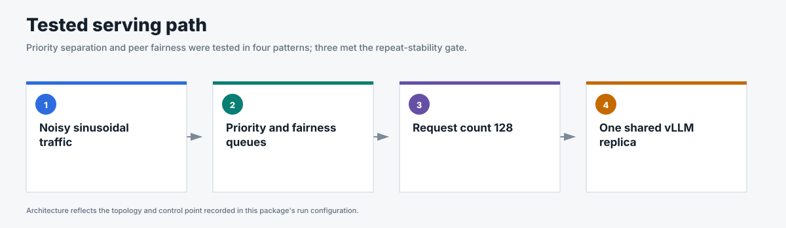
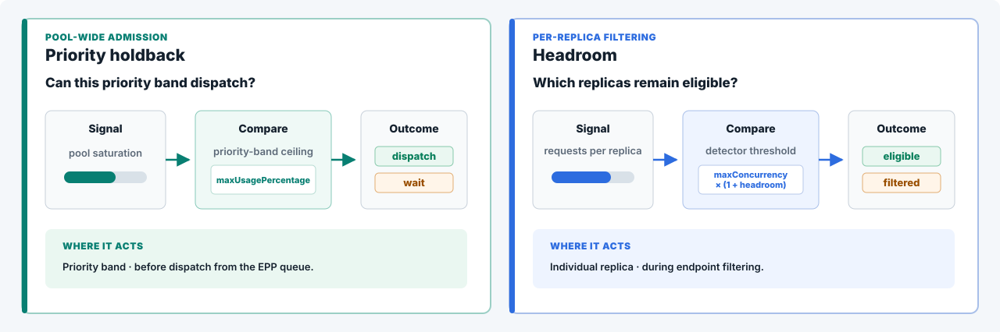
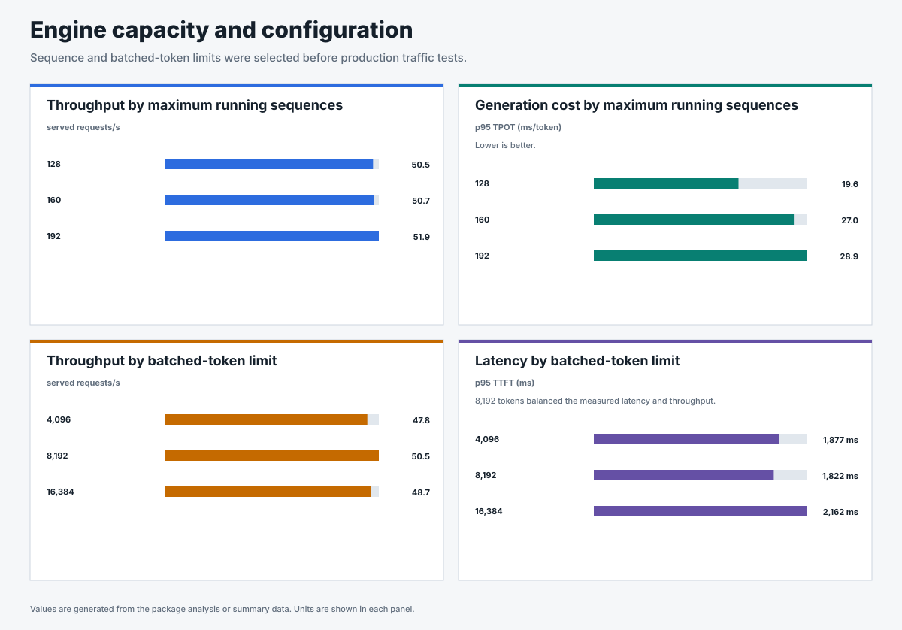
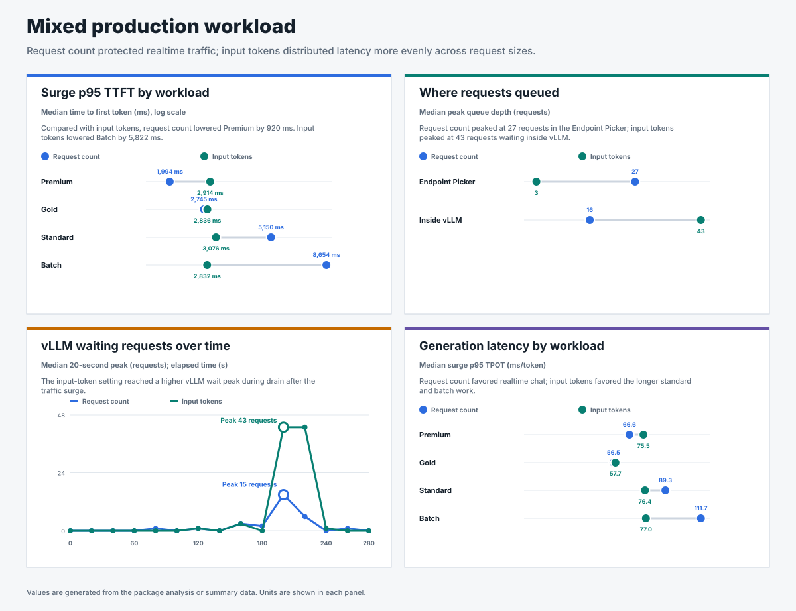
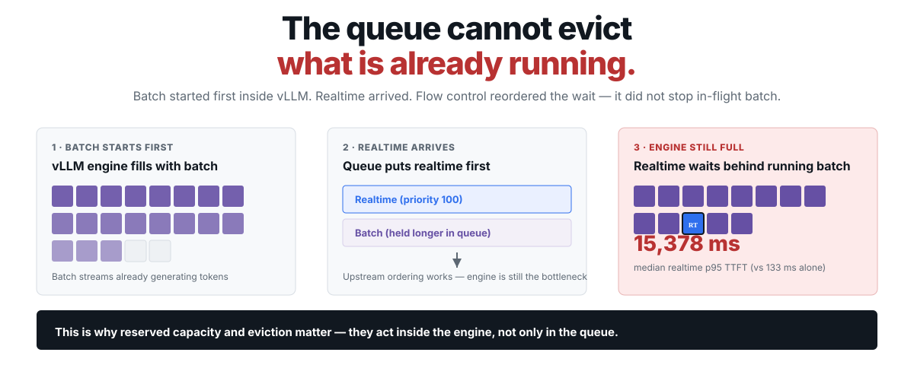
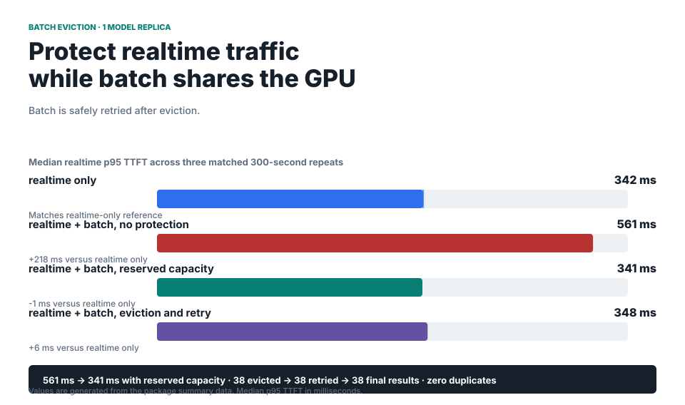
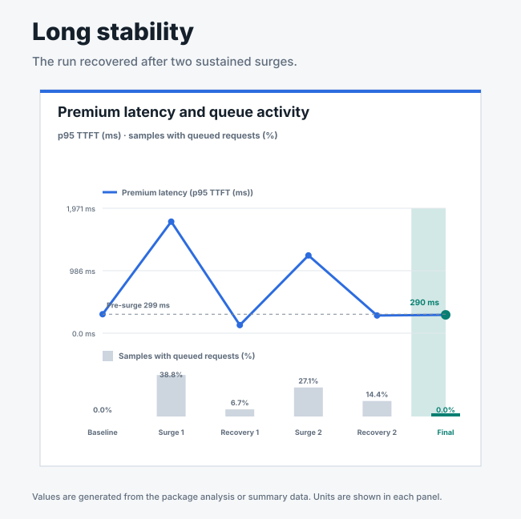

# Flow control benchmarks for llm-d

When GPU workers are saturated, llm-d flow control queues new requests before
vLLM and dispatches higher-priority work first. The benchmark campaign measures
how flow control protects realtime traffic, how admission settings affect
latency, and how reserved capacity and eviction handle running batch work.

## The story in four takeaways

### Share one GPU pool across tenants and workload classes

Priority and fairness policies let chat, batch, and tenant traffic use the same
model pool. The policy separates who receives capacity when demand exceeds what
the pool can serve immediately.

### Let policy decide who waits when the pool saturates

Higher-priority realtime traffic retains preferential access. Deferrable batch
and overloaded lower-priority traffic absorb more of the queueing delay.

### Keep one tenant's surge from starving its peers

Round-robin fairness preserves turns for tenants in the same priority band.
Their latency still depends on the capacity available inside vLLM.

### Protect realtime after batch has already entered vLLM

Reserved capacity preserves realtime access. When realtime demand needs more
capacity, eligible batch work is evicted and safely retried.

## How flow control protects shared capacity

The Gateway attaches priority and fairness information to each request. The
Endpoint Picker holds new requests when the selected detector reports
saturation. Higher-priority queues dispatch first, and round-robin ordering
gives same-priority tenants turns. vLLM schedules requests after dispatch.

The policy has two timing boundaries:

| Request state | Available control | Result |
|---|---|---|
| Waiting at the Endpoint Picker | Priority, fairness, detector headroom, and reserved capacity | Flow control decides whether the request can leave the queue. |
| Running inside vLLM | Batch eviction and retry | Flow control can interrupt eligible batch work so higher-priority requests can use the reclaimed capacity. |

## Select a configuration for the workload

The configuration tests establish how much work vLLM can run and when the
Endpoint Picker should queue new requests. The selected values balance served
throughput with p95 TTFT and p95 time per output token for the tested model,
hardware, and request shapes.

Increasing the vLLM active-request limit from 128 to 192 added about one to two
served requests per second. The p95 time per output token increased by 47%.
The benchmark selected the lower-latency setting for the production scenarios.

The Endpoint Picker detector changes where new requests begin to queue:

| Admission signal | What it measures | Evidence-based use |
|---|---|---|
| In-flight requests | Requests already admitted by the Endpoint Picker | Produced the lowest realtime p95 TTFT in the matched consolidation and same-priority tests. |
| In-flight tokens | Prompt tokens admitted by the Endpoint Picker | Accounts for request size and improved some long-context and batch results in mixed traffic. |
| vLLM waiting queue | Requests queued inside vLLM | Responds to observed engine queueing after requests reach the model server. |
| KV-cache pressure | Model-memory use reported by vLLM | Provides a memory-pressure signal for the utilization detector. |

Request-count admission protected realtime traffic best in the tested mixed
workload. Token-count admission reduced latency for some larger request shapes.
The request mix and latency objective determine which tradeoff fits a service.

## Protect realtime traffic from batch interference

Running batch work occupies vLLM capacity until the request
finishes or is interrupted. The batch-interference benchmark measures the
latency impact before reserved capacity and eviction are added.

The 115-times increase was measured with request-count admission, 4,096 input
tokens, 128 output tokens, and a noisy traffic rate centered on 3 requests per
second. The result shows the risk for the tested batch-first workload. Queue
admission can hold new batch requests, while running requests require reserved
capacity or eviction.

Reserved capacity protects realtime access before batch consumes the available
capacity. Eviction extends that protection to eligible batch work that is
already running. Evicted batch work is safely retried through the normal
request path.

The detailed package records the retry counts, final-result checks, and
realtime p95 TTFT measurements. The mechanism worked with one and two model
replicas. Run-to-run variation in the two-replica test was too large to support
a latency-scaling claim.

## Verify recovery, scale, and routing separately

The hardening tests isolate three operational questions. Each result has a
different claim boundary.

| Test | Result | Boundary |
|---|---|---|
| [Long stability](../benchmark-data/upstream-flow-control-v0.9.0/long-stability/) | The queue drained after two sustained surges and every request completed. | One 30-minute run supports recovery behavior for the tested traffic. |
| [Model-pool scaling](../benchmark-data/upstream-flow-control-v0.9.0/multi-replica-scaling/) | Served throughput per GPU stayed within 0.6% from one to four model replicas. | HTTP 429 responses in smaller pools prevent a rejection-free scale claim. |
| [Prefix-aware routing](../benchmark-data/upstream-flow-control-v0.9.0/prefix-cache-routing/) | Realtime and batch latency improved; standard long-context latency and route imbalance increased. | The tested prompts produced limited additional prefix reuse. |

## Evidence and reproduction

The repository publishes the configuration, request data, traffic samples,
system metrics, acceptance checks, and claim boundaries for each benchmark
package.

| Campaign | Role in the evidence |
|---|---|
| [Endpoint Picker v0.9.0](../benchmark-data/upstream-flow-control-v0.9.0/) | Main stable-image campaign for configuration, production traffic, mixed workloads, recovery, scaling, and routing. |
| [Batch eviction](../benchmark-data/batch-eviction/) | Experimental capability proof for reserved capacity, eviction, and retry with one and two model replicas. |
| [RHAII 3.4 flow control](../benchmark-data/rhaii-3.4-flow-control/) | Earlier utilization-detector campaign. Comparable scenarios support directional consistency across the two campaigns. |

[`pipeline/benchmark.py`](../pipeline/benchmark.py) is the public runner. Each
package README records the commands, image, settings, traffic shape, and
acceptance checks used for the published runs. The [Flow Control Flight
Recorder](https://github.com/alexagriffith/flow-control-visualizer) replays the
published time-series packages as synchronized traffic, Endpoint Picker queue,
and vLLM views.

Absolute latency depends on the model, hardware, request shape, and offered
load. A deployment SLO requires a named target and matched TTFT, end-to-end
latency, time per output token, and success-rate tests at the target load.

## Learn flow control

- [Written flow-control guide](../learn/flow-control.html)
- [Interactive walkthrough](../learn/flow-control-journey.html)
- [Combined benchmark report](../benchmark-data/results.html)
- [SLO proof test design](slo-proof-tests.md)
