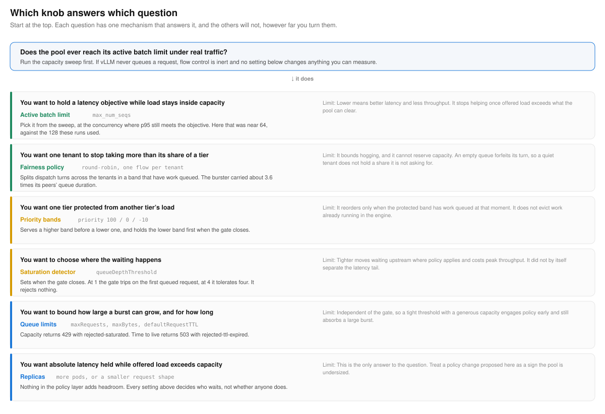

# Tuning map

A pool under pressure has more settings than it has problems. This maps the question you are actually asking onto the one mechanism that answers it, and states what each mechanism will not do however far you turn it. Everything here comes from measured runs in this repo.

## Start with the sweep

Sweep the pool before changing any policy setting. Step concurrency until vLLM begins queueing requests, and record p95 time to first token and throughput at each step, for each request shape you expect to serve.

The sweep answers two questions at once. It tells you where the pool stops absorbing load, and it tells you what latency costs at every point before that. On this pool, at 512 input and 128 output tokens, p95 time to first token ran 69 ms at 16 concurrent, 197 ms at 48, 289 ms at 64, 323 ms at 96, and 559 ms at 128, while every request shape first queued at 160.

If your traffic never reaches that queueing point, flow control is inert. It will not appear in any measurement, and none of the settings below will change an outcome. That is the correct result rather than a misconfiguration.

## The active batch limit sets latency inside capacity

`max_num_seqs` caps how many requests vLLM runs concurrently. Every decode step advances all running sequences, so a fuller batch makes every token slower for everyone in it. Choose it from the sweep, at the concurrency where p95 still meets the objective. Against a 300 ms objective, this pool points at roughly 64.

It stops helping once offered load exceeds what the pool can clear. A smaller batch clears less work per second, so the queue in front of it grows, and time to first token is queue duration plus engine time. One run set the limit to 64 and made tier separation obvious while p95 rose above 700 ms. Below a certain point you are measuring throttling rather than protection.

## Fairness bounds hogging inside a band

The round-robin policy splits dispatch turns across the tenants in a band that have work queued. In a matched pair with three tenants in one band, the bursting tenant sent about ten times its peers' load and carried about 3.6 times their queue duration, while the two peers finished within a few percent of each other.

It cannot reserve capacity. Round-robin is work-conserving, so an empty queue forfeits its turn rather than holding the cycle, which means a tenant that is not asking for a share does not hold one. A heavy tenant therefore takes whatever its neighbors leave, and their share of the running batch tracks their demand rather than their entitlement.

## Priority separates bands, when the protected band has demand

Priority is the first tier of the dispatch cycle and runs before fairness sees the queues. A higher band is served before a lower one, and when the gate closes the lower band is held first.

It reorders only when the protected band has work queued at the moment of contention. In the same matched pair, moving the bursting tenant down a band left peer tail latency where it was, because peers sending a small fraction of the load were rarely queued when their turn came, so there was nothing to reorder. In a separate campaign where the interactive tiers carried real load of their own, the same mechanism produced a clear separation, with the surging tier carrying roughly three times the queue duration.

The distinction to carry into a design review is that ordering a queue is not the same as limiting how much of the running batch a tenant holds. Priority and fairness both order. Neither one caps occupancy.

## The saturation detector decides where waiting happens

`queueDepthThreshold` sets when the gate closes, expressed as a divisor: waiting requests over the threshold, against KV cache used over its own threshold, whichever is larger, averaged across pods. At 1.0 the gate closes and requests hold in the endpoint picker instead of the servers.

At threshold 1 the gate trips on the first queued request. At 4 it tolerates four. It rejects nothing at any value. A tighter setting moves waiting upstream where policy still applies and costs peak throughput, and on its own it did not separate the latency tail in any run here.

At 512 input and 64 output tokens the KV term stays far below its 0.8 default, so the score reduces to queue depth alone. A pool serving long generations or long prompts should expect the KV term to bind first, and should tune it rather than inherit it.

## Queue limits bound the blast radius

Three settings decide how much the endpoint picker holds and for how long. `maxRequests` bounds requests held in a band's queues, `maxBytes` bounds them by size, and both return 429 with `rejected-saturated` at the limit. `defaultRequestTTL` returns 503 with `rejected-ttl-expired` for a request that sits too long.

These are independent of the gate, which makes the combination expressive. A tight `queueDepthThreshold` with a generous `maxRequests` engages policy at the first sign of queueing and still absorbs a large burst. A loose threshold with a small `maxRequests` lets the servers fill before policy engages and then rejects quickly once it does.

## Capacity is the only lever that adds headroom

Nothing in the policy layer creates capacity. Every setting above decides who waits and where, not whether anyone waits. When offered load exceeds what the pool can clear for a sustained period, the bounded outcomes are rejection and more replicas.

This is worth stating in a design review, because a proposal to fix a sustained overload with a policy change is usually a sign the pool is undersized. Flow control's job in that moment is to make the overload land on the traffic you chose rather than on whoever happened to arrive.

## Reading the results

One pattern held across every scenario measured here. Queue duration separates strongly under policy, median latency separates moderately, and the tail stays coupled once the pool is saturated, because every dispatched request shares the same batch.

Report all three. A reader shown only the median will assume the tail followed it, and an operator who holds a vendor to a tail number under saturation is asking the policy layer for something that lives in the capacity layer.
