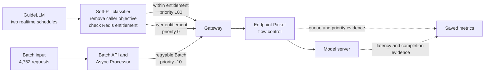

# Soft provisioned-throughput replay

This package replays the soft provisioned-throughput comparison published in
[`benchmark-data/rhaii-3.5-flow-control/soft-pt`](../../benchmark-data/rhaii-3.5-flow-control/soft-pt/).

## What each component does

| Component | Role in the accepted test |
|---|---|
| GuideLLM 0.7.0 | Replayed two synchronized, 240-second realtime request schedules. |
| Soft-PT classifier | Removed caller-supplied objective headers, checked one synthetic entitlement in Redis, and assigned priority 100 or 0. |
| Batch API and Async Processor | Submitted and drained the priority -10 backlog while realtime traffic ran. |
| Endpoint Picker and vLLM metrics | Confirmed the assigned priorities reached flow control and reconciled request outcomes. |

GuideLLM generated the model traffic. It did not authenticate a workload,
enforce a quota, rewrite scheduling headers, or submit the Batch backlog. The
classifier and Batch components supplied those functions.



The classifier is the trust boundary. Both realtime clients deliberately send
the same false priority-100 objective. The classifier removes that value and
sets priority 100 only while the entitled flow has quota. It assigns priority 0
after the quota is consumed. The Async Processor owns retry for priority -10
Batch requests.

This classifier is a benchmark harness. It trusts the synthetic fairness ID in
the trace so the study can isolate quota behavior. A production deployment must
derive workload identity from authenticated metadata before assigning a
fairness ID or objective.

## Files

- [`classifier_proxy.py`](classifier_proxy.py) is the streaming classification
  proxy used by the study, with deployment names moved to environment variables.
- [`policy.json`](policy.json) records the tested token weights, request cost,
  entitlement, and objective mapping.
- [`token_bucket_reserve.lua`](token_bucket_reserve.lua) and
  [`token_bucket_settle.lua`](token_bucket_settle.lua) implement the atomic
  Redis reservation.
- [`preflight_token_bucket.py`](preflight_token_bucket.py) checks reservation,
  overflow, idempotency, release, and cleanup before traffic.
- [`generate_batch_input.py`](generate_batch_input.py) regenerates the exact
  4,752-request synthetic Batch file used by the accepted test.
- [`traces/`](traces/) contains the exact GuideLLM schedules for both realtime
  flows.
- [`kubernetes/classifier-service.yaml`](kubernetes/classifier-service.yaml)
  exposes the classifier running in the benchmark-runner pod.
- [`run-arm.sh`](run-arm.sh) composes those pieces for one comparison arm.

## Prerequisites

Start with a compatible model service, Endpoint Picker, Redis, Batch API, and
Async Processor. Apply the tested serving-side configuration in
[`09-soft-pt-serving-policy.yaml`](../../benchmark-data/rhaii-3.5-flow-control/examples/benchmark-reproduction/09-soft-pt-serving-policy.yaml),
then deploy the CPU benchmark runner:

```bash
kubectl apply -n "$NAMESPACE" -f pipeline/kubernetes/benchmark-runner.yaml
kubectl wait -n "$NAMESPACE" --for=condition=Ready \
  pod/flow-control-benchmark-runner --timeout=600s
```

The public runner installs `aiohttp==3.14.1`, the classifier's only Python
dependency. Redis is accessed through its RESP protocol, so no Redis Python
package is required.

## Run one arm

Set deployment-specific values. `BATCH_API_URL` must be reachable from the
machine running the script; a local `kubectl port-forward` is sufficient.

```bash
export NAMESPACE=flow-control-demo
export RUNNER_POD=flow-control-benchmark-runner
export REDIS_HOST=redis.flow-control-demo.svc.cluster.local
export UPSTREAM_URL=http://flow-control-gateway.gateway-system.svc.cluster.local/flow-control-demo/flow-control-model
export BATCH_API_URL=http://127.0.0.1:48201
export MODEL_NAME=openai/gpt-oss-20b
export LLM_INFERENCE_SERVICE=flow-control-model

pipeline/soft-pt/run-arm.sh classifying-quota
```

Valid arms are `no-quota`, `classifying-quota`, and `blocking-quota`. The
script captures and validates the live `LLMInferenceService` and Endpoint
Picker deployment, generates the Batch file, verifies its accepted SHA-256,
resets only the replay's Redis keys, starts the classifier, submits the Batch
backlog, runs the published GuideLLM pipeline, and saves classifier and Batch
evidence.

Run three counterbalanced blocks for a matched comparison:

1. `no-quota`, `classifying-quota`, `blocking-quota`
2. `blocking-quota`, `no-quota`, `classifying-quota`
3. `classifying-quota`, `blocking-quota`, `no-quota`

Keep the model, topology, traffic traces, Batch input, detector, and policy
fixed across all nine runs. The accepted study used one GPT-OSS 20B replica on
one H100 with prefix caching disabled.

After one arm passes, run the full counterbalanced order:

```bash
pipeline/soft-pt/run-matrix.sh
```

## Local validation

```bash
python3 -m unittest \
  pipeline/rhaii35/test_guidellm_replay.py \
  pipeline/soft-pt/test_soft_pt.py
python3 pipeline/soft-pt/generate_batch_input.py --check
ruby pipeline/validate_rhaii35_public_package.rb
```

The unit test does not require a cluster or Redis. It checks the policy,
header-rewrite boundary, and exact Batch input hash. A counted run still needs
live Endpoint Picker, vLLM, classifier, Redis, Batch, and route evidence.
